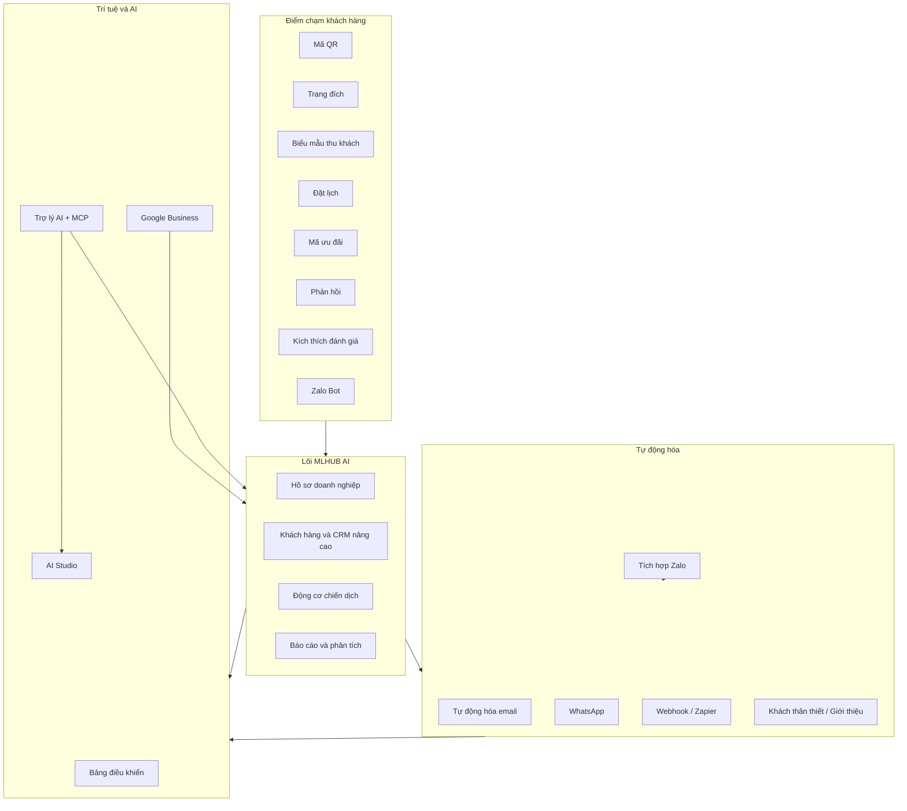
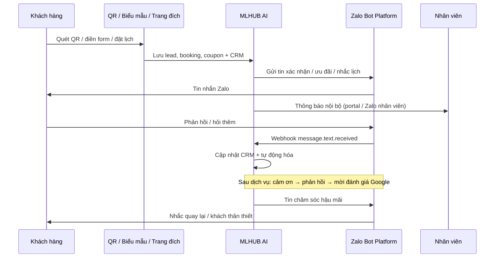

# MLHUB AI — Báo cáo bối cảnh hệ thống SaaS tăng trưởng địa phương

> **Phiên bản tài liệu:** 2026-06  
> **Nền tảng triển khai:** [mlhub.vn](https://mlhub.vn)  
> **Đối tượng đọc:** Ban điều hành, đối tác, nhà đầu tư, đội triển khai  
> **Quy ước trình bày:** Văn bản chính bằng tiếng Việt; thuật ngữ chuyên ngành kèm tiếng Anh trong ngoặc. Khi trình bày miệng có thể gọi chung là **hệ thống SaaS tăng trưởng địa phương** hoặc **bộ công cụ tăng trưởng địa phương** — thương hiệu chính thức là **MLHUB AI**.

---

## 1. Tóm tắt điều hành

**MLHUB AI** là nền tảng **phần mềm dạng dịch vụ (Software as a Service — SaaS)** triển khai tại **mlhub.vn**, hỗ trợ doanh nghiệp địa phương tăng trưởng khách hàng, chăm sóc sau mỗi điểm chạm và đo lường hiệu quả chiến dịch — **không** thay thế bán hàng tại quầy (Point of Sale — POS), quản lý kho, kế toán hay thuế.

Hệ thống gom các hoạt động rời rạc (quét mã QR, biểu mẫu thu khách, đặt lịch, ưu đãi, phản hồi, đánh giá Google, tin nhắn Zalo) vào **một nguồn dữ liệu thống nhất**, kích hoạt **tự động hóa đa kênh** và cung cấp **Trợ lý AI gắn giao thức ngữ cảnh mô hình (Model Context Protocol — MCP)** để vận hành bằng ngôn ngữ tự nhiên.

**Giá trị cốt lõi:** biến mỗi tương tác khách hàng thành dữ liệu có thể quản lý, quy trình có thể tự động hóa và báo cáo có thể đo lường — giúp chủ doanh nghiệp và đội vận hành ra quyết định dựa trên số liệu thay vì cảm tính.

---

## 2. Định vị sản phẩm

### 2.1 MLHUB AI là gì?

MLHUB AI là **hệ điều hành tăng trưởng nhẹ (Lightweight Growth Operating System)** cho mô hình kinh doanh địa phương tại Việt Nam và khu vực:

| Lớp | Vai trò |
| --- | --- |
| **Lớp dữ liệu** | Hồ sơ doanh nghiệp, khách hàng, chiến dịch, khách tiềm năng (lead), đặt lịch (booking), mã ưu đãi (coupon), phản hồi (feedback), đánh giá (review), quản lý quan hệ khách hàng (Customer Relationship Management — CRM) |
| **Lớp tự động hóa** | Email, WhatsApp, Zalo Bot, webhook/Zapier, tự động hóa CRM, khách hàng thân thiết/giới thiệu (loyalty/referral) |
| **Lớp trí tuệ** | Bảng điều khiển (dashboard), báo cáo, AI Studio (sinh nội dung), Trợ lý AI + MCP |

### 2.2 MLHUB AI không làm gì?

- Không quản lý bán hàng tại quầy (POS), tồn kho, sổ sách kế toán, kê khai thuế.
- Không thay thế hệ thống hoạch định nguồn lực doanh nghiệp/CRM lớn (Enterprise Resource Planning — ERP) — mà **bổ sung lớp tăng trưởng và chăm sóc khách** ngay sau điểm chạm marketing.

### 2.3 Phạm vi giải quyết

| Vấn đề phổ biến | Cách MLHUB AI xử lý |
| --- | --- |
| Khách đến nhưng không để lại dữ liệu | Mã QR, trang đích (landing page), biểu mẫu thu khách (lead form) gắn nguồn |
| Khách quan tâm nhưng không được chăm sóc lại (follow-up) | CRM, tự động hóa email/Zalo/WhatsApp, tác vụ (task) |
| Khách đã dùng dịch vụ nhưng không được mời đánh giá | Công cụ kích thích đánh giá (Review Booster) + Google Business + nhắc Zalo |
| Phản hồi xấu phát hiện muộn | Biểu mẫu phản hồi riêng + cảnh báo + xử lý trước khi lên công khai |
| Ưu đãi phát ra nhưng không đo được | Chiến dịch mã ưu đãi (coupon campaign) + báo cáo nhận/dùng |
| Dữ liệu nằm rời ở Excel, chat, sổ tay | Một CRM + dòng thời gian tương tác (timeline) |
| Quản lý thiếu báo cáo rõ ràng | Báo cáo + Trợ lý AI đọc số liệu thật |

---

## 3. Bối cảnh thị trường

### 3.1 Thị trường Đà Nẵng

Đà Nẵng là trung tâm kinh tế — dịch vụ miền Trung, có quy mô dân số và lưu lượng khách du lịch đáng kể, mức độ ứng dụng công nghệ trong kinh doanh ngày càng cao. Đa số là **doanh nghiệp vừa và nhỏ (Small and Medium Enterprise — SME)** — chủ sở hữu thường trực tiếp phụ trách marketing và chăm sóc khách, nguồn lực công nghệ và đội vận hành còn gọn so với doanh nghiệp lớn.

**MLHUB AI** định hướng **ưu tiên thị trường Đà Nẵng** làm điểm triển khai ban đầu (nền tảng **mlhub.vn**), làm nền để mở rộng sang các địa phương khác khi mô hình đã được kiểm chứng.

### 3.2 Nhu cầu thị trường Đà Nẵng

Trên thị trường Đà Nẵng, các nhu cầu vận hành lặp lại ở nhiều loại hình kinh doanh — **không gắn riêng một ngành nghề cụ thể**:

| Nhóm nhu cầu | Mô tả ngắn |
| --- | --- |
| **Thu và giữ dữ liệu khách** | Ghi nhận liên hệ và hành vi từ điểm chạm thực tế (cửa hàng, sự kiện, quảng cáo), không chỉ dừng ở lượt xem trên mạng xã hội |
| **Chuẩn hóa chăm sóc sau tương tác** | Xác nhận, nhắc lịch, chăm sóc lại (follow-up), mời phản hồi và đánh giá — thay vì phụ thuộc trí nhớ cá nhân |
| **Kết nối kênh địa phương** | Đồng bộ **Zalo**, Facebook, Google Maps, mã QR với dữ liệu nội bộ thống nhất |
| **Đo lường hiệu quả chiến dịch** | Biết nguồn nào mang khách, bước nào làm khách rời, chi phí marketing có mang lại kết quả hay không |
| **Công cụ dễ vận hành** | Không đòi hỏi đội công nghệ thông tin (Information Technology — IT) riêng — phù hợp chủ doanh nghiệp và đội nhỏ |

Thực trạng phổ biến: marketing qua **Facebook, Google Maps, Zalo, mã QR tại điểm bán**; chăm sóc khách bằng **tin nhắn và ghi chép thủ công**, thiếu quy trình chung; khó nối **ngoại tuyến sang trực tuyến (offline-to-online)** — khách quét mã nhưng không để lại liên hệ, yêu cầu qua hộp thư đến không được ghi vào hệ thống.

### 3.3 Mong muốn của thị trường

Doanh nghiệp trên thị trường Đà Nẵng mong muốn:

- **Một nền tảng gọn** — gom thu khách, đặt lịch, ưu đãi, phản hồi, đánh giá và báo cáo, thay vì dùng nhiều công cụ rời không liên thông.
- **Tự động hóa thực tế** trên kênh khách đang dùng hàng ngày (đặc biệt **Zalo**), không chỉ email.
- **Quản lý uy tín trực tuyến** chủ động — đánh giá Google, phản hồi kịp thời, xử lý ý kiến tiêu cực sớm.
- **Trợ lý AI** giúp đọc số liệu và gợi ý việc ưu tiên — giảm rào cản kỹ thuật cho người không chuyên marketing.
- **Chi phí SaaS minh bạch**, gói dịch vụ phù hợp quy mô địa phương.

**MLHUB AI** trên **mlhub.vn** hình thành để đáp ứng bối cảnh, nhu cầu và mong muốn đó: chuẩn hóa điểm chạm, tự động hóa chăm sóc lại đa kênh, đo lường tỷ suất hoàn vốn (Return on Investment — ROI) từng chiến dịch, và hỗ trợ vận hành bằng lớp trí tuệ nhân tạo (Artificial Intelligence — AI).

---

## 4. Mô hình SaaS và nền tảng kỹ thuật

### 4.1 Mô hình kinh doanh

MLHUB AI vận hành theo mô hình **đa khách thuê (multi-tenant)** trên đám mây (cloud):

- **Đăng ký / đăng nhập** với xác thực hai lớp (Two-Factor Authentication — 2FA), không gian làm việc theo đội (workspace/team).
- **Gói cước (Plans)** với hạn mức theo tính năng: số doanh nghiệp, chiến dịch, trang đích, mã QR, CRM, email/tháng, tin Zalo/tháng…
- **Tín dụng AI (Credits)** cho tác vụ sinh nội dung và Trợ lý AI nâng cao.
- **Thanh toán đa cổng** (Stripe, PayPal, 2Checkout, chuyển khoản thủ công) và quản lý đăng ký gói (subscription)/hóa đơn.
- **Nhãn trắng nhẹ (white-label):** tên miền riêng (custom domain), gỡ thương hiệu MLHUB, tùy chỉnh giao diện (theme/CSS).
- **Đa ngôn ngữ:** tiếng Việt và tiếng Anh trên cổng khách hàng (portal).

### 4.2 Kiến trúc sản phẩm (tóm tắt)

Nền tảng xây trên **Laravel 13 + Livewire 4**, kiến trúc **khối nguyên mô-đun (modular monolith)** (~72 module): lõi quản trị SaaS, cổng khách hàng, plugin thanh toán và gói tùy biến thị trường Việt Nam.

**Công cụ lõi công cụ tăng trưởng (growth tool engine) dùng chung:** năm công cụ Review Booster, Đặt lịch (Booking), Mã ưu đãi (Coupon), Phản hồi (Feedback), Biểu mẫu thu khách (Lead Form) cùng chạy trên một động cơ chiến dịch — mỗi chiến dịch có loại (type), cấu hình JSON, trang công khai, mã QR và phân tích (analytics) thống nhất.

**Phân loại ngành (taxonomy):** 18 nhóm ngành (ưu tiên Đà Nẵng–Quảng Nam) — Trợ lý AI và quy trình làm quen (onboarding) gợi ý module/chiến dịch phù hợp từng ngành.



---

## 5. Nhóm tính năng chính

### 5.1 Hồ sơ doanh nghiệp và địa điểm (Business Profile & Business Locations)

Tạo và quản lý hồ sơ doanh nghiệp địa phương: ngành nghề (18 nhóm phân loại), mô tả dịch vụ, liên hệ, hình ảnh, thương hiệu, đường dẫn công khai và nhiều địa điểm vật lý. Đây là **lớp dữ liệu nền** cho mọi chiến dịch, mã QR, đặt lịch, báo cáo và tích hợp Google/Zalo.

### 5.2 Trang chiến dịch và trang đích (Campaign Page & Landing Page)

Tạo nhanh trang phục vụ từng mục tiêu: thu khách tiềm năng (lead), nhận đặt lịch, phát ưu đãi, xin phản hồi, giới thiệu dịch vụ hoặc điều hướng hành động — **không cần xây website riêng** cho mỗi chiến dịch. Hỗ trợ thiết kế mẫu (template), màu sắc, logo và bộ mẫu marketing tái sử dụng.

### 5.3 Mã QR — kết nối ngoại tuyến sang trực tuyến (QR Code & Offline-to-Online)

Tạo mã QR cho hồ sơ, đặt lịch, biểu mẫu thu khách, nhận ưu đãi, phản hồi, xin đánh giá hoặc đường dẫn tùy ý. Đặt tại cửa hàng, quầy, hóa đơn, menu, poster — mỗi lượt quét được ghi nhận và chuyển thành dữ liệu phân tích. Hỗ trợ **tên miền riêng (custom domain)** cho thương hiệu riêng.

### 5.4 Biểu mẫu khách hàng tiềm năng (Lead Form)

Thu thập họ tên, số điện thoại, email, nhu cầu và nguồn phát sinh. Dữ liệu khách tiềm năng (lead) tự động đẩy vào CRM, gắn thẻ (tag), phân nhóm và kích hoạt tự động hóa (email, Zalo, webhook).

### 5.5 Đặt lịch và yêu cầu tư vấn (Booking & Booking Request)

Khách gửi yêu cầu hẹn theo dịch vụ, giờ làm việc, khung giờ (slot) và thời gian đệm (buffer). Trạng thái: chờ xác nhận (Pending), đã xác nhận (Confirmed), hoàn tất (Completed), đã hủy (Cancelled), cần chăm sóc lại (Follow-up Required) — giảm bỏ sót khách có nhu cầu thật.

### 5.6 Mã ưu đãi và chiến dịch khuyến mãi (Coupon & Promotion Campaign)

Tạo chiến dịch mã giảm giá: hạn dùng, giới hạn lượt phát, trang nhận ưu đãi, theo dõi đã nhận / đã dùng / hết hạn — đo hiệu quả từng đợt khuyến mãi.

### 5.7 Phản hồi khách hàng (Customer Feedback)

Thu điểm số, nhận xét và góp ý sau trải nghiệm — phát hiện vấn đề sớm, xử lý khách chưa hài lòng trước khi ảnh hưởng uy tín công khai.

### 5.8 Tăng trưởng đánh giá (Review Booster & Review Management)

Luồng xin đánh giá thông minh: khách hài lòng (điểm đánh giá ≥ ngưỡng) được điều hướng sang đánh giá Google/Facebook; khách không hài lòng chuyển sang biểu mẫu riêng tư. Kết hợp **Hồ sơ Doanh nghiệp Google (Google Business Profile)** để đồng bộ đánh giá, trả lời bằng AI, theo dõi điểm và đánh giá tiêu cực.

### 5.9 Tích hợp Google Business Profile

Đồng bộ địa điểm, đánh giá, phản hồi và bài đăng Google Business. Hỗ trợ **trả lời đánh giá bằng AI (AI Review Reply)**, quy tắc trả lời tự động, theo dõi xu hướng điểm đánh giá — lớp **quản lý uy tín địa phương (Local Reputation Management)**.

### 5.10 Quản lý khách hàng và CRM nâng cao (Advanced CRM)

Trên nền danh sách khách cơ bản: thẻ (tag), phân khúc (segment), ghi chú (note), tác vụ (task), dòng thời gian hoạt động (timeline), điểm/giá trị vòng đời khách hàng (Customer Lifetime Value — CLV), tự động hóa nội bộ, gộp hồ sơ trùng (merge). Mọi gửi biểu mẫu từ công cụ tăng trưởng đều gom về **một hồ sơ khách thống nhất**.

### 5.11 Khách hàng thân thiết và giới thiệu (Loyalty & Referral)

Chương trình tích điểm (thẻ tích tem — stamp card), thẻ thành viên, phần thưởng, mã đổi quà và giới thiệu khách mới (referral) — tăng tỷ lệ khách quay lại (Repeat Visit) và giá trị vòng đời khách hàng (CLV).

### 5.12 Tự động hóa email (Smart Email Automation)

Gửi email theo sự kiện: khách tiềm năng mới, đặt lịch, mã ưu đãi, phản hồi, luồng xin đánh giá — xác nhận, nhắc lịch, cảm ơn, chăm sóc lại, báo cáo nội bộ.

### 5.13 Tự động hóa WhatsApp (WhatsApp Automation)

Thông báo qua WhatsApp Cloud API cho khách quốc tế, du lịch hoặc ngành thường dùng WhatsApp — bổ sung song song email, Zalo và webhook.

### 5.14 Webhook, Zapier và kết nối hệ thống ngoài

Đẩy sự kiện (lead, booking, coupon, feedback, review) sang Google Sheets, n8n, Make, Zapier, CRM bên ngoài, Telegram, Slack — MLHUB AI trở thành **trung tâm sự kiện (event hub)** mở, không khóa trong hệ sinh thái đóng.

### 5.15 Báo cáo và phân tích (Reporting & Analytics)

Theo dõi lượt quét QR, khách tiềm năng, đặt lịch, tỷ lệ xác nhận, mã ưu đãi nhận/dùng, phản hồi, đánh giá, nguồn phát sinh và chiến dịch hiệu quả. Kết hợp Trợ lý AI để chuyển số liệu thành **nhận định (insight), cảnh báo và đề xuất hành động**.

### 5.16 AI Studio — bộ công cụ sáng tạo nội dung

Tách biệt với Trợ lý vận hành: AI Studio thực hiện tác vụ *“viết / soạn / tạo giúp tôi”*:

| Công cụ | Mục đích |
| --- | --- |
| **AI Content** | Chú thích (caption), tin nhắn ưu đãi, nhắc đặt lịch, bài đăng mạng xã hội |
| **Content Planner** | Lập lịch nội dung marketing |
| **AI Repurpose** | Tái sử dụng nội dung đa kênh |
| **AI Image** | Banner, ảnh khuyến mãi |
| **Review Reply AI** | Soạn phản hồi đánh giá Google |

Mỗi tác vụ gắn **tín dụng AI**; có cơ chế dự phòng (fallback) khi nhà cung cấp AI lỗi — không làm vỡ trải nghiệm người dùng.

### 5.17 Hạ tầng SaaS bổ trợ

- **Đội ngũ / không gian làm việc (Teams / Workspace):** mời thành viên, phân quyền, chat nội bộ.
- **Quản lý tệp (File manager):** thư viện media, tích hợp Drive/Dropbox/OneDrive.
- **Tiếp thị liên kết (Affiliate):** chương trình giới thiệu người dùng mới.
- **Phiếu hỗ trợ (Support tickets):** hỗ trợ khách hàng SaaS.
- **Trung tâm quản trị (Admin hub):** quản lý gói, tín dụng, giao diện, ngôn ngữ, nhà cung cấp AI, chợ module (marketplace).

---

## 6. Tích hợp Zalo — kênh giao tiếp chủ lực tại Việt Nam

MLHUB AI tích hợp **Nền tảng Zalo Bot (Zalo Bot Platform)** ([tài liệu chính thức](https://bot.zapps.me/docs)) để đưa tự động hóa vào kênh chat quen thuộc nhất của người Việt.

### 6.1 Vai trò của Zalo trong hệ sinh thái

| Kênh | Vai trò |
| --- | --- |
| **Zalo Bot** | Tương tác tự động một-một: xác nhận, nhắc lịch, gửi ưu đãi, mời phản hồi/đánh giá |
| **Webhook hai chiều** | Zalo gửi sự kiện về MLHUB AI; hệ thống xác thực `X-Bot-Api-Secret-Token` và xử lý tin nhắn đến |
| **Đồng bộ CRM** | Mọi tương tác Zalo gắn với hồ sơ khách và dòng thời gian trên cổng khách hàng (portal) |

Zalo Bot là tài khoản tự động trên nền tảng Zalo — cho phép doanh nghiệp **chuẩn hóa quy trình**, kết nối CRM/nền tảng dữ liệu khách hàng (Customer Data Platform — CDP) nội bộ và **tối ưu chi phí vận hành** so với trả lời thủ công từng khách.

### 6.2 Sự kiện webhook hỗ trợ

Theo [đặc tả Webhook Zalo Bot](https://bot.zapps.me/docs/webhook), hệ thống nhận và xử lý các sự kiện:

- `message.text.received` — tin nhắn văn bản (khách hỏi, xác nhận, phản hồi).
- `message.image.received` — hình ảnh (ví dụ: hóa đơn, ảnh sản phẩm).
- `message.sticker.received`, `message.voice.received` — nhãn dán (sticker), tin thoại (voice).
- `message.unsupported.received` — tuân thủ quy định bảo vệ nhóm đối tượng đặc biệt.

Dữ liệu JSON gồm `from`, `chat.id`, `text`, `message_id`, `date` — MLHUB AI dùng `chat.id` để phản hồi đúng cuộc hội thoại.

### 6.3 Luồng vận hành Zalo × MLHUB AI



### 6.4 Tự động hóa Zalo theo sự kiện nghiệp vụ

| Sự kiện MLHUB AI | Hành động Zalo gợi ý |
| --- | --- |
| Khách tiềm năng mới (lead) | Xác nhận đã nhận + cam kết thời gian phản hồi (SLA) |
| Đặt lịch chờ xác nhận | Nhắc nhân viên + xác nhận với khách |
| Đặt lịch sắp tới | Nhắc lịch 24 giờ / 2 giờ trước |
| Mã ưu đãi đã nhận | Gửi mã + hướng dẫn đổi quà |
| Phản hồi điểm thấp | Cảnh báo nội bộ + tin xin lỗi / xử lý |
| Sau dịch vụ | Cảm ơn → mời phản hồi → mời đánh giá Google |
| Khách lâu chưa quay lại | Tin ưu đãi quay lại / chương trình thân thiết |

### 6.5 Giá trị chiến lược tích hợp Zalo

- **Phù hợp thị trường Việt Nam:** Zalo là kênh chat phổ biến — tỷ lệ chuyển đổi (conversion) cao hơn email với khách địa phương.
- **Đóng vòng ngoại tuyến–trực tuyến:** mã QR tại quầy → dữ liệu trong CRM → chăm sóc Zalo trong vài phút.
- **Giảm phụ thuộc hộp thư đến thủ công:** tự động hóa + Trợ lý AI soạn tin Zalo theo ngữ cảnh chiến dịch.

---

## 7. Trợ lý AI và MCP — lớp điều hành thông minh

### 7.1 Định vị Trợ lý AI

Trợ lý AI MLHUB AI là **trợ lý đồng hành vận hành tăng trưởng (copilot)** trên cổng khách hàng **mlhub.vn** — trả lời câu hỏi *“hôm nay thế nào, nên làm gì, mở đâu”* bằng tiếng Việt tự nhiên, dựa trên **số liệu thật** của tài khoản (lead, booking, review, QR, gói cước, tín dụng…).

Phân tách rõ với AI Studio:

| Khía cạnh | Trợ lý AI | AI Studio |
| --- | --- | --- |
| Câu hỏi điển hình | “Tuần này bao nhiêu khách tiềm năng?” “Đặt lịch nào chưa xác nhận?” | “Viết caption khuyến mãi” “Tạo banner AI” |
| Tín dụng AI | Cơ bản (Basic): không trừ; Nâng cao (Advanced): có trừ | Trừ theo từng tác vụ |
| Đầu ra | Tóm tắt + nút hành động mở đúng màn hình portal | Nội dung / ảnh / kế hoạch |

### 7.2 Hai chế độ Trợ lý AI

**AI cơ bản (Basic AI) — mặc định:**

- Nhận diện ý định (intent) bằng từ khóa (keyword) — hơn 34 ý định, 18 nhóm ngành, 13 kịch bản vận hành.
- Đọc ảnh chụp chỉ số (metrics snapshot) từ bảng điều khiển, CRM, đánh giá, chiến dịch — lưu bộ nhớ đệm (cache) ngắn hạn.
- Trả lời ngắn + tối đa 3 nút hành động (mở báo cáo, biểu mẫu thu khách, Review Booster…) — **không tốn tín dụng AI**.

**AI nâng cao (Advanced AI) — tùy chọn:**

- Gọi mô hình ngôn ngữ lớn (Large Language Model — LLM) qua OpenAI/Gemini với ngữ cảnh JSON đã lọc — không gửi câu hỏi thô vào bộ nhớ đệm.
- Trừ tín dụng khi thành công; luôn có cơ chế dự phòng Basic nếu API lỗi.

### 7.3 MCP (Model Context Protocol) — lớp kết nối ngữ cảnh

**MCP** là chuẩn kết nối giúp Trợ lý AI truy cập **đúng dữ liệu, đúng công cụ, đúng quy trình** thay vì trả lời chung chung:

| Thành phần MCP | Chức năng trong MLHUB AI |
| --- | --- |
| **Công cụ ngữ cảnh (Context tools)** | Đọc chỉ số, CRM, đánh giá Google, nhật ký tự động hóa, trạng thái Zalo |
| **Công cụ hành động (Action tools)** | Gợi ý / kích hoạt nút hành động trên portal, chuyển tiếp (handoff) sang AI Studio |
| **Tri thức ngành (Industry knowledge)** | Gợi ý module ưu tiên theo phân loại ngành trong hệ thống (khi người dùng đã khai báo hoặc hỏi theo ngữ cảnh) |
| **Động cơ kịch bản (Scenario engine)** | Xử lý đa kịch bản: điểm thấp + xin đánh giá + Google → đặt lịch |
| **Cầu nối kênh (Channel bridge)** | Soạn tin Zalo/email, nháp trả lời đánh giá, đề xuất ưu đãi |

Nhờ MCP, chủ doanh nghiệp có thể hỏi:

- *“Tuần này nguồn khách tiềm năng nào hiệu quả nhất?”*
- *“Khách nào chưa được chăm sóc?”*
- *“Phản hồi xấu nằm ở đâu — ưu tiên xử lý gì hôm nay?”*
- *“QR nhiều lượt quét nhưng ít số điện thoại — nên sửa gì?”*
- *“Soạn tin Zalo nhắc lịch cho đặt lịch ngày mai.”*

Trợ lý AI **không thay thế** quyết định kinh doanh — mà **giảm thời gian đọc báo cáo**, **chuẩn hóa gợi ý hành động** và **rút ngắn đường từ nhận định (insight) đến thao tác** trên mlhub.vn.

### 7.4 Chuyển tiếp Trợ lý AI → AI Studio (Handoff)

Khi phát hiện ý định *tạo nội dung* (viết bài, caption, banner, lập lịch), Trợ lý AI **chuyển tiếp** sang AI Studio thay vì sinh văn bản dài trong chat — giữ ranh giới rõ: **vận hành so với sáng tạo**.

---

## 8. Định hướng đối tượng

> **Lưu ý:** Phân khúc khách hàng theo **ngành nghề cụ thể chưa được chốt** — báo cáo này **không liệt kê** danh mục ngành để tránh khóa định vị sớm. Trọng tâm hiện tại là **thị trường Đà Nẵng** và **các nhóm nhu cầu vận hành** mà MLHUB AI đáp ứng (xem mục 3).

Khi triển khai và thu thập phản hồi thực tế, đội sản phẩm sẽ xác định dần đối tượng ưu tiên dựa trên dữ liệu sử dụng — không ép khung ngành từ đầu.

| Hướng nhu cầu | Giá trị MLHUB AI mang lại |
| --- | --- |
| **Chủ doanh nghiệp tự vận hành marketing** | Công cụ gọn, Trợ lý AI hướng dẫn, không cần đội IT |
| **Đội nhỏ phụ trách khách hàng** | CRM, tác vụ, tự động hóa Zalo/email, giảm bỏ sót |
| **Ưu tiên uy tín và đánh giá trực tuyến** | Review Booster, Google Business, phản hồi riêng tư |
| **Chiến dịch có điểm chạm thực tế** | Mã QR, trang đích, đo lường nguồn và chuyển đổi |
| **Mở rộng tích hợp sau này** | Webhook, Zapier — nối hệ thống nội bộ khi doanh nghiệp trưởng thành |

---

## 9. Hành trình giá trị điển hình (Customer Journey)

1. **Thu hút:** mã QR / trang đích / quảng cáo → khách vào trang chiến dịch.
2. **Chuyển đổi (conversion):** điền biểu mẫu, đặt lịch, nhận ưu đãi — dữ liệu vào CRM.
3. **Phản hồi tức thì:** email + **Zalo** xác nhận; nhân viên nhận thông báo trên portal.
4. **Phục vụ:** cập nhật trạng thái đặt lịch; ghi chú CRM.
5. **Hậu mãi:** biểu mẫu phản hồi → nếu hài lòng: Review Booster → Google; nếu không: xử lý riêng.
6. **Giữ chân:** khách thân thiết, ưu đãi quay lại, tự động hóa Zalo theo phân khúc.
7. **Tối ưu:** báo cáo + Trợ lý AI chỉ ra nguồn/chuyển đổi tốt, điểm nghẽn và việc ưu tiên tuần tới.

---

## 10. Kết quả kỳ vọng khi triển khai

- Tăng khả năng thu thập dữ liệu khách từ điểm chạm trực tuyến và ngoại tuyến.
- Tăng số khách tiềm năng được ghi nhận và xử lý đúng cam kết thời gian (SLA).
- Giảm bỏ sót lead, quên gọi lại, quên chăm sóc khách cũ.
- Tăng lịch hẹn và đăng ký dịch vụ có đo lường.
- Tăng lượt nhận và sử dụng ưu đãi.
- Tăng phản hồi sau trải nghiệm và **đánh giá Google thật**.
- Phát hiện sớm phản hồi tiêu cực — bảo vệ thương hiệu.
- Tăng tỷ lệ khách quay lại qua loyalty, referral và tự động hóa Zalo.
- Chuẩn hóa quy trình cho đội vận hành — giảm phụ thuộc một cá nhân “nhớ hết”.
- Báo cáo rõ theo chiến dịch, nguồn, điểm chạm.
- **Trợ lý AI + MCP** rút ngắn thời gian ra quyết định hàng ngày.

---

## 11. Tầm nhìn sản phẩm

**Tầm nhìn:** MLHUB AI trên **mlhub.vn** trở thành **hệ điều hành tăng trưởng mặc định** cho doanh nghiệp địa phương tại Việt Nam — nơi mọi điểm chạm khách hàng được **ghi nhận**, mọi chăm sóc lại quan trọng được **tự động hóa** (đặc biệt qua **Zalo**), và mọi quyết định vận hành được **hỗ trợ bởi AI đọc dữ liệu thật**.

```text
┌──────────────────────────────────────────────────────────────┐
│  TRÍ TUỆ: Bảng điều khiển · Báo cáo · Trợ lý AI + MCP · Studio │
├──────────────────────────────────────────────────────────────┤
│  TỰ ĐỘNG: Email · WhatsApp · Zalo Bot · Webhook · CRM auto    │
├──────────────────────────────────────────────────────────────┤
│  DỮ LIỆU: Doanh nghiệp · Chiến dịch · Lead · Booking · CRM   │
└──────────────────────────────────────────────────────────────┘
         ▲                    ▲                    ▲
    QR · Trang đích · Biểu mẫu · Đặt lịch · Coupon · Phản hồi · Google
```

**Giá trị cuối cùng:** tăng **niềm tin** (đánh giá và phản hồi minh bạch), tăng **dữ liệu khách hàng**, tăng **chuyển đổi (conversion)**, tăng **khách quay lại** và giảm **thất thoát cơ hội** trong vận hành hàng ngày.

Hệ thống SaaS tăng trưởng địa phương không chỉ là tập hợp module — mà là **bộ máy tăng trưởng có thể đo lường**, biết khách đến từ đâu, đang kẹt ở bước nào, chiến dịch nào hiệu quả, và **hành động tiếp theo nên là gì** — với Trợ lý AI và Zalo đồng hành trên từng ca vận hành tại **mlhub.vn**.

---

## 12. Tham chiếu kỹ thuật (nội bộ đội phát triển)

| Tài liệu | Nội dung |
| --- | --- |
| `ARCHITECTURE_MODULE.md` | Bản đồ 72 module, route, bảng cơ sở dữ liệu |
| `ARCHITECTURE_FEATURE.md` | Ma trận tính năng và độ sẵn sàng |
| `ARCHITECTURE_MLHUBAI.md` | Kiến trúc Trợ lý AI (intent, context, handoff) |
| `ARCHITECTURE_BACKEND.md` | Kiến trúc SaaS, gói cước, tín dụng, đa khách thuê |
| [Zalo Bot Platform](https://bot.zapps.me/docs) | Tích hợp Bot, webhook, gửi/nhận tin |

---

*Tài liệu mô tả bối cảnh và tầm nhìn **MLHUB AI** — hệ thống SaaS tăng trưởng địa phương tại **mlhub.vn**, phục vụ báo cáo chiến lược. Chi tiết triển khai kỹ thuật và trạng thái production từng module xem bộ `ARCHITECTURE_*.md` trong repository.*
