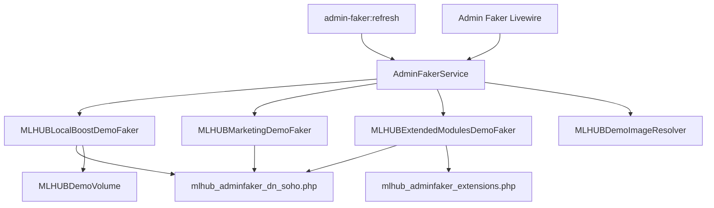

# ARCHITECTURE — Admin Faker (Investor Demo Đà Nẵng)

> Quy ước naming: branding hiển thị luôn dùng **MLHUB** và class/file liên quan cũng đồng bộ theo tiền tố `MLHUB*`.

## 1. Mục đích & disclaimer

Admin Faker tạo **workspace demo liền mạch** cho nhà đầu tư và hộ kinh doanh SOHO tại **Đà Nẵng**: nhiều hồ sơ kinh doanh, chi nhánh, chiến dịch QR, landing page, khách CRM, engagement 6–18 tháng, nội dung marketing site (FAQ, blog, support).

**Disclaimer:** Tên thương hiệu trong `database/seeders/data/mlhub_adminfaker_dn_soho.php` (Mì Quảng 1A, Bé Mặn, Vanda Spa, Highlands, East Meets West Dental, v.v.) chỉ **minh họa giao diện MLHUB**. Không đại diện quan hệ vận hành với thương hiệu thật. Trên slide investor nên ghi *“Dữ liệu mô phỏng”*.

Dữ liệu sau seed **có thể tiếp tục chỉnh sửa** như user thật; chỉ bản ghi có marker/slug demo mới bị xóa khi Clear/Refresh.

---

## 2. Luồng chạy (Coolify — quy trình chuẩn)

Bạn **không cần** cấu hình Admin Faker riêng trên Coolify. Chỉ cần deploy code + env như `.env.example`.

### Trên Coolify (env)

| Biến | Pilot/demo | Production thật |
|------|------------|-----------------|
| `MLHUB_ALLOW_RESET_DEMO` | `true` | `false` |
| `MLHUB_CONTACT_EMAIL` | `demo@mlhub.vn` | email thật |

`MLHUB_ADMIN_FAKER_USER` — **không bắt buộc**; mặc định code = `demo@mlhub.vn`.

### Sau khi deploy

1. **Commit** → push GitHub → Coolify deploy lại.
2. **SSH vào container app** (Laravel):
   ```bash
   php artisan mlhub:reset-demo --force
   ```
   Lệnh này tự: wipe DB → migrate → seed → **admin-faker:refresh** → extras → optimize:clear.
3. **Thoát container**, chạy **Redis** (session/cache/queue) — dùng host/port/password từ Coolify:
   ```bash
   redis-cli -h <REDIS_HOST> -p 6379 -a "<REDIS_PASSWORD>" FLUSHALL
   ```
4. Đăng nhập: **`demo@mlhub.vn` / `123456`** (super admin + demo đầy đủ).

**Thời gian seed ước tính:** 1–4 phút trong container app.

### Lệnh thủ công (hiếm khi cần)

| Lệnh | Khi nào |
|------|---------|
| `php artisan admin-faker:refresh` | Chỉ refresh faker trên DB hiện có (Admin UI) |
| `php artisan mlhub:reset-demo --force` | Reset toàn bộ pilot — **dùng cái này** |

---

## 3. Sơ đồ kiến trúc



---

## 4. Danh sách tính năng đã faker

| ✓ | Module | Model / bảng | Class | File data | Mặc định | Clear |
|---|--------|--------------|-------|-----------|----------|-------|
| ✓ | Hồ sơ KD | `LocalBusiness` | `MLHUBLocalBoostDemoFaker` | `mlhub_adminfaker_dn_soho.php` → `businesses` | **10** | ✓ theo tên |
| ✓ | Chi nhánh | `BusinessLocation` | ↑ | `locations` | **21** | ✓ |
| ✓ | Chiến dịch QR | `QrCampaign` | ↑ | `campaigns` | **32** | ✓ slug `admin-faker-*` |
| ✓ | Landing (campaign) | `LandingPage` | `LandingPageFactory::syncFromCampaign` | ↑ | **32** | ✓ |
| ✓ | Landing độc lập | `LandingPage` | ↑ | `standalone_landing_pages` | **18** | ✓ slug |
| ✓ | Dịch vụ booking | `BookingService` | ↑ | `booking_services` | **12** | ✓ |
| ✓ | Khách hàng | `Customer` | ↑ | `customers` | **120** | ✓ |
| ✓ | Tag CRM | `CustomerTag` | ↑ | (hardcoded 9 tag) | 9 | ✓ pivot |
| ✓ | QR scans | `lb_qr_scans` | `MLHUBDemoVolume` | `campaign_metrics` | ~12k+ visits | ✓ |
| ✓ | Lead | `lb_lead_submissions` | ↑ | ↑ conversions | ~1k+ | ✓ |
| ✓ | Booking | `lb_bookings` | ↑ | ↑ | ~800+ | ✓ |
| ✓ | Coupon | `lb_coupon_redemptions` | ↑ | ↑ | ~900+ | ✓ |
| ✓ | Review | `lb_review_feedbacks` | ↑ | ↑ | ~1k+ | ✓ |
| ✓ | Feedback | `lb_feedback_responses` | ↑ | ↑ | ~600+ | ✓ |
| ✓ | FAQ | `faqs` | `MLHUBMarketingDemoFaker` | `marketing.faqs` + generator | **250** | ✓ `demo-preview-*` |
| ✓ | Blog | `blogs` | ↑ | `marketing.blogs` + generator | **250** (6 danh mục, 8 tag) | ✓ |
| ✓ | Support | `support_tickets` + comments | ↑ | `marketing.support_tickets` | **6** | ✓ `[DEMO]%` |
| ✓ | Affiliate | commissions / withdrawals | ↑ | (code) | 3 + 2 | ✓ marker |
| ✓ | Thông báo global | `notification_manuals` | ↑ | `marketing.global_notifications` | **7** | ✓ `[DEMO]%` |
| ✓ | Email automation | `lb_email_automations` + logs | `MLHUBExtendedModulesDemoFaker` | `mlhub_adminfaker_extensions.php` | **6** + logs | ✓ tên `[DEMO]%` |
| ✓ | CRM nâng cao | activities, tasks, notes, segments, automations | ↑ | ↑ `crm_*` | **~80** KH + 4 segment + 4 automation | ✓ marker / `[DEMO]%` |
| ✓ | Loyalty stamp cards | `lb_loyalty_*` | ↑ | `loyalty_cards` | **4** thẻ + stamps | ✓ slug `admin-faker-%` |
| ✓ | Referral | `lb_referral_*` | ↑ | `referral_campaigns` | **2** chiến dịch + links | ✓ slug `admin-faker-%` |
| ✓ | Template packs | `MarketingTemplate` (system) | ↑ | `TemplatePackService` | system packs | — |
| ✓ | Báo cáo (`AppLocalAnalytics`) | — | (đọc số liệu trên) | — | dashboard đủ số | — |

**Marker:** `DemoMarker::SOURCE` = `admin-faker` trong `settings` / `metadata` / payload engagement.

**Thứ tự seed:** `MLHUBLocalBoostDemoFaker` → `MLHUBMarketingDemoFaker` → `MLHUBExtendedModulesDemoFaker` (cần khách hàng & doanh nghiệp đã có).

---

## 5. Chưa faker / out of scope

| Tính năng | Ghi chú |
|-----------|---------|
| LinkBio, Short links | Không seed (StackPosts legacy) |
| Social publishing / channels | Không có trong MLHUB fork |
| AI Studio / lịch sử AI | Module có; không seed prompt history (tốn credit/API) |
| Google Business Profile sync | Chỉ link review tùy chỉnh trên campaign |
| Upload ảnh mới | `MLHUBDemoImageResolver` tái dùng ảnh user có sẵn |
| Webhook automation / Custom domain | Cấu hình thật theo tenant — không faker |

---

## 6. Persona Đà Nẵng SOHO (chỉnh trong file data)

| Key | Tên demo | Loại | Chi nhánh (trong config) |
|-----|----------|------|---------------------------|
| `mi_quang_1a` | Mì Quảng 1A Đà Nẵng | restaurant | 2 |
| `banh_trang_tran` | Bánh Tráng Cuốn Thịt Heo Trần | restaurant | 2 |
| `be_man_seafood` | Bé Mặn — Hải Sản | restaurant | 2 |
| `vanda_spa` | Vanda Spa | spa | 2 |
| `sen_spa_dn` | Sen Spa | spa | 2 |
| `east_west_dental` | East Meets West Dental | clinic | 2 |
| `highlands_dn` | Highlands Coffee | cafe | 3 |
| `camellia_homestay` | Camellia Homestay & Villa | homestay | 2 |
| `chuong_duong_tour` | Chuồng Dê Tour | tour | 2 |
| `california_gym` | California Fitness | gym | 2 |

Sửa tên/địa chỉ/SĐT tại `businesses` + `locations` trong `mlhub_adminfaker_dn_soho.php`, sau đó `admin-faker:refresh`.

---

## 7. Quy ước đặt tên

| Loại | Quy ước |
|------|---------|
| Chiến dịch QR | slug `admin-faker-{brand}-{type}-...` |
| Landing độc lập | slug `admin-faker-lp-...` |
| Blog / FAQ | slug `demo-preview-...` |
| Support | title `[DEMO] ...` |
| Notification | title `[DEMO] ...` |
| Khách | email `khach.dn.{n}@demo.mlhub.vn` |
| Engagement source | `admin-faker` trong JSON payload |

---

## 8. Checklist show nhà đầu tư (10 bước)

1. Đăng nhập portal user demo (user #1 hoặc `MLHUB_ADMIN_FAKER_USER`).
2. **Dashboard** — tổng visit, lead, hoạt động gần đây.
3. **Hồ sơ kinh doanh** — **11** cơ sở SOHO / hộ kinh doanh Đà Nẵng.
4. **Chi nhánh** — mỗi cơ sở có location; QR design khác nhau.
5. **Chiến dịch QR** — tối thiểu **5** growth-tool / cơ sở (review, lead, coupon, feedback, booking/url).
6. Mở **analytics** 1 campaign review + 1 coupon (volume ~10M tổng).
7. **Landing pages** — sync từ campaign + trang độc lập theo cơ sở.
8. **Khách hàng** — **11.000** CRM (mô phỏng 1–2 năm; ~1.000 khách/cơ sở).
9. Mở **1 funnel live** (URL public campaign) — form review/lead.
10. (Tuỳ chọn) Guest site: FAQ/blog; Admin: support + notification.

---

## 9. Chỉnh volume (không sửa Blade/PHP service)

1. Sửa `database/seeders/data/mlhub_adminfaker_dn_soho.php` (`meta`):
   - `target_qr_visits` — **10000000** (~10M quét; hệ số nhân tự tính từ tổng baseline campaign)
   - `site_count` — **11** cơ sở; `min_campaigns_per_site` — **5**
   - `customer_target` — **11000** (~1k khách/cơ sở, 1–2 năm)
   - `volume_scale` — **20** (CRM, loyalty, affiliate)
   - `engagement_max_days_ago` — **730** (24 tháng timeline)
   - `marketing_faq_target` / `marketing_blog_target` — **250** FAQ + **250** blog (nội dung MLHUB, SOHO, Đà Nẵng)
   - `metrics_multiplier` — fallback nếu `target_qr_visits` = 0
2. Mở rộng runtime: `modules/AdminFaker/Support/MLHUBEnterpriseDemoExpander.php` (thêm cơ sở/campaign/landing thiếu).
3. Chạy: `php artisan admin-faker:refresh` hoặc `php artisan mlhub:reset-demo --force` (chỉ pilot; `MLHUB_ALLOW_RESET_DEMO=true`).

**Lưu ý load-test:** ~**10M** `lb_qr_scans` + hàng triệu lead/booking/review/feedback — seed **20–60 phút**. Pilot: `max_execution_time` ≥ **3600**, `memory_limit` ≥ **1024M**, MySQL buffer pool lớn, disk đủ.

---

## 10. Đồng bộ ngược với `mlhub_demo_vn.php`

| File | Vai trò |
|------|---------|
| `mlhub_adminfaker_dn_soho.php` | **Admin Faker** — investor demo Đà Nẵng (user #1) |
| `mlhub_demo_vn.php` | **LocalBoostDemoSeeder** / `mlhub:reset-demo` — user `demo@mlhub.vn`, 3 business mẫu VN |

Khi đổi metric engagement dùng chung, cập nhật **cả hai** hoặc chỉ `campaign_metrics` trong file tương ứng. `MLHUBDemoVolume` đọc `mlhub_demo_vn.php`; Admin Faker dùng `MLHUBAdminFakerConfig::metricsForSlug()` từ file DN SOHO.

---

## 11. File map

```
modules/AdminFaker/Support/
  AdminFakerService.php          # orchestrator
  MLHUBLocalBoostDemoFaker.php   # portal LocalBoost
  MLHUBMarketingDemoFaker.php    # FAQ, blog, support, affiliate
  MLHUBAdminFakerConfig.php      # load data + slug helpers
  MLHUBEnterpriseDemoExpander.php # 11 cơ sở, ≥5 campaign/cơ sở, target QR
  MLHUBMarketingContentGenerator.php # 200–300 FAQ/blog MLHUB SOHO Đà Nẵng
  MLHUBDemoImageResolver.php
  DemoMarker.php

database/seeders/data/
  mlhub_adminfaker_dn_soho.php   # ← chỉnh demo tại đây

database/Support/MLHUBDemoVolume.php  # bulk QR / engagement
```

---

## 12. Kiểm thử

```bash
php artisan admin-faker:refresh
php artisan optimize:clear
```

- [ ] Portal: ≥ 10 businesses, ≥ 30 campaigns
- [ ] Clear → seed lại: không lỗi FK
- [ ] Chạy 2 lần `--no-clear`: không duplicate slug

*Ghi chú CI/local: môi trường dev cần PHP + DB đã migrate.*
