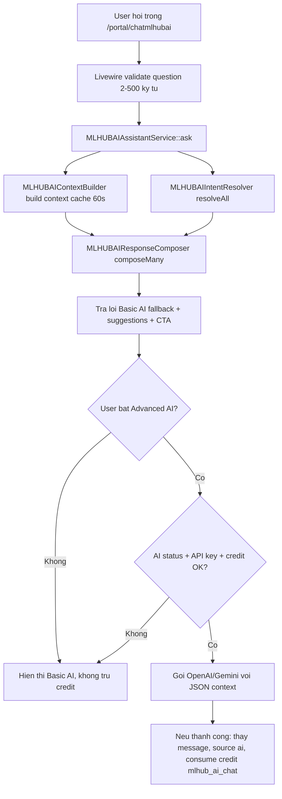

# MLHUBAI - Bao cao kien truc, tu khoa va ma tran noi dung

> Ngay quet: 2026-06-20  
> Cap nhat P0: 2026-06-21 - P0 da duoc duyet va da trien khai.  
> Pham vi: tinh nang `MLHUB AI Assistant` tai `/portal/chatmlhubai`, Basic AI khong dung token OpenAI/Gemini, Advanced AI co the dung OpenAI/Gemini neu bat va co API key.  
> Trang thai: da quet, lap ma tran noi dung, va nang cap P0 cho Basic AI.

---

## 1. Ket luan nhanh

Tinh nang MLHUBAI hien da co khung kha dung cho giai doan "tro ly noi bo khong ton token":

- Co route rieng: `/portal/chatmlhubai`, route name `portal.chatmlhubai`.
- Co widget compact tren dashboard thong qua `MLHUBAIDashboardPanel`.
- Co 2 che do:
  - `Basic AI`: nhan dien intent bang tu khoa, doc so lieu that, ghep cau tra loi bang template, khong dung credit/token.
  - `Advanced AI`: chi goi OpenAI/Gemini khi user bat toggle, he thong co API key, va credit con du.
- Co context builder doc metrics that: business, campaign, active campaign, visits, leads, bookings, coupon claims, feedback, conversion rate, khach moi, review, top campaigns, recent activity.
- Co CTA link theo intent: customers, QR campaigns, review booster, reports, businesses, AI Studio.

Tuy nhien, de Basic AI tra loi "muot" nhu tro ly hang ngay, code hien tai moi phu lop loi cua dashboard. Bo intent hien tai co 8 nhom, 76 cum tu khoa, 5 cau hoi goi y dau tien, va 21 cau hoi dao sau. Trong khi san pham hien co nhieu module lien quan hon: landing pages, booking, coupon, feedback, lead forms, CRM, Google Business, automation, loyalty/referral, file manager, credit, billing, team, support, AI Studio chi tiet. Neu user hoi cac chu de nay, Basic AI de roi vao cau fallback "I did not quite catch that".

Khuyen nghi: truoc khi dung token LLM, nen mo rong Basic AI thanh mot "knowledge router" noi bo: intent matrix + metric matrix + URL matrix + question bank + response segment bank. Cac de xuat code nam o cuoi file va can duoc duyet truoc khi lam.

---

## 2. Ban do code hien tai

| Lop | File | Vai tro hien tai | Ghi chu danh gia |
| --- | --- | --- | --- |
| Route | `modules/CustomMLHUB/Routes/web.php` | Dang ky `/portal/chatmlhubai`, middleware `web`, `auth`, `verified`; route name `portal.chatmlhubai`. | Dung route user portal, can plan feature gate o Livewire. |
| Config | `modules/CustomMLHUB/config/config.php` | Khai bao `route_prefix => portal/chatmlhubai`. | On dinh, de doi prefix neu can. |
| Provider | `modules/CustomMLHUB/Providers/CustomMLHUBServiceProvider.php` | Bind service singleton, load route/view, register credit action `mlhub_ai_chat`, them sidebar item. | Sidebar chi hien khi user co feature `mlhub`. |
| Livewire full page | `modules/CustomMLHUB/Livewire/ChatMLHUBAI.php` | Trang chat full. | Mount assistant va render view `custommlhub::chat`. |
| Livewire compact | `modules/CustomMLHUB/Livewire/MLHUBAIDashboardPanel.php` | Panel chat compact tren dashboard. | Neu khong co feature `mlhub` thi an panel. |
| Shared trait | `modules/CustomMLHUB/Livewire/Concerns/InteractsWithMLHUBAIAssistant.php` | Quan ly messages, question, suggested prompts, toggle Advanced AI, validate cau hoi 2-500 ky tu. | Chua luu lich su chat dai han, moi ton tai trong state Livewire. |
| Service | `modules/CustomMLHUB/Support/MLHUBAIAssistant/MLHUBAIAssistantService.php` | Orchestrator: build context, resolve intent, compose fallback, neu advanced thi goi OpenAI/Gemini va tru credit. | Basic AI dung truoc, Advanced AI la lop tang cuong. |
| Intent resolver | `modules/CustomMLHUB/Support/MLHUBAIAssistant/MLHUBAIIntentResolver.php` | So khop keyword bang `str_contains`, tinh confidence don gian. | Keyword hien tai con mong, chua normalize khong dau/fuzzy typo tu dong. |
| Context builder | `modules/CustomMLHUB/Support/MLHUBAIAssistant/MLHUBAIContextBuilder.php` | Gom snapshot so lieu user trong cache 60 giay. | Da doc nhieu bang growth core, chua doc sau CRM/Google/automation/billing. |
| Response composer | `modules/CustomMLHUB/Support/MLHUBAIAssistant/MLHUBAIResponseComposer.php` | Ghep cau tra loi theo intent, them greeting, CTA action. | Co cau tra loi ngan gon, nhung moi co 7 intent nghiep vu. |
| UI | `modules/CustomMLHUB/Resources/views/partials/chat-shell.blade.php` | Chat shell, toggle Basic/Advanced, message bubbles, action buttons, suggested prompts. | UI da noi ro Basic AI khong ton credits; Advanced AI can API key va credit. |

---

## 3. Luong xu ly hien tai

Nguyen tac tot da co:

- Basic AI luon tao cau tra loi truoc, nen khi API loi van co ket qua.
- Advanced AI duoc rang buoc boi `ai_chat_status`, provider credentials, va credit.
- System prompt Advanced AI yeu cau chi dung so lieu trong JSON context, khong bia metrics.
- Actions chi tao neu `Route::has($routeName)`.

Diem can canh giac:

- Model mac dinh trong service dang la `gpt-5.4`. Can doi chieu voi cau hinh that truoc khi bat Advanced AI production.
- Neu user hoi ngoai 7 intent nghiep vu hien co, Basic AI khong co "tri thuc san pham" de tra loi.
- Fallback khong log coverage/confidence, nen kho biet user dang hoi nhom nao bi thieu.

---

## 4. Hien trang Basic AI

### 4.1 Chi so hien tai

| Chi so | Gia tri hien tai | Nguon |
| --- | ---: | --- |
| Intent tong | 8 | `greeting`, `new_customers`, `campaigns`, `reviews`, `next_steps`, `overview`, `visits`, `businesses` |
| Intent nghiep vu co cau tra loi rieng | 7 | Tru `greeting`; unknown dung fallback chung. |
| Cum keyword hien tai | 76 | Dem tu `intentKeywords()`. |
| Cau hoi goi y ban dau | 5 | `initialPrompts()`. |
| Cau hoi dao sau cung topic | 21 | 7 nhom x 3 cau. |
| Explore prompts | 6 | Pool cau hoi de chuyen chu de. |
| CTA route groups | 7 | customers, qr-campaigns, review-booster, reports, businesses, ai-studio. |
| Cache context | 60 giay | `MLHUBAIContextBuilder::CACHE_TTL_SECONDS`. |
| Gioi han input | 2-500 ky tu | Livewire validation. |

### 4.2 Intent va keyword hien tai

| Intent | Keyword hien tai | Cau hoi goi y/follow-up hien tai | Metrics/Context dang dung | CTA hien tai |
| --- | --- | --- | --- | --- |
| `greeting` | xin chào, xin chao, chào, chao, hello, helo, hallo, alo, hi bạn, hi ban | Khong co follow-up rieng; dung initial prompts. | `generated_at`, `user.short_name`. | Khong co. |
| `new_customers` | khách mới, khach moi, customer mới, new customer, khách hàng mới, tuần này có khách, tuan nay co khach, có khách mới, co khach moi | "Where did the new customers come from?", "How does it compare to last week?", "How can I get more new customers?" | `customers.new_this_week`, `customers.new_last_week`, `customers.delta`, `weekly_signals.leads/bookings/positive_reviews`. | `portal.customers`. |
| `campaigns` | chiến dịch, chien dich, campaign, đang chạy, dang chay, tổng hợp chiến dịch, tong hop chien dich, running campaign | "Which campaign performs best?", "Which campaign needs improvement?", "How do I create a new campaign?" | `active_campaigns`, `campaign.type`, `visits`, `conversions`. | `portal.qr-campaigns`. |
| `reviews` | đánh giá, danh gia, review, sao, rating, phản hồi review, đánh giá tuần, danh gia tuan | "Which reviews need a reply?", "How can I get more 5-star reviews?", "What is my average rating?" | `reviews.count`, `reviews.average_rating`, `reviews.needs_reply`, `reviews.positive_count`. | `portal.review-booster`. |
| `next_steps` | làm gì, lam gi, gợi ý, goi y, next step, what should i do, chiến dịch mới, chien dich moi, đề xuất, de xuat, nên làm | "Suggest a weekend campaign", "What should I prioritize first?", "How can I grow revenue quickly?" | `onboarding`, `metrics.visits`, `metrics.review_clicks`. | Tuy onboarding: businesses, qr-campaigns, review-booster, ai-studio. |
| `overview` | tổng quan, tong quan, overview, báo cáo, bao cao, report, tình hình, tinh hinh, kết quả, ket qua | "Which metric is dropping?", "What stood out this week?", "What should I do next? / Suggest a new campaign." | `metrics.businesses`, `active_campaigns`, `visits`, `leads`, `bookings`, `coupon_claims`, `conversion_rate`. | `portal.reports`. |
| `visits` | lượt quét, luot quet, qr scan, lượt truy cập, luot truy cap, visits, traffic | "Where do the visits come from?", "What is my conversion rate?", "How can I get more QR scans?" | `metrics.visits`, `weekly_signals.qr_scans`, `weekly_signals.leads`, `weekly_signals.bookings`. | `portal.reports`. |
| `businesses` | cơ sở, co so, danh sách cơ sở, danh sach co so, doanh nghiệp, doanh nghiep, business, chi nhánh, chi nhanh, cửa hàng, cua hang, địa điểm, dia diem | "Which business performs best?", "How do I add a new business?", "Where do I update business info?" | `business_list.count`, `business_list.names`. | `portal.businesses`. |

### 4.3 Context metrics hien co

| Context key | Noi dung | Nguon | Do san sang cho Basic AI |
| --- | --- | --- | --- |
| `metrics.businesses` | So business cua user | `LocalBusiness` | San sang |
| `metrics.campaigns` | Tong campaign | `QrCampaign` | San sang |
| `metrics.active_campaigns` | Campaign da publish | `QrCampaign.published_at` | San sang |
| `metrics.visits` | Tong QR scan | `QrScan` | San sang, can loc bot trong backlog rieng |
| `metrics.review_clicks` | Review feedback rating >= 4 | `ReviewFeedback` | San sang |
| `metrics.leads` | Lead submissions | `LeadSubmission` | San sang |
| `metrics.bookings` | Bookings | `Booking` | San sang |
| `metrics.coupon_claims` | Coupon redemptions | `CouponRedemption` | San sang |
| `metrics.feedback` | Feedback response + review rating <= 3 | `FeedbackResponse`, `ReviewFeedback` | San sang |
| `metrics.conversion_rate` | Conversions / visits | Tong hop noi bo | San sang |
| `customers.*` | Khach moi tuan nay, tuan truoc, delta | `Customer` | San sang |
| `weekly_signals.*` | leads, bookings, positive reviews, coupon claims, QR scans trong tuan | Nhieu model growth | San sang |
| `reviews.*` | Count, average rating, needs reply, positive count trong tuan | `ReviewFeedback` | San sang |
| `active_campaigns[]` | 6 campaign da publish gan nhat, type, visits, conversions | `QrCampaign`, conversions tong hop | San sang |
| `top_campaigns[]` | Top 5 campaign theo visits/conversions | `PortalGrowthDashboardMetrics` | Co trong context nhung chua duoc response composer khai thac sau |
| `recent_activity[]` | 5 activity gan nhat | `PortalGrowthDashboardMetrics` | Co trong context nhung chua duoc response composer khai thac sau |
| `business_list` | Count va toi da 12 ten business | `LocalBusiness` | San sang |
| `onboarding` | create_business, create_campaign, publish_campaign, share_qr, boost_reviews | Derived tu metrics | San sang |

---

## 5. Danh gia "da quet het ngoc ngach chua?"

### 5.1 Da cham dung cac ngoc ngach cua rieng tinh nang chat

| Khu vuc | Ket qua |
| --- | --- |
| Route `/portal/chatmlhubai` | Da co va dung middleware auth/verified. |
| Sidebar portal | Da dang ky item `MLHUB AI Assistant`, chi hien khi user co feature `mlhub`. |
| Dashboard panel | Da co compact chat panel va link mo full chat. |
| Basic/Advanced toggle | Da co UI va logic. Basic khong dung credit. Advanced can API key va credit. |
| Context live data | Da gom data that tu dashboard/growth modules. |
| Intent matching | Da co nhung con don gian. |
| Response templates | Da co nhung phu it chu de. |
| CTA action | Da co nhung it route lien quan. |
| Credit | Advanced AI moi tru `mlhub_ai_chat`. |
| Test rieng cho MLHUBAI | Chua thay test trong `tests/` cho resolver/composer/service. |

### 5.2 Chua bao phu het "ngoc ngach san pham"

Nhung nhom sau co route/module hien huu nhung chua co intent rieng, keyword rieng, cau hoi rieng hoac response segment rieng trong Basic AI:

- Landing Pages
- Review Booster chi tiet: review link, negative feedback, pending replies
- Booking pages: lich hen, service, slot, booking conversion
- Coupon campaigns: ma da phat, usage limit, coupon claims
- Feedback forms: private feedback, low rating, NPS
- Lead forms: source lead, lead quality, follow-up
- Business locations
- Customers chi tiet, segmentation, duplicate/merge
- Advanced CRM: segments, tags, tasks, automations, reports
- Google Business Profile: OAuth, locations, Google reviews, auto reply, posts, insights
- Email/WhatsApp/Webhook automation
- Loyalty cards va referral campaigns
- File manager, media search, image editor
- AI Studio chi tiet: Campaign Builder, Content Writer, Repurpose, Planner, AI Image, Prompt History, Settings
- Credits, billing, packages, invoices
- Teams/workspace
- Support tickets
- Profile/security/language
- Public URLs: `/qr/{slug}`, `/lp/{slug}`, `/b/{business}`, `/l/{location}`, loyalty/referral URLs

Nhan dinh: code hien tai "vibecode" da lam du khung chay va phu core dashboard, nhung chua lap thanh bo tri thuc san pham day du. De MLHUBAI giong tro ly thong bao moi ngay, can bo sung ma tran noi dung truoc khi dung LLM.

---

## 6. Ma tran URL tinh nang lien quan

| Nhom | Route name | URL/prefix | Basic AI nen hieu de tra loi | Trang thai trong Basic AI hien tai |
| --- | --- | --- | --- | --- |
| MLHUBAI | `portal.chatmlhubai` | `/portal/chatmlhubai` | Mo tro ly, giai thich Basic/Advanced AI | Co UI, chua co intent "how_to_use_ai". |
| Dashboard | `portal.dashboard` | `/portal/dashboard` | Tong quan ngay, onboarding, widgets | Dung metrics, chua CTA truc tiep trong composer. |
| Businesses | `portal.businesses` | `/portal/businesses` | Tao/sua business, danh sach co so | Da co intent `businesses`. |
| Business create | `portal.businesses.create` | `/portal/businesses/create` | Huong dan tao business dau tien | Chi co onboarding CTA chung. |
| Business detail | `portal.businesses.show` | `/portal/businesses/{business}` | Ho so, campaign, reviews, leads, reports cua tung business | Chua co intent theo business detail. |
| Locations | `portal.businesses.locations`, `portal.locations` | `/portal/businesses/{business}/locations`, `/portal/locations` | Chi nhanh/dia diem/QR dia diem | Chua co intent rieng. |
| Customers | `portal.customers` | `/portal/customers` | Danh sach khach, khach moi | Co `new_customers`, nhung chua co lifecycle/segment. |
| CRM | `portal.crm.*` | `/portal/crm/...` | Segment, tag, task, automation, CRM report | Chua co intent. |
| QR Campaigns | `portal.qr-campaigns` | `/portal/qr-campaigns` | Tao QR, xem analytics QR | Co `campaigns`/`visits`, con mong. |
| QR Analytics | `portal.qr-campaigns.analytics` | `/portal/qr-campaigns/{slug}/analytics` | Campaign nao tot/xau | Chua CTA analytics cu the. |
| Public QR | `qr-campaigns.public` | `/qr/{campaign}` | Link cong khai khach quet | Chua co intent ve public link. |
| Landing Pages | `portal.landing-pages` | `/portal/landing-pages` | Tao campaign page, form submit | Chua co intent. |
| Public landing | `landing-pages.public` | `/lp/{slug}` | Link landing public | Chua co intent. |
| Review Booster | `portal.review-booster` | `/portal/review-booster` | Lay review, review xau, pending reply | Co `reviews` nhung chua sau. |
| Booking | `portal.booking-pages` | `/portal/booking-pages` | Lich hen, dich vu, slot trong | Chua co intent rieng, chi tinh booking count. |
| Coupon | `portal.coupon-campaigns` | `/portal/coupon-campaigns` | Ma uu dai, claim, gioi han | Chua co intent rieng, chi tinh coupon claims. |
| Feedback | `portal.feedback-forms` | `/portal/feedback-forms` | Phan hoi rieng, diem thap, NPS | Chua co intent rieng, chi tinh feedback count. |
| Lead Forms | `portal.lead-forms` | `/portal/lead-forms` | Lead, form, follow-up | Chua co intent rieng, chi tinh leads. |
| Reports | `portal.reports` | `/portal/reports` | Bao cao, conversion, top campaign | Co `overview`/`visits`, chua dung top_campaigns/recent_activity sau. |
| Marketing Templates | `portal.marketing-templates` | `/portal/marketing-templates` | Mau noi dung, template | Chua co intent. |
| AI Studio | `portal.ai-studio` | `/portal/ai-studio` | Campaign Builder | Chi CTA trong `next_steps`, chua co intent. |
| AI Review Reply | `portal.ai-studio.review-reply` | `/portal/ai-studio/review-reply` | Viet phan hoi review bang AI | Chua co intent. |
| AI Content | `portal.ai-content` | `/portal/ai-studio/ai-content` | Viet caption/content | Chua co intent. |
| AI Planner | `portal.ai-content-planner` | `/portal/ai-studio/planner` | Ke hoach noi dung | Chua co intent. |
| AI Repurpose | `portal.ai-repurpose` | `/portal/ai-studio/repurpose` | Tai su dung noi dung | Chua co intent. |
| AI Image | `portal.ai-image` | `/portal/ai-studio/image` | Tao anh AI | Chua co intent. |
| Prompt history | `portal.ai-studio.prompt-history` | `/portal/ai-studio/prompt-history` | Lich su prompt | Chua co intent. |
| AI settings | `portal.ai-studio.settings` | `/portal/ai-studio/settings` | Cau hinh AI workspace/user | Chua co intent. |
| AI removed modules | `portal.ai-video`, `portal.ai-review`, `portal.ai-best-time`, `portal.ai-semantic-search` | Route files co tren dia nhung providers khong load route | Khong nen goi y trong UI neu provider da remove surface | Chua can intent, nen ghi la khong kha dung. |
| Google Business | `portal.google-business` | `/portal/integrations/google-business` | Google locations, reviews, posts, insights, auto reply | Chua co intent. |
| Email Automation | `portal.email-*` | `/portal/email-automation/...` | Email automation/template/log | Chua co intent. |
| WhatsApp | `portal.whatsapp-*` | `/portal/whatsapp-notification/...` | WhatsApp automation/template/log | Chua co intent. |
| Webhook | `portal.webhook-*` | `/portal/webhook-automation/...` | Webhook automation/log | Chua co intent. |
| Loyalty | `portal.loyalty-cards` | `/portal/loyalty-cards` | The tich diem, referral | Chua co intent. |
| Files | `portal.files.index` | `/portal/files` | Thu vien file, preview/download/edit image | Chua co intent. |
| Credits | `portal.credits` | `/portal/credits` | Credit con lai, lich su dung | Chua co intent trong chat. |
| Packages | `portal.packages` | `/portal/packages` | Nang cap goi | Chua co intent. |
| Billing | `portal.billing`, `portal.invoices` | `/portal/billing`, `/portal/invoices` | Hoa don, subscription | Chua co intent. |
| Teams | `portal.teams` | `/portal/teams` | Workspace, team members | Chua co intent. |
| Support | `portal.support.index` | `/portal/support` | Ticket ho tro | Chua co intent. |
| Profile | `portal.profile` | `/portal/profile` | Ho so, mat khau | Chua co intent. |
| Affiliate | `portal.affiliate.index` | `/portal/affiliate` | Affiliate/referral revenue | Chua co intent. |
| Custom domains | `portal.brand.domains`, `portal.qr-codes.domains` | `/portal/brand/custom-domains`, `/portal/qr-codes/domains` | Ten mien rieng cho QR/campaign | Chua co intent. |

---

## 7. Ma tran intent de bo sung

Bang nay la "content matrix" de Basic AI tra loi muot hon ma chua can OpenAI token. Nen tach ra file config/data rieng khi duoc duyet.

| Intent de xuat | Tu khoa nen them | Cau hoi mau nen them | Metrics/du lieu can doc | CTA/URL lien quan | Uu tien |
| --- | --- | --- | --- | --- | --- |
| `help_using_mlhubai` | mlhub ai, trợ lý, assistant, basic ai, advanced ai, không tốn token, credit, hỏi gì được, cách dùng | "MLHUB AI hỏi được những gì?", "Basic AI có tốn credit không?", "Khi nào cần Advanced AI?" | `advancedAvailable`, credit summary neu co | `portal.chatmlhubai`, `portal.credits`, `portal.ai-studio.settings` | P0 |
| `daily_briefing` | hôm nay, sáng nay, báo cáo ngày, daily, briefing, hôm qua, tuần này, cần chú ý | "Sáng nay tình hình thế nào?", "Hôm nay tôi nên xem chỉ số nào?", "Có gì bất thường không?" | metrics, weekly_signals, recent_activity, top_campaigns | `portal.dashboard`, `portal.reports` | P0 |
| `onboarding` | bắt đầu, setup, chưa có dữ liệu, tạo đầu tiên, cần làm gì trước, hướng dẫn | "Tôi mới tạo tài khoản thì làm gì trước?", "Tại sao dashboard chưa có số liệu?" | onboarding hints | businesses/create, qr-campaigns, review-booster | P0 |
| `business_locations` | chi nhánh, địa điểm, location, cơ sở con, mã QR địa điểm, cửa hàng nào | "Có bao nhiêu chi nhánh?", "Thêm địa điểm ở đâu?", "Mở QR của địa điểm thế nào?" | LocalBusiness + BusinessLocation count | `portal.businesses.locations`, `portal.locations` | P1 |
| `customers` | khách hàng, khách cũ, khách quay lại, danh bạ, data khách, customer list | "Có bao nhiêu khách?", "Khách mới đến từ đâu?", "Tôi nên chăm sóc nhóm khách nào?" | Customer count, new/returning, source, recent activity | `portal.customers`, `portal.crm.customers` | P0 |
| `customer_followup` | chăm sóc lại, follow up, nhắc khách, khách cũ, quay lại, gửi tin | "Nhắc khách quay lại như thế nào?", "Nên gửi ưu đãi cho nhóm nào?" | customers, CRM segments, email/whatsapp availability | CRM, email, whatsapp, coupon | P1 |
| `top_campaigns` | chiến dịch tốt nhất, top campaign, hiệu quả nhất, kém nhất, cần cải thiện | "Chiến dịch nào đang tốt nhất?", "Chiến dịch nào cần sửa?", "Tại sao conversion thấp?" | top_campaigns, active_campaigns, conversion_rate | `portal.qr-campaigns.analytics`, `portal.reports` | P0 |
| `qr_scans` | quét QR, scan, mã QR, lượt quét, in mã, đặt mã ở đâu | "Lượt quét tuần này thế nào?", "Làm sao tăng QR scan?", "Mã QR nằm ở đâu?" | visits, weekly qr_scans, campaign public URL | `portal.qr-campaigns`, public QR links | P0 |
| `landing_pages` | landing page, trang chiến dịch, trang công khai, public page, link campaign | "Tạo landing page ở đâu?", "Trang nào đang có form submit?", "Copy link public thế nào?" | landing page count/status/submissions if available | `portal.landing-pages`, `/lp/{slug}` | P1 |
| `review_booster` | review booster, xin đánh giá, đánh giá google, 5 sao, rating thấp, phản hồi riêng | "Làm sao tăng đánh giá 5 sao?", "Có review nào cần trả lời không?", "Review xấu xử lý thế nào?" | review stats, needs_reply, positive/private feedback | `portal.review-booster`, `portal.google-business?tab=reviews` | P0 |
| `google_reviews` | google review, đánh giá google, trả lời review, sync review, auto reply | "Đồng bộ Google review chưa?", "Review Google nào cần trả lời?", "Auto reply đang bật chưa?" | GoogleBusiness connection, reviews, rules | `portal.google-business?tab=reviews`, `?tab=auto_reply` | P1 |
| `booking` | đặt lịch, booking, lịch hẹn, slot, dịch vụ, khách đặt | "Hôm nay có lịch hẹn không?", "Tạo trang đặt lịch thế nào?", "Dịch vụ nào được đặt nhiều?" | bookings this week, service count, upcoming bookings | `portal.booking-pages` | P0 |
| `coupon` | coupon, mã giảm giá, voucher, ưu đãi, claim, khách nhận mã | "Có bao nhiêu khách nhận mã?", "Tạo voucher cuối tuần thế nào?", "Mã nào gần hết lượt?" | coupon_claims, campaign settings usage/expiry | `portal.coupon-campaigns` | P0 |
| `feedback` | feedback, phản hồi riêng, góp ý, khách không hài lòng, NPS, rating thấp | "Có phản hồi xấu nào không?", "Khách phàn nàn gì nhiều?", "Nên xử lý feedback thế nào?" | feedback count, low rating, recent feedback themes if available | `portal.feedback-forms`, reports | P0 |
| `leads` | lead, khách tiềm năng, form tư vấn, yêu cầu báo giá, số điện thoại mới | "Có lead mới không?", "Lead từ form nào?", "Nên follow up lead nào trước?" | leads this week, recent lead activity, campaign source | `portal.lead-forms`, `portal.businesses.leads` | P0 |
| `conversion` | chuyển đổi, conversion, tỉ lệ, hiệu suất, funnel, scan ra khách | "Tỉ lệ chuyển đổi bao nhiêu?", "Tại sao scan nhiều mà ít lead?", "Nên tối ưu bước nào?" | visits, conversions, conversion_rate, top_campaigns | `portal.reports` | P0 |
| `reports` | báo cáo, analytics, report, biểu đồ, chỉ số, dashboard | "Mở báo cáo ở đâu?", "Báo cáo tuần này có gì?", "Chỉ số nào giảm?" | metrics, top_campaigns, recent_activity | `portal.reports` | P0 |
| `ai_studio` | ai studio, campaign builder, tạo nội dung, viết caption, prompt, lịch sử prompt | "AI Studio làm được gì?", "Tạo nội dung chiến dịch ở đâu?", "Xem lại prompt cũ thế nào?" | credit summary, route availability, prompt history count if available | `portal.ai-studio`, `portal.ai-content`, `portal.ai-studio.prompt-history` | P1 |
| `ai_content_writer` | content writer, caption, bài viết, nội dung facebook, bài quảng cáo, CTA | "Viết caption cho ưu đãi cuối tuần", "Tạo CTA cho landing page", "Viết tin nhắn nhắc khách" | business profile, campaign type, brand voice if available | `portal.ai-content` | P1 |
| `ai_planner` | content planner, lịch nội dung, kế hoạch bài đăng, calendar | "Lập kế hoạch nội dung 7 ngày", "Tuần này đăng gì?" | campaign/business context, AI credit | `portal.ai-content-planner` | P2 |
| `ai_image` | ảnh AI, tạo ảnh, image, banner, poster, visual | "Tạo ảnh khuyến mãi ở đâu?", "AI image có tốn credit không?" | AI image jobs, credits | `portal.ai-image`, `portal.files.index` | P2 |
| `credits` | credit, token, số dư, hết credit, mua thêm, usage | "Tôi còn bao nhiêu credit?", "Basic AI có trừ credit không?", "Mua thêm credit ở đâu?" | credit_summary, plan permission cost | `portal.credits`, `portal.packages` | P0 |
| `billing` | thanh toán, hóa đơn, invoice, gói, nâng cấp, subscription | "Nâng cấp gói ở đâu?", "Xem hóa đơn ở đâu?", "Gói hiện tại giới hạn gì?" | plan usage, billing status, invoices | `portal.packages`, `portal.billing`, `portal.invoices` | P1 |
| `plan_limits` | giới hạn, limit, gói hiện tại, tối đa, quota, hết lượt | "Tôi còn tạo được bao nhiêu campaign?", "Vì sao không tạo được QR?", "Gói Free giới hạn gì?" | PlanLimitGuard usageSummary | dashboard planUsage, packages | P0 |
| `files` | file, media, ảnh, upload, thư viện, drive, dropbox, onedrive, edit image | "Upload ảnh ở đâu?", "Tìm ảnh online thế nào?", "Dung lượng còn bao nhiêu?" | storage usage, file count, plan limits | `portal.files.index`, `portal.files.search-online` | P2 |
| `crm_segments` | CRM, segment, phân nhóm, tag, task, ghi chú, automation CRM | "Phân nhóm khách thế nào?", "Tạo task chăm sóc khách ở đâu?", "CRM automation là gì?" | CRM counts, segments/tags/tasks/automation | `portal.crm.*` | P1 |
| `google_business` | Google Business, GBP, location google, bài đăng google, insight | "Kết nối Google Business ở đâu?", "Có sync review chưa?", "Đăng bài Google thế nào?" | connection count, location count, review sync, posts | `portal.google-business` | P1 |
| `email_automation` | email automation, email template, email log, gửi email tự động | "Tạo email chăm sóc lại ở đâu?", "Email có gửi lỗi không?" | automation count, templates, logs, SMTP status if available | `portal.email-automations`, `portal.email-logs` | P2 |
| `whatsapp_automation` | whatsapp, tin nhắn, cloud api, template whatsapp, log | "Gửi WhatsApp tự động thế nào?", "WhatsApp còn giới hạn gì?" | whatsapp limits/logs | `portal.whatsapp-notifications` | P2 |
| `webhook_automation` | webhook, zapier, automation ngoài, API, retry | "Kết nối Zapier/webhook ở đâu?", "Webhook lỗi xem ở đâu?" | webhook automations/logs | `portal.webhook-automations`, `portal.webhook-logs` | P2 |
| `loyalty_referral` | loyalty, tích điểm, thẻ thành viên, referral, giới thiệu bạn bè | "Tạo thẻ tích điểm ở đâu?", "Chiến dịch giới thiệu hoạt động thế nào?" | loyalty card/referral counts | `portal.loyalty-cards` | P2 |
| `custom_domains` | tên miền riêng, custom domain, domain QR, branded link | "Gắn tên miền riêng ở đâu?", "Domain đã verify chưa?" | custom domain status/count | `portal.brand.domains`, `portal.qr-codes.domains` | P2 |
| `teams` | team, workspace, thành viên, phân quyền, mời người | "Mời nhân viên vào workspace thế nào?", "Đổi workspace ở đâu?" | team members, workspace role | `portal.teams` | P1 |
| `support` | hỗ trợ, ticket, liên hệ, lỗi, cần giúp | "Gửi ticket hỗ trợ ở đâu?", "Tôi cần báo lỗi" | ticket count/status if available | `portal.support.index` | P1 |
| `profile_security` | hồ sơ, mật khẩu, đổi email, bảo mật, 2FA, ngôn ngữ | "Đổi mật khẩu ở đâu?", "Đổi ngôn ngữ thế nào?" | user profile, locale | `portal.profile`, language route | P2 |
| `unknown` | fallback | "Bạn có thể hỏi lại theo một trong các nhóm: khách, chiến dịch, review, booking..." | none | suggested prompts | P0 |

---

## 8. Bo cau hoi de MLHUBAI goi y

### 8.1 Starter prompts nen thay/bo sung

Hien co 5 cau bang tieng Anh. Nen bo sung ban tieng Viet hoac dam bao translation co day du:

| Nhom | Cau hoi nen co |
| --- | --- |
| Tong quan | "Sáng nay tình hình kinh doanh thế nào?" |
| Tong quan | "Tóm tắt nhanh tuần này cho tôi." |
| Hanh dong | "Hôm nay tôi nên ưu tiên việc gì?" |
| Khach hang | "Tuần này có khách mới không?" |
| Campaign | "Chiến dịch nào đang hiệu quả nhất?" |
| QR | "Lượt quét QR tuần này thế nào?" |
| Review | "Có đánh giá nào cần trả lời không?" |
| Booking | "Có lịch hẹn mới nào không?" |
| Lead | "Có lead mới nào cần chăm sóc không?" |
| Coupon | "Voucher/coupon nào đang được nhận nhiều?" |
| Feedback | "Có phản hồi xấu nào cần xử lý không?" |
| Plan/Credit | "Basic AI có tốn credit không?" |

### 8.2 Question bank theo ngữ cảnh

| Trang thai du lieu | Cau hoi nen goi y | Dinh huong tra loi |
| --- | --- | --- |
| Chua co business | "Tôi cần làm gì để bắt đầu?" | Them business truoc, roi tao campaign/QR. |
| Co business, chua co campaign | "Nên tạo chiến dịch đầu tiên loại nào?" | Review Booster neu shop dich vu/F&B, lead form neu can tu van, coupon neu can quay lai. |
| Co campaign, chua publish | "Làm sao đưa campaign ra public?" | Publish campaign/landing, copy link/QR. |
| Co publish, chua co scan | "Tại sao chưa có lượt quét?" | Dat QR o quay, ban, hoa don, tin nhan; kiem tra public link. |
| Scan cao, conversion thap | "Scan nhiều nhưng ít khách để lại thông tin, nên làm gì?" | Kiem tra CTA, form ngan hon, uu dai ro hon, review/coupon/lead split. |
| Nhieu review tot | "Làm sao tận dụng review tốt?" | Reply, dung trong landing/social, Google Business post. |
| Nhieu feedback xau | "Phản hồi xấu đang nói gì?" | Uu tien xu ly, dung private feedback, tao task CRM. |
| Nhieu lead | "Lead nào cần gọi trước?" | Uu tien lead gan nhat/tu campaign co y dinh cao. |
| Het credit | "Hết credit thì Basic AI còn dùng được không?" | Basic AI van dung duoc; Advanced AI/AI Studio can credit. |
| Sap vuot plan limit | "Tôi còn tạo được bao nhiêu campaign/QR?" | Doc plan usage, goi y nang cap neu gan het. |

### 8.3 Cau hoi ban ngay theo vai tro "tro ly thong bao moi ngay"

| Thoi diem | Cau hoi/chu de | Response segment nen ghep |
| --- | --- | --- |
| Sang | "Chào buổi sáng, hôm nay tôi cần xem gì?" | Greeting + yesterday/this week snapshot + 1 rui ro + 1 next action. |
| Truoc gio mo cua | "Có lịch hẹn hay lead nào cần chuẩn bị không?" | Booking upcoming + lead new + CTA booking/leads. |
| Giua ngay | "Chiến dịch nào đang kéo khách tốt?" | Top campaign + conversion + goi y share QR. |
| Chieu | "Có feedback/review cần xử lý không?" | Needs reply + low rating/private feedback + CTA review/feedback. |
| Cuoi ngay | "Tóm tắt ngày hôm nay." | Visits, leads, bookings, coupons, feedback, review count + next-day action. |
| Cuoi tuan | "Cuối tuần nên chạy chiến dịch gì?" | Weekend coupon/review booster/booking reminder theo context. |

---

## 9. Bo chi so nen them vao Basic AI

| Nhom chi so | Field de xuat | Cach dung trong cau tra loi | Uu tien |
| --- | --- | --- | --- |
| Freshness | `context.generated_at`, `data_freshness_seconds` | Noi ro "so lieu cap nhat luc..." neu can. | P0 |
| Intent | `intent`, `matched_keywords`, `confidence`, `coverage_score` | Debug noi bo, khong can hien user. | P0 |
| Readiness | `context_readiness` theo module | Neu thieu bang/module/permission, noi ly do. | P0 |
| Plan | `plan.name`, `plan.limits`, `plan.usage_percent` | Tra loi "con bao nhieu quota". | P0 |
| Credits | `credits.remaining`, `credits.used`, `credits.limit`, `credit_cost_mlhub_ai_chat` | Giai thich Basic vs Advanced. | P0 |
| Campaign trends | `top_campaigns`, `worst_campaigns`, `delta_visits`, `delta_conversions` | Noi "tang/giam so voi tuan truoc". | P1 |
| Conversion | `conversion_by_type`, `conversion_by_campaign` | Go y toi uu dung diem nghen. | P1 |
| Review | `needs_reply`, `low_rating_count`, `google_review_count`, `avg_rating_delta` | Uu tien xu ly review/feedback. | P1 |
| Booking | `upcoming_bookings`, `booking_by_service`, `no_show_or_cancelled` | Tro ly van hanh ngay. | P1 |
| Leads | `new_leads`, `uncontacted_leads`, `lead_source_campaigns` | Goi y follow-up. | P1 |
| CRM | `open_tasks`, `segments_count`, `automations_active` | Tro ly cham soc lai. | P2 |
| Google Business | `connected_locations`, `reviews_synced`, `posts_scheduled`, `auto_reply_enabled` | Giai thich local presence. | P2 |
| Automation | `email_logs_failed`, `whatsapp_logs_failed`, `webhook_logs_failed` | Canh bao van hanh. | P2 |

---

## 10. Cong thuc tra loi Basic AI de "muot" ma khong dung token

Nen xem moi cau tra loi Basic AI la ghep 5 segment co dieu kien:

1. Greeting/time-aware segment  
   Vi du: "Chào buổi sáng anh/chị, em đã xem nhanh số liệu mới nhất."

2. Fact segment  
   Chi noi so lieu co trong context: "Tuần này có 12 lượt quét QR, 3 lead, 1 booking."

3. Interpretation segment  
   Dung rule noi bo: conversion rate thap/cao, review rating tot/xau, campaign empty, onboarding missing.

4. Next action segment  
   Luon dua 1-3 viec co the lam ngay: tao campaign, share QR, reply review, goi lead, tao coupon.

5. CTA segment  
   Gan action route: "Mở Reports", "Tạo chiến dịch", "Mở Review Booster".

### 10.1 Rule goi y nhanh

| Dieu kien | Cau tra loi nen uu tien |
| --- | --- |
| `businesses = 0` | Tao business truoc, vi campaign/QR can home base. |
| `campaigns = 0` | Tao Review Booster hoac Lead Form dau tien. |
| `active_campaigns = 0 and campaigns > 0` | Publish campaign dang nhap. |
| `visits = 0 and active_campaigns > 0` | Chia se/in QR, dat tai quay/hoa don/tin nhan. |
| `visits > 0 and conversion_rate = 0` | CTA/form/uu dai chua du manh; de xuat coupon/lead form ro hon. |
| `reviews.needs_reply > 0` | Tra loi review truoc de tang uy tin. |
| `weekly_signals.leads > 0` | Goi/cham soc lead trong ngay. |
| `weekly_signals.bookings > 0` | Kiem tra lich hen va nhac khach. |
| `weekly_signals.coupon_claims > 0` | Theo doi doi ma va tao follow-up quay lai. |
| `feedback > 0 or low_rating_count > 0` | Xu ly phan hoi rieng truoc khi day review cong khai. |

### 10.2 Diem tin cay noi bo nen tinh

| Ten diem | Cong thuc y tuong | Muc dich |
| --- | --- | --- |
| `keyword_score` | Tong do dai keyword match / do dai cau hoi, co trong so theo keyword dai | Xep hang intent. |
| `route_confidence` | 1 neu route ton tai, 0 neu khong | Chi hien CTA dung. |
| `data_confidence` | 1 neu context co metric can thiet, 0.5 neu thieu mot phan, 0 neu khong co | Chon cau tra loi "du lieu thieu" thay vi noi qua chac. |
| `answer_confidence` | Trung binh co trong so cua keyword/data/route | De fallback sang goi y hoi lai. |
| `module_coverage` | So module duoc context builder doc / so module lien quan intent | Biet intent nao can bo sung context. |

---

## 11. De xuat nang cap code - cho duyet truoc khi lam

Khong thuc hien trong lan nay. Day la backlog de bạn chon lam tiep.

| Uu tien | De xuat | Loi ich | Rui ro/ghi chu |
| --- | --- | --- | --- |
| P0 | Tach `intentKeywords`, `questionBank`, `routeMatrix`, `responseSegments` ra class/config rieng | De mo rong khong lam phinh `MLHUBAIIntentResolver` va `ResponseComposer` | Can test de tranh vo Basic AI. |
| P0 | Them unit test cho resolver/composer/service Basic AI | Bao ve keyword, multi-intent, fallback, CTA | Nen test truoc khi sua logic. |
| P0 | Normalize tieng Viet khong dau: dung ban normalized song song, xu ly "danh gia" va "đánh giá" nhu nhau | Tang match khi user go khong dau | Can tranh lam hong tu khoa co dau hien tai. |
| P0 | Them `matched_keywords`, `confidence`, `fallback_reason` noi bo vao response metadata/log | Biet user hoi gi ma he thong chua tra loi duoc | Khong can hien tren UI user. |
| P1 | Mo rong `MLHUBAIContextBuilder` theo module: plan/credits, landing, booking, coupon, lead, feedback, CRM, Google | Basic AI tra loi day du san pham | Can doc bang co dieu kien `Schema::hasTable` va plan feature. |
| P1 | Them intent hierarchy: primary intent + secondary intents + topic entities | Cau hoi "review va booking tuần này sao?" tra loi ca hai muot hon | Can test multi-intent. |
| P1 | Dung `top_campaigns` va `recent_activity` trong composer | Tra loi co ngu canh hon, giong bao cao moi ngay | Context da co, chi can composer dung. |
| P1 | Them Vietnamese-first prompts thay cho English starter neu locale `vi` | UX hop voi MLHUB Viet Nam | Can cap nhat translation. |
| P1 | Them "help cards" khi unknown: dua 5 nhom user co the hoi | Giam cam giac bi tat | Don gian, it rui ro. |
| P2 | Admin/editor cho knowledge base Basic AI | Non-dev co the them keyword/cau hoi | Can thiet ke UI va permission. |
| P2 | Luu chat history hoac prompt log Basic AI | Phan tich nhu cau that cua user | Can privacy/retention. |
| P2 | Scheduled daily briefing | Tro ly tu dong thong bao moi ngay | Can automation/notification design. |

---

## 12. P0 da trien khai (Xong - 2026-06-21)

| Hang muc P0 | Trang thai | File cap nhat | Ghi chu |
| --- | --- | --- | --- |
| Tach ma tran tu khoa/cau hoi/route | Xong | `modules/CustomMLHUB/Support/MLHUBAIAssistant/MLHUBAIKnowledgeBase.php` | Them knowledge base rieng cho Basic AI: intent keywords, starter prompts, follow-up prompts, explore prompts, route actions. |
| Mo rong intent P0 | Xong | `MLHUBAIKnowledgeBase.php`, `MLHUBAIIntentResolver.php` | Da them `help_using_mlhubai`, `daily_briefing`, `onboarding`, `top_campaigns`, `qr_scans`, `review_booster`, `booking`, `coupon`, `feedback`, `leads`, `conversion`, `credits`, `plan_limits`. |
| Normalize tieng Viet khong dau | Xong | `MLHUBAIIntentResolver.php` | Resolver chuyen cau hoi va keyword ve ban normalized, nen cau hoi khong dau van match duoc keyword co dau/khong dau. |
| Tra ve matched keywords/confidence | Xong | `MLHUBAIIntentResolver.php`, `MLHUBAIAssistantService.php` | Response co `metadata.confidence`, `metadata.matched_keywords`, `metadata.matches`, `metadata.intents`, `metadata.advanced_requested`. |
| Starter prompts tieng Viet | Xong | `MLHUBAIKnowledgeBase.php` | Da thay bo cau hoi dau bang cac cau hoi Viet-first: bao cao sang nay, top campaign, Basic AI/credit, booking/coupon/lead, next action. |
| Composer dung top campaigns/recent activity | Xong | `MLHUBAIResponseComposer.php` | `daily_briefing` va `top_campaigns` da doc `top_campaigns[]`; `daily_briefing` da doc `recent_activity[]`. |
| Them response segments cho P0 | Xong | `MLHUBAIResponseComposer.php` | Co doan tra loi rieng cho booking, coupon, feedback, leads, conversion, credits, plan limits, QR scan, Review Booster. |
| CTA route lien quan P0 | Xong | `MLHUBAIKnowledgeBase.php`, `MLHUBAIResponseComposer.php` | Da mo rong CTA toi dashboard, reports, chatmlhubai, ai settings, booking pages, coupon campaigns, feedback forms, lead forms, credits, packages. |
| Unit test bao ve Basic AI | Xong mot phan | `tests/Unit/CustomMLHUB/MLHUBAIAssistantBasicAiTest.php` | Da them test cho resolver multi-intent, starter prompts, composer daily briefing/top campaign, metadata service. Chua chay full Pest duoc do may host chua co PHP va Docker escalation bi quota chan. |

### 12.1 Ma tran P0 sau nang cap

| Intent | Tu khoa chinh da co | Du lieu Basic AI dang dung | URL/CTA lien quan |
| --- | --- | --- | --- |
| `help_using_mlhubai` | mlhub ai, tro ly, assistant, basic ai, advanced ai, token, credit, cach dung | Rule noi bo Basic/Advanced AI | `portal.chatmlhubai`, `portal.ai-studio.settings` |
| `daily_briefing` | hom nay, sang nay, bao cao ngay, daily, briefing, can chu y | `metrics`, `top_campaigns.0`, `recent_activity.0` | `portal.dashboard`, `portal.reports` |
| `onboarding` | bat dau, setup, chua co du lieu, tao dau tien, can lam gi truoc | `onboarding`, `metrics` | businesses, qr-campaigns, review-booster, ai-studio tuy hint |
| `top_campaigns` | chien dich tot nhat, top campaign, hieu qua nhat, kem nhat, dang tot | `top_campaigns[]` | `portal.reports`, `portal.qr-campaigns` |
| `qr_scans` | quet qr, scan qr, ma qr, luot quet, in ma, dat ma | `metrics.visits`, `weekly_signals.qr_scans/leads/bookings` | `portal.reports`, `portal.qr-campaigns` |
| `review_booster` | review booster, xin danh gia, danh gia google, 5 sao, rating thap | `reviews.*` | `portal.review-booster` |
| `booking` | dat lich, booking, lich hen, slot, dich vu, khach dat | `metrics.bookings`, `weekly_signals.bookings` | `portal.booking-pages` |
| `coupon` | coupon, ma giam gia, voucher, uu dai, claim | `metrics.coupon_claims`, `weekly_signals.coupon_claims` | `portal.coupon-campaigns` |
| `feedback` | feedback, phan hoi, gop y, khach khong hai long, nps, rating thap | `metrics.feedback`, `reviews.needs_reply` | `portal.feedback-forms` |
| `leads` | lead, khach tiem nang, form tu van, yeu cau bao gia, so dien thoai moi | `metrics.leads`, `weekly_signals.leads` | `portal.lead-forms`, `portal.customers` |
| `conversion` | chuyen doi, conversion, ti le, hieu suat, funnel | `metrics.conversion_rate`, `visits`, `leads`, `bookings`, `coupon_claims`, `feedback` | `portal.reports` |
| `credits` | credit, token, so du, het credit, mua them, usage | Rule noi bo Basic khong tru credit | `portal.credits` |
| `plan_limits` | gioi han, limit, goi hien tai, quota, het luot, nang goi | Chua co plan snapshot trong context; tra loi canh bao khong bia so | `portal.packages` |

### 12.2 Trang thai xac minh

| Kiem tra | Ket qua | Ghi chu |
| --- | --- | --- |
| PHP lint `MLHUBAIKnowledgeBase.php` bang Docker | Pass | `No syntax errors detected`. |
| `git diff --check` | Pass | Chi co canh bao line-ending CRLF/LF cua workspace Windows, khong co whitespace error. |
| `php -v` tren host | Fail moi truong | Host hien bao `php` khong co tren PATH. |
| Pest/PHPUnit P0 | Chua chay duoc | Lan truoc container Laravel dung `php:8.3-cli` bi loi boot theme `No theme registered for area [guest]`; lan tiep theo Docker escalation bi quota chan. Can chay lai khi co PHP host hoac container app da boot theme dung. |

### 12.3 Viec con lai sau P0

| Uu tien tiep | De xuat | Ly do |
| --- | --- | --- |
| P1 | Bo sung plan/credit snapshot vao `MLHUBAIContextBuilder` | De `credits` va `plan_limits` tra loi bang so that thay vi rule chung. |
| P1 | Them context chi tiet cho booking/coupon/lead/feedback gan nhat | De tra loi "ai", "luc nao", "campaign nao" sau hon. |
| P1 | Luu coverage log cho unknown/fallback | De biet user hoi nhom nao nhieu va bo sung keyword dung nhu cau that. |
| P1 | Chay lai Pest tren moi truong PHP day du | Khoa chat P0 bang test tu dong truoc khi mo tiep. |

## 13. P1 Knowledge Base da trien khai (2026-06-21)

Pham vi lan nay: chi mo rong Basic AI Knowledge Base va response templates trong `modules/CustomMLHUB/Support/MLHUBAIAssistant/*`, doi chieu route portal/public voi `ARCHITECTURE_MODULE.md` va route files thuc te. Khong them admin-only route, khong hard-code dynamic public URL khi context chua co slug, khong goi OpenAI/Gemini, khong tao migration, khong doi schema/provider/bootstrap.

| Intent P1 | Trang thai | Route action da them | Ghi chu |
| --- | --- | --- | --- |
| `business_locations` | Xong | `portal.locations`, `portal.businesses` | Khong dung route co tham so nhu `portal.businesses.locations` vi can business id. |
| `customers` | Xong | `portal.customers`, `portal.crm.customers` | `portal.crm.customers` se tu bi bo qua neu module CRM khong load route. |
| `landing_pages` | Xong | `portal.landing-pages` | Khong tu tao public link landing khi chua co slug trong context. |
| `marketing_templates` | Xong | `portal.marketing-templates` | Chi portal route. |
| `crm_segments` | Xong | `portal.crm.segments`, `portal.crm.customers` | Chi portal CRM route, khong admin route. |
| `google_business` | Xong | `portal.google-business` | Chi huong dan kiem tra OAuth/location/insights trong portal. |
| `google_reviews` | Xong | `portal.google-business` | Khong them query tab hard-code; response giai thich review/auto reply. |
| `ai_studio` | Xong | `portal.ai-studio`, `portal.ai-studio.prompt-history`, `portal.ai-studio.settings` | Basic AI van khong ton credit; AI Studio task co the ton credit. |
| `ai_content_writer` | Xong | `portal.ai-content`, `portal.ai-studio` | `portal.ai-content` da duoc grep trong route file. |
| `billing` | Xong | `portal.billing`, `portal.invoices`, `portal.packages` | Dung portal billing/invoices/packages, khong admin billing. |
| `teams` | Xong | `portal.teams` | Khong dung route join/stream/switch trong action. |
| `support` | Xong | `portal.support.index` | Khong dung support show vi can ticket param. |

### 13.1 Test P1 da them

| Test | Muc dich |
| --- | --- |
| `resolver recognizes P1 portal product intents` | Bao ve resolver nhan dien du 12 intent P1 voi cau hoi khong dau/mixed English. |
| `P1 route actions stay portal scoped and avoid dynamic public URLs` | Bao ve route action khong co `admin`, khong co route dynamic param, va co cac route portal can thiet. |
| `composer answers P1 intents with rule based guidance` | Bao ve composer tra loi Basic AI bang template cho landing pages, Google reviews, Billing, Support va khong hard-code `/lp/{slug}`. |

### 13.2 Route doi chieu

Tat ca route action P1 da them deu duoc grep tu route files hien tai. Runtime van duoc bao ve boi `Route::has()` trong `MLHUBAIResponseComposer::intentActions`, nen neu module nao khong load provider thi action se khong render thay vi loi.

| Route name | Nguon grep |
| --- | --- |
| `portal.locations` | `modules/AppBusinessLocations/Routes/web.php` |
| `portal.customers` | `modules/AppCustomers/Routes/web.php` |
| `portal.crm.customers`, `portal.crm.segments` | `modules/AppAdvancedCustomerCrm/Routes/web.php` |
| `portal.landing-pages` | `modules/AppLandingPages/Routes/web.php` |
| `portal.marketing-templates` | `modules/AppMarketingTemplates/Routes/web.php` |
| `portal.google-business` | `modules/AppGoogleBusiness/Routes/web.php` |
| `portal.ai-studio`, `portal.ai-studio.prompt-history`, `portal.ai-studio.settings` | `modules/AppAIStudio/Routes/web.php` |
| `portal.ai-content` | `modules/AppAIContent/Routes/web.php` |
| `portal.billing`, `portal.invoices` | `modules/AppBilling/Routes/web.php` |
| `portal.packages` | `modules/AppPayments/Routes/web.php` |
| `portal.teams` | `modules/AppTeams/Routes/web.php` |
| `portal.support.index` | `modules/AppSupport/Routes/web.php` |

### 13.3 Chua thay doi

| File | Trang thai |
| --- | --- |
| `ARCHITECTURE_MODULE.md` | Chi doc doi chieu route/module, khong sua. |
| `ARCHITECTURE_SOP.md` | Chi doc doi chieu SOP/CRM route, khong sua. |
| `MLHUBAIContextBuilder.php` | Chua sua trong P1 Knowledge Base nay; cac cau tra loi P1 khong bia so khi context chua co snapshot. |

## 14. Viec nen lam ngay sau khi duyet

1. P0 da xong: test file da tao, intent P0 da them, starter prompts da Viet hoa, composer da dung top campaigns/recent activity, metadata da co trong response.
2. Chay lai Pest khi moi truong PHP/container san sang.
3. Tiep tuc P1: plan/credits snapshot, context chi tiet theo module, fallback coverage log.
4. Sau khi Basic AI on dinh, moi tinh tiep co nen bat Advanced AI/token cho cau hoi phuc tap.

---

## 15. Nguon da quet

| File/nhom file | Ly do quet |
| --- | --- |
| `modules/CustomMLHUB/Routes/web.php` | Xac nhan route `/portal/chatmlhubai`. |
| `modules/CustomMLHUB/Providers/CustomMLHUBServiceProvider.php` | Xac nhan service binding, sidebar, credit action. |
| `modules/CustomMLHUB/Livewire/*` | Xac nhan UI full/compact va plan gate. |
| `modules/CustomMLHUB/Livewire/Concerns/InteractsWithMLHUBAIAssistant.php` | Xac nhan message flow, validation, suggested prompts. |
| `modules/CustomMLHUB/Support/MLHUBAIAssistant/*` | Xac nhan Basic/Advanced AI, intent, context, response composer. |
| `modules/CustomMLHUB/Resources/views/partials/chat-shell.blade.php` | Xac nhan UI Basic/Advanced, CTA, empty state. |
| `app/Support/Portal/PortalGrowthDashboardMetrics.php` | Xac nhan metrics dashboard dang dung. |
| `database/seeders/PlanSeeder.php` | Xac nhan `credit_cost_mlhub_ai_chat` va permission `mlhub`. |
| `modules/*/Routes/web.php` cua cac module portal | Lap ma tran URL tinh nang lien quan. |
| `modules/*/Providers/*ServiceProvider.php` lien quan | Xac nhan sidebar, plan key, route surface that su duoc load. |
| `ARCHITECTURE_FEATURE.md`, `ARCHITECTURE_MODULE.md` | Doi chieu tai lieu hien co; khong thay the quet code hien tai. |
