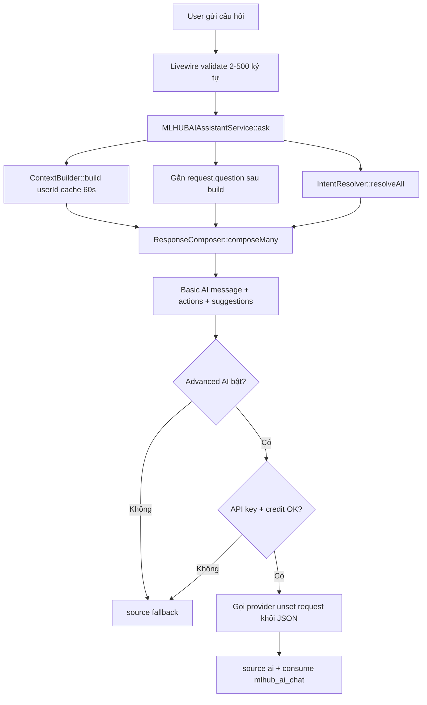

# Chat MLHUB AI — Kiến trúc hiện trạng

> **Cập nhật:** 2026-06-21
> **Trạng thái:** Basic AI **usable/stable** trên production (`mlhub.vn`). Rule-based, không gọi LLM trừ khi user bật Advanced AI.
> **Phạm vi tài liệu:** chỉ Chat MLHUB AI (`/portal/chatmlhubai`). Không thay `ARCHITECTURE_MODULE.md`, `ARCHITECTURE_FEATURE.md`, `ARCHITECTURE_SOP.md`.

---

## 1. Tính năng là gì

Chat MLHUB AI là trợ lý vận hành trong Portal:

- User hỏi bằng tiếng Việt tự nhiên (2–500 ký tự).
- **Basic AI** (mặc định): nhận diện intent bằng keyword, đọc snapshot số liệu thật, ghép câu trả lời ngắn + tối đa 3 CTA portal — **không** gọi OpenAI/Gemini, **không** trừ tín dụng AI.
- **Advanced AI** (toggle): gọi provider đã cấu hình (OpenAI/Gemini) với JSON context; trừ credit `mlhub_ai_chat` khi thành công. Luôn có sẵn câu trả lời Basic làm fallback.

**Câu chốt:** Chat trả lời *“hôm nay thế nào, nên làm gì, mở đâu”*; **AI Studio** thực hiện *“viết/soạn/tạo giúp tôi”*.


| Khía cạnh                   | Chat MLHUB AI                          | AI Studio                                  |
| --------------------------- | -------------------------------------- | ------------------------------------------ |
| Route                       | `portal.chatmlhubai`                   | `portal.ai-studio`, `portal.ai-content`, … |
| Credit Basic                | Không trừ                              | —                                          |
| Credit tác vụ sinh nội dung | Handoff sang Studio (action key riêng) | `ai_studio_`* theo module                  |
| Permission                  | Feature `mlhub`                        | Feature `ai_studio`, …                     |


---

## 2. Entry points & UI


| Thành phần      | File                                                  | Ghi chú                                                     |
| --------------- | ----------------------------------------------------- | ----------------------------------------------------------- |
| Route           | `modules/CustomMLHUB/Routes/web.php`                  | `/portal/chatmlhubai`, middleware `web`, `auth`, `verified` |
| Full page       | `Livewire/ChatMLHUBAI.php`                            | View `custommlhub::chat`                                    |
| Dashboard panel | `Livewire/MLHUBAIDashboardPanel.php`                  | Compact chat, link mở full                                  |
| Trait           | `Livewire/Concerns/InteractsWithMLHUBAIAssistant.php` | Messages, validate, `ask()`                                 |
| Shell           | `Resources/views/partials/chat-shell.blade.php`       | Toggle Basic/Advanced, bubbles, CTA, suggested prompts      |


**UI copy quan trọng:**

- Basic: *“quick info lookup … no credits used”*
- Advanced: cần API key + trừ credit mỗi câu
- Footer metric/guidance do **composer** thêm vào message — Blade **không** render footer cũ trùng lặp

**Plan gate:** `canUsePlanFeature('mlhub')` — sidebar/panel ẩn nếu không có quyền.

---

## 3. Bản đồ code

```
modules/CustomMLHUB/Support/MLHUBAIAssistant/
├── MLHUBAIAssistantService.php      # Orchestrator ask()
├── MLHUBAIContextBuilder.php        # Snapshot metrics (cache 60s)
├── MLHUBAIIntentResolver.php        # Keyword match + focus priority
├── MLHUBAIKnowledgeBase.php         # Keywords, prompts, routes, batch/handoff helpers
└── MLHUBAIResponseComposer.php      # Template + CTA + footer

tests/Unit/CustomMLHUB/MLHUBAIAssistantBasicAiTest.php
```

---

## 4. Luồng xử lý




**Nguyên tắc an toàn:**

1. Basic AI luôn compose trước — API lỗi vẫn có câu trả lời.
2. `request.question` **không** nằm trong cache ContextBuilder; service merge sau `build()`.
3. Advanced AI: `unset($advancedContext['request'])` trước khi gửi JSON provider.
4. Cache key: `mlhub_ai_context:{userId}:team-{portal_team_id}:{locale}` — tách workspace/locale.
5. CTA chỉ render khi `Route::has($routeName)` — module tắt thì action biến mất.

---

## 5. Basic AI vs Advanced AI


|               | Basic AI                           | Advanced AI                                                           |
| ------------- | ---------------------------------- | --------------------------------------------------------------------- |
| Toggle        | `useAdvancedAi = false` (mặc định) | User bật trong chat shell                                             |
| LLM           | Không                              | OpenAI hoặc Gemini (`ai_chat_provider`)                               |
| Credit        | Không trừ                          | `mlhub_ai_chat` sau reply thành công                                  |
| Điều kiện     | Luôn chạy                          | `ai_chat_status=1` + API key + `credit_service()->ensureCanConsume()` |
| System prompt | —                                  | Chỉ dùng số trong JSON context; không bịa metrics                     |


Model mặc định service: `gpt-5.4` từ option `ai_chat_model` — cần đối chiếu admin trước khi bật production Advanced.

---

## 6. Context (`MLHUBAIContextBuilder`)

**TTL:** 60 giây (`CACHE_TTL_SECONDS`). **Không** cache `request.question`.


| Key                  | Nguồn                              | Dùng cho                                    |
| -------------------- | ---------------------------------- | ------------------------------------------- |
| `metrics.`*          | `PortalGrowthDashboardMetrics`     | visits, leads, bookings, conversion, …      |
| `top_campaigns[]`    | Top 5 campaign                     | `daily_briefing`, `top_campaigns`           |
| `recent_activity[]`  | 5 hoạt động gần nhất               | `daily_briefing`                            |
| `customers.`*        | Customer weekly                    | `new_customers`                             |
| `weekly_signals.*`   | Lead/booking/review/coupon/QR tuần | Briefing, QR, conversion                    |
| `reviews.*`          | ReviewFeedback tuần                | Review intents                              |
| `active_campaigns[]` | QrCampaign published (≤6)          | Campaign guidance                           |
| `business_list`      | LocalBusiness                      | `businesses`                                |
| `onboarding[]`       | Derived từ metrics                 | `onboarding`, `next_steps`                  |
| `user`               | Tên user                           | Greeting                                    |
| `workspace.*`        | Team workspace owner               | Scope plan/credit                           |
| `plan.*`             | `PlanLimitGuard::usageSummary()`   | `plan_limits` — `available=false` nếu thiếu |
| `credits.*`          | `credit_summary()`                 | `credits` — `available=false` nếu thiếu     |


**Runtime-only (không cache):**

```php
// MLHUBAIAssistantService::ask()
$context = array_replace_recursive($this->contextBuilder->build($userId), [
    'request' => ['question' => $question],
]);
```

Composer đọc câu hỏi qua `data_get($context, 'request.question')` cho scenario/industry/handoff.

**Chưa đọc trong context:** CRM counts, Google OAuth snapshot, landing slug cụ thể, `lb_businesses.type`, automation/loyalty logs.

---

## 7. Intent resolver

**File:** `MLHUBAIIntentResolver.php`
**Ma trận keyword:** `MLHUBAIKnowledgeBase::intentKeywords()` — **34 intent**.

**Pipeline:**

1. Normalize câu hỏi + keyword (ASCII lowercase, gộp space) — match có dấu/không dấu.
2. `resolveAll()` — multi-intent, confidence, `matched_keywords`.
3. Dedupe helpers: `removeDuplicateHelpCredit`, `removeGenericNextSteps`, `removeLooseDailyBriefing`, `removeReviewDuplication`.
4. `focusEverydayQuestion()` — ép intent chính cho câu hỏi vận hành.

### Thứ tự ưu tiên `focusEverydayQuestion()`


| #   | Điều kiện                                                                                                                   | Intent focus                         |
| --- | --------------------------------------------------------------------------------------------------------------------------- | ------------------------------------ |
| 1   | Hỏi giới hạn gói (`goi hien tai` / `goi cua toi` + `gioi han`…)                                                             | `plan_limits`                        |
| 2   | Tài khoản mới (`isNewAccountOnboardingQuestion`)                                                                            | `onboarding`                         |
| 3   | Multi-scenario ordering (≥2 tín hiệu + hỏi thứ tự)                                                                          | `feedback`                           |
| 4   | Studio handoff (tạo/viết/soạn thật)                                                                                         | `ai_content_writer` hoặc `ai_studio` |
| 5   | ≥3 nhóm ngành trong câu                                                                                                     | `industry_recommendation` (batch)    |
| 6   | Match block: onboarding (tạo cơ sở vs chiến dịch) → industry → scenario (credit, QR, rating, Google→booking, lead, review…) | Theo bảng focus nội bộ               |


**Lưu ý:** Câu *“Viết caption”* handoff Studio **trước** industry. Câu *“AI Content nên dùng như công cụ trong ngành spa?”* **không** handoff (advisory guard).

**Metadata response** (root + `metadata.`*): `confidence`, `matched_keywords`, `matches`, `intents`, `advanced_requested`. `fallback_reason` ở root response (không trong metadata).

---

## 8. Response composer

**File:** `MLHUBAIResponseComposer.php`


| Hành vi         | Chi tiết                                                                                                                                                                                                                                                               |
| --------------- | ---------------------------------------------------------------------------------------------------------------------------------------------------------------------------------------------------------------------------------------------------------------------- |
| `composeMany()` | Ghép tối đa 4 intent; cap CTA ≤3 qua `actionsFor()`                                                                                                                                                                                                                    |
| Footer          | **Một** footer duy nhất mỗi response                                                                                                                                                                                                                                   |
| Metric footer   | *“Câu trả lời có sử dụng số liệu thực tế từ tài khoản của bạn.”*                                                                                                                                                                                                       |
| Guidance footer | *“Câu trả lời dựa trên tri thức nội bộ và cấu trúc tính năng của MLHUB.”*                                                                                                                                                                                              |
| Scenario keys   | `low_rating_recovery`, `qr_high_scan_low_lead`, `google_to_booking`, `phone_collection`, `review_collection`, `branch_performance`, `no_credit_campaign`, `industry_batch`, `multi_scenario_ordering`, `studio_handoff`, `multi_studio_handoff` — dùng guidance footer |


**CTA rules:**

- Map intent → route qua `MLHUBAIKnowledgeBase::routeActions()` hoặc helper chuyên biệt (`industryGroupRouteActions`, `studioHandoffRouteActions`, …).
- Chỉ portal routes; **không** admin; **không** route có `{id}`/`{slug}` khi thiếu context.
- Dedupe URL; `array_slice(..., 0, 3)`.

**Không sinh nội dung marketing dài** trong chat — handoff Studio hoặc gợi ý Marketing Templates.

---

## 9. Industry — 18 nhóm ngành

**Nguồn taxonomy:** `BusinessTypeCatalog` (18 nhóm).
**Nhận diện:** từ **câu hỏi runtime** (`industryGroupAliasMap()` + normalize) — **chưa** đọc `lb_businesses.type` từ DB.


| Helper                            | Mục đích                                                      |
| --------------------------------- | ------------------------------------------------------------- |
| `industryGroupDetectionOrder()`   | Thứ tự ưu tiên khi match **một** nhóm                         |
| `detectMatchedIndustryGroups()`   | Tất cả nhóm match trong câu                                   |
| `isMultiIndustryBatchQuestion()`  | ≥3 nhóm → batch mode                                          |
| `resolveIndustryBatchClusters()`  | Gom tối đa 4 cụm (F&B/service, B2B, sản xuất/OCOP, cộng đồng) |
| `industryBatchSummaryMessage()`   | Tóm tắt batch, không liệt kê đủ 18 nhóm                       |
| `composeIndustryRecommendation()` | Template ngắn ~80–140 từ / nhóm + scenario overlay            |


**Scenario overlay** (trước template ngành đơn): review collection, Google→booking, phone collection, low rating.

**Health/Dental/Fitness:** template nhắc không tư vấn y khoa, không hứa chữa khỏi.

**Other/Needs Classification:** hỏi thêm ngành, fallback nhẹ — không ép template F&B.

---

## 10. Studio handoff

**Phát hiện:** `MLHUBAIKnowledgeBase::detectStudioHandoffTypes()` → `detectStudioHandoff()`.


| Loại                   | Ví dụ trigger                   | Intent focus                         |
| ---------------------- | ------------------------------- | ------------------------------------ |
| `content_writing`      | Viết caption, tạo bài quảng cáo | `ai_content_writer`                  |
| `content_planner`      | Lập lịch nội dung               | `ai_studio`                          |
| `review_reply_writing` | Trả lời review giúp tôi         | `ai_studio`                          |
| `image_generation`     | Tạo banner/ảnh AI               | `ai_studio`                          |
| `multi_studio`         | ≥2 loại trong một câu           | `ai_studio` + message chia theo loại |


**Advisory guard** (`isStudioToolAdvisoryQuestion` + `hasStudioCreationIntent`):

- *“Ưu tiên landing, QR, CRM hay AI Content?”* → tư vấn công cụ, **không** handoff.
- *“Viết caption livestream”* → handoff.

**Excluded:** câu hỏi vận hành review sync (*“review nào cần trả lời”*) — không handoff.

**CTA handoff** (`studioHandoffRouteActions` / `studioMultiHandoffRouteActions`): tối đa 3, ví dụ AI Content, AI Studio, Prompt History.

---

## 11. Batch / multi-topic mode


| Mode                    | Trigger                                                | Output                                                       |
| ----------------------- | ------------------------------------------------------ | ------------------------------------------------------------ |
| Multi-industry          | ≥3 nhóm trong alias map                                | Batch summary 4 cụm + CTA batch                              |
| Multi-scenario ordering | Rating thấp + xin review + Google→booking + hỏi thứ tự | Feedback → Review Booster → Google → Booking/Landing         |
| Multi-Studio            | ≥2 tác vụ Studio                                       | Liệt kê loại → route tương ứng, không chọn mỗi type đầu tiên |


---

## 12. Plan, credit, onboarding


| Intent               | Hành vi                                                                                      |
| -------------------- | -------------------------------------------------------------------------------------------- |
| `credits`            | Đọc `credits.`* snapshot; luôn nhắc Basic AI không trừ credit; zero balance vẫn dùng Basic   |
| `plan_limits`        | Đọc `plan.usage`; thắng `billing` khi hỏi *“Gói hiện tại giới hạn gì?”*                      |
| `onboarding`         | Tài khoản mới / tạo cơ sở vs chiến dịch; CTA businesses + QR — **không** CTA Studio mặc định |
| `no_credit_campaign` | Scenario trong `credits` — chiến dịch manual, template, CRM, không bắt Advanced              |


---

## 13. Prompts & i18n


| Loại                | Số lượng    | File             |
| ------------------- | ----------- | ---------------- |
| `initialPrompts()`  | 5           | KnowledgeBase    |
| `deepenPrompts()`   | 34 nhóm × 3 | KnowledgeBase    |
| `explorePrompts()`  | 13          | KnowledgeBase    |
| User-facing strings | `__()`      | Composer + Blade |


Copy UI/CTA chi tiết: `ARCHITECTURE_I18N.md` §17. Ma trận ngành SOP: `ARCHITECTURE_SOP.md` §E.

---

## 14. Test coverage

**File:** `tests/Unit/CustomMLHUB/MLHUBAIAssistantBasicAiTest.php`
**Số lượng:** **70 test functions** (+ Pest datasets mở rộng ~100 assertions).


| Nhóm                | Ví dụ test                                                                     |
| ------------------- | ------------------------------------------------------------------------------ |
| Core P0/P1          | Resolver, composer, service metadata, footer đơn                               |
| Plan/credit Phase B | Snapshot, degrade, plan limit thắng billing                                    |
| Industry 18 nhóm    | Mỗi nhóm có snippet; spa, wholesale, BĐS, health                               |
| Scenario            | QR low-lead, 2 sao, chi nhánh, no-credit campaign                              |
| Studio handoff      | Caption, Facebook, review reply, image; spa không handoff                      |
| Batch E.1/E.2       | Multi-industry, multi-scenario, multi-studio, advisory guard                   |
| UI                  | Chat shell không footer cũ; onboarding không CTA Studio                        |
| Regression          | Credit, spa đơn, caption trực tiếp, request.question không trong cache payload |


**Chạy test (khi có PHP 8.3+):**

```bash
vendor/bin/pint --dirty
php artisan test tests/Unit/CustomMLHUB/MLHUBAIAssistantBasicAiTest.php
```

**Trạng thái verify doc (2026-06-21):** host Windows dev **chưa chạy được** Pest/Pint — thiếu `php` PATH; Docker local thiếu network `coolify`.

---

## 15. Smoke manual (12 câu)


| #   | Câu hỏi                                        | Kỳ vọng ngắn                                    |
| --- | ---------------------------------------------- | ----------------------------------------------- |
| 1   | AI Cơ bản có tốn tín dụng AI không?            | Basic không trừ; footer số liệu nếu có snapshot |
| 2   | Tôi còn bao nhiêu tín dụng AI?                 | Số dư thật                                      |
| 3   | Gói hiện tại của tôi giới hạn gì?              | `plan_limits`, usage                            |
| 4   | Spa, nên dùng MLHUB tính năng nào trước?       | Industry spa; không Studio                      |
| 5   | Đại lý phân phối mỹ phẩm                       | B2B form + CRM                                  |
| 6   | BĐS cho thuê, lấy lead                         | Landing + form + CRM                            |
| 7   | 6 ngành trong một câu                          | Batch summary, không template spa đơn           |
| 8   | Review + 2 sao + Google + đặt bàn, thứ tự nào? | Feedback → Review → Google → Booking            |
| 9   | Nhà hàng viết bài Facebook ưu đãi              | Handoff AI Content                              |
| 10  | Tạo ảnh banner khuyến mãi bằng AI              | Handoff AI Image/Studio                         |
| 11  | QR nhiều quét, ít SĐT                          | Conversion / form / báo cáo                     |
| 12  | Mới tạo tài khoản, bắt đầu từ đâu?             | Onboarding, không industry                      |


---

## 16. Giới hạn hiện tại

- Keyword match `str_contains` — chưa fuzzy typo.
- Ngành từ câu hỏi, không từ hồ sơ business DB.
- Không intent riêng: email/WhatsApp/webhook automation, loyalty, files, profile/2FA, affiliate, custom domains.
- Không CTA public slug (`/qr/{slug}`, `/lp/{slug}`) khi context thiếu slug.
- Không persistence chat history / coverage log cho `unknown`.
- Advanced AI chưa QA staging đầy đủ (Phase F).

---

## 17. Future backlog (Chat MLHUB AI only)


| Ưu tiên | Hạng mục                                                                         |
| ------- | -------------------------------------------------------------------------------- |
| P1      | Chạy Pest trên container PHP; smoke 12 câu trên staging/production               |
| P1      | Snapshot ngành từ `lb_businesses.type` / BusinessTypeCatalog vào ContextBuilder  |
| P1      | CRM/Google connection counts trong context                                       |
| P2      | Intent automation/loyalty/files/profile                                          |
| P2      | Coverage log `unknown` intent (analytics nội bộ)                                 |
| P2      | Advanced AI QA: model admin, credit `mlhub_ai_chat`, staging                     |
| P3      | Admin editor knowledge base; chat history; scheduled daily briefing notification |


**Không làm trong scope hiện tại:** mở rộng Basic AI bằng LLM mặc định; thay Studio AI; migration/schema mới cho chat.

---

## 18. Tài liệu liên quan


| File                      | Nội dung                        |
| ------------------------- | ------------------------------- |
| `ARCHITECTURE_MODULE.md`  | CustomMLHUB module, routes      |
| `ARCHITECTURE_SOP.md`     | SOP ngành, scenario matrix §E   |
| `ARCHITECTURE_I18N.md`    | Copy UI assistant §17           |
| `ARCHITECTURE_FEATURE.md` | Độ sẵn sàng production tổng thể |
| `.cursorrules`            | Quy tắc agent khi sửa assistant |


**Khi sửa logic assistant:** đọc file này + chạy `MLHUBAIAssistantBasicAiTest.php` + cập nhật §14–§16 + §19 nếu thay đổi coverage/giới hạn.

---

## 19. Coverage audit & ma trận chạm (2026-06-21)

> **Phạm vi audit:** chỉ đọc code + test hiện tại — không sửa logic. Mục tiêu: biết Chat MLHUB AI **đã chạm sâu/vừa/nông** phần nào của MLHUB để bổ sung ma trận câu trả lời sau này.

### 19.0 Executive summary

Chat MLHUB AI (Basic AI) hiện là **rule-based assistant vận hành**: 34 intent keyword, 13 scenario overlay, 18 nhóm ngành, 30 route portal CTA, snapshot 15 context key (+ `request.question` runtime). Luồng ổn cho **báo cáo tổng quan, onboarding, plan/credit, industry guidance, scenario vận hành, Studio handoff** — đã có **70 test functions** Pest.

**Đã chạm sâu:** metrics dashboard, daily briefing, plan/credit snapshot, industry 18 nhóm + batch 4 cụm, multi-scenario ordering, Studio handoff 4 loại, onboarding tài khoản mới.

**Chạm vừa:** CRM (list/segment CTA, không pipeline), Google Business (CTA + review count, không OAuth insight), billing/packages (CTA, không lifecycle), chi nhánh (locations CTA, không so sánh số liệu chi nhánh).

**Chạm nông / chưa chạm:** automation (email/WhatsApp/webhook), loyalty/referral, file/media, profile/2FA, affiliate, custom domain, CRM tasks/tags/automations, public slug URL cụ thể, `lb_businesses.type`, chat history, fuzzy typo, Advanced AI QA production.

**Bản đồ trạng thái (tóm tắt):**

```
ĐÃ CHẠM SÂU          CHẠM VỪA              CHƯA / NÔNG
─────────────────    ─────────────────     ─────────────────────────
Dashboard/metrics    Google Business       Email/WhatsApp automation
Daily briefing       CRM list/segments     Webhook automation
Plan + credits       Billing/invoices      Loyalty stamp cards
Onboarding           Teams (CTA only)      Files / AI Video / Repurpose
Industry 18 + batch  Landing (index CTA)   Profile / 2FA
Scenarios 8+3 batch  Booking (index CTA)   CRM tasks/tags/pipeline
Studio handoff 4     Coupon (index CTA)    Public /qr/{slug} /lp/{slug}
Reports (aggregate)  Lead forms (index)    lb_businesses.type
                     Feedback (index)      Chat history persistence
                     Review booster        Advanced AI staging QA
                     QR campaigns          Semantic search module
```

---

### 19.1 Current coverage numbers


| Hạng mục                                     | Số lượng                                      | Nguồn đếm                                                                             |
| -------------------------------------------- | --------------------------------------------- | ------------------------------------------------------------------------------------- |
| Route/CTA portal **duy nhất** Chat có thể mở | **30**                                        | `MLHUBAIKnowledgeBase` (routeActions + industry + handoff + batch + scenario helpers) |
| Intent (`intentKeywords()`)                  | **34**                                        | KnowledgeBase L14–230                                                                 |
| Chuỗi keyword/alias intent (ước lượng)       | **~510**                                      | intent block + normalize ASCII                                                        |
| Nhóm ngành (`industryGroupAliasMap`)         | **18**                                        | = `BusinessTypeCatalog`                                                               |
| Alias ngành (ước lượng)                      | **~191**                                      | 18 nhóm × ~8–15 alias                                                                 |
| Scenario key (`scenario()`)                  | **13**                                        | composer + KnowledgeBase helpers                                                      |
| Industry batch cluster                       | **4**                                         | service_at_point, b2b_pipeline, production_supply, community_program                  |
| Studio handoff type                          | **4** (+ `multi_studio` ảo)                   | content_writing, content_planner, review_reply_writing, image_generation              |
| Studio handoff alias (ước lượng)             | **~46**                                       | `studioHandoffAliasMap()`                                                             |
| Context key cached                           | **15**                                        | ContextBuilder `buildFresh()`                                                         |
| Context runtime                              | **+1**                                        | `request.question` (không cache)                                                      |
| Compose method                               | **33** + `composeUnknown`                     | ResponseComposer                                                                      |
| Test functions                               | **70**                                        | `MLHUBAIAssistantBasicAiTest.php`                                                     |
| Initial / deepen / explore prompts           | **5 / 102 / 13**                              | KnowledgeBase                                                                         |
| Giới hạn input                               | **2–500** ký tự                               | Livewire validate                                                                     |
| Giới hạn CTA/response                        | **≤3** CTA; **≤4** intent trong `composeMany` | Composer                                                                              |
| Cache context TTL                            | **60s**                                       | `CACHE_TTL_SECONDS`                                                                   |


**Route::has guard:** mọi CTA qua `MLHUBAIResponseComposer::actionsFor()` — route không đăng ký → action biến mất (an toàn module tắt).

---

### 19.2 Ma trận route / URL / CTA

#### 19.2.1 Route Chat **đang chạm trực tiếp** (30 route)


| Route name                        | Module/tính năng  | Label CTA (VI)              | Intent / scenario / ngành                                      | Param | Route::has | Mức chạm | Rủi ro                          |
| --------------------------------- | ----------------- | --------------------------- | -------------------------------------------------------------- | ----- | ---------- | -------- | ------------------------------- |
| `portal.chatmlhubai`              | CustomMLHUB       | Mở MLHUB AI                 | `help_using_mlhubai`                                           | Không | Có         | Vừa      | Self-ref OK                     |
| `portal.dashboard`                | Dashboard         | Mở bảng điều khiển          | `daily_briefing`, metrics intents                              | Không | Có         | Sâu      | —                               |
| `portal.reports`                  | Local Analytics   | Xem báo cáo                 | `conversion`, `top_campaigns`, `branch_performance`, batch B2B | Không | Có         | Sâu      | Chỉ index, không drill campaign |
| `portal.qr-campaigns`             | QR Campaigns      | Quản lý chiến dịch          | `campaigns`, `qr_scans`, F&B industry, onboarding              | Không | Có         | Sâu      | Không CTA analytics `{slug}`    |
| `portal.coupon-campaigns`         | Coupon            | Mở mã ưu đãi                | `coupon`, returning, retail/F&B CTA                            | Không | Có         | Vừa      | Không redemption detail         |
| `portal.review-booster`           | Review Booster    | Mở công cụ xin đánh giá     | `review_booster`, `reviews`, multi-scenario                    | Không | Có         | Sâu      | —                               |
| `portal.booking-pages`            | Booking           | Mở trang đặt lịch           | `booking`, beauty/tourism, google_to_booking                   | Không | Có         | Vừa      | Không booking detail            |
| `portal.feedback-forms`           | Feedback          | Mở form góp ý               | `feedback`, low_rating, multi-scenario                         | Không | Có         | Sâu      | Không response detail           |
| `portal.lead-forms`               | Lead Forms        | Mở form khách tiềm năng     | `leads`, B2B/retail, phone_collection                          | Không | Có         | Vừa      | Không submission detail         |
| `portal.customers`                | Customers         | Mở khách hàng               | `customers`, `new_customers`, `leads`                          | Không | Có         | Vừa      | List only                       |
| `portal.crm.customers`            | CRM               | Mở khách hàng trong CRM     | `crm_segments`, industry B2B, batch                            | Không | Có         | Vừa      | Không `{customer}` show         |
| `portal.crm.segments`             | CRM               | Mở nhóm khách hàng CRM      | `crm_segments`, wholesale                                      | Không | Có         | Nông     | Không segment logic             |
| `portal.landing-pages`            | Landing           | Mở trang đích               | `landing_pages`, B2B/real estate                               | Không | Có         | Vừa      | Không public `/lp/{slug}`       |
| `portal.marketing-templates`      | Templates         | Mở mẫu marketing            | `marketing_templates`, no_credit, Studio                       | Không | Có         | Vừa      | —                               |
| `portal.google-business`          | Google Business   | Mở Google Business          | `google_business`, `google_reviews`, scenarios                 | Không | Có         | Vừa      | Không OAuth/connect status      |
| `portal.businesses`               | Business Profiles | Quản lý cơ sở kinh doanh    | `onboarding`, `businesses`, default industry                   | Không | Có         | Sâu      | Không `{business}` edit         |
| `portal.locations`                | Locations         | Mở địa điểm                 | `business_locations`, branch_performance                       | Không | Có         | Nông     | Redirect → businesses           |
| `portal.credits`                  | Credits           | Xem lịch sử tín dụng AI     | `credits`                                                      | Không | Có         | Sâu      | —                               |
| `portal.packages`                 | Payments          | Xem gói dịch vụ             | `plan_limits`, `billing`                                       | Không | Có         | Vừa      | —                               |
| `portal.billing`                  | Payments          | Mở thanh toán               | `billing`                                                      | Không | Có         | Nông     | CTA generic                     |
| `portal.invoices`                 | Payments          | Mở hóa đơn                  | `billing`                                                      | Không | Có         | Nông     | —                               |
| `portal.ai-studio`                | AI Studio         | Mở AI Studio                | `ai_studio`, handoff                                           | Không | Có         | Sâu      | Handoff đúng ranh giới          |
| `portal.ai-studio.settings`       | AI Studio         | Cài đặt AI                  | `help_using_mlhubai`, `credits`, `ai_studio`                   | Không | Có         | Vừa      | —                               |
| `portal.ai-studio.prompt-history` | AI Studio         | Mở lịch sử câu lệnh         | handoff multi/single                                           | Không | Có         | Vừa      | —                               |
| `portal.ai-studio.review-reply`   | AI Studio         | Mở trả lời đánh giá AI      | `review_reply_writing` handoff                                 | Không | Có         | Sâu      | Không soạn review trong chat    |
| `portal.ai-content`               | AI Content        | Mở công cụ viết nội dung AI | `ai_content_writer`, handoff                                   | Không | Có         | Sâu      | Advisory guard OK               |
| `portal.ai-content-planner`       | Content Planner   | Mở lập lịch nội dung        | `content_planner` handoff                                      | Không | Có         | Sâu      | —                               |
| `portal.ai-image`                 | AI Image          | Mở tạo ảnh AI               | `image_generation` handoff                                     | Không | Có         | Sâu      | Không tạo ảnh trong chat        |
| `portal.teams`                    | Teams             | Mở đội ngũ                  | `teams`                                                        | Không | Có         | Nông     | Không permission depth          |
| `portal.support.index`            | Support           | Mở hỗ trợ                   | `support`                                                      | Không | Có         | Nông     | —                               |


#### 19.2.2 Route **có trong hệ thống** nhưng Chat **chưa chạm**


| Route name (mẫu)                       | Module          | Lý do chưa CTA                      | Nên Basic AI?            | Ưu tiên         |
| -------------------------------------- | --------------- | ----------------------------------- | ------------------------ | --------------- |
| `portal.crm.tasks`                     | CRM             | Thiếu intent + context task counts  | Có (P2)                  | P2              |
| `portal.crm.tags`                      | CRM             | Thiếu intent                        | Có (P3)                  | P3              |
| `portal.crm.automations`               | CRM             | Thiếu intent                        | Có (P2)                  | P2              |
| `portal.crm.reports`                   | CRM             | Trùng partial `portal.reports`      | Có (P2)                  | P2              |
| `portal.crm.customers.show`            | CRM             | Cần `{customer}` — thiếu context ID | Không (chưa)             | P3              |
| `portal.email-automations`             | Email           | Không intent                        | Có (P2)                  | P2              |
| `portal.whatsapp-notifications`        | WhatsApp        | Không intent                        | Có (P2)                  | P2              |
| `portal.webhook-automations`           | Webhook         | Không intent                        | Có (P3)                  | P3              |
| `portal.loyalty-cards`                 | Loyalty         | Không intent/context                | Có (P2)                  | P2              |
| `portal.files.`*                       | Files           | Không intent                        | Không (P3)               | P3              |
| `portal.profile`                       | Profile         | Không intent                        | Không (P3)               | P3              |
| `portal.affiliate.`*                   | Affiliate       | Không intent                        | Không (P3)               | P3              |
| `portal.brand.*` / `portal.qr-codes.*` | Custom domain   | Dynamic slug                        | Không (cần slug context) | P2              |
| `portal.qr-campaigns.analytics`        | QR              | `{campaign:slug}`                   | Không (cần slug)         | P2              |
| `portal.google-business.connect`       | Google OAuth    | Admin-like flow                     | Không CTA trực tiếp      | P1 context only |
| `portal.ai-video`                      | AI Video        | Không handoff type                  | Có (P3)                  | P3              |
| `portal.ai-repurpose`                  | AI Repurpose    | Không handoff                       | Có (P3)                  | P3              |
| `portal.ai-semantic-search`            | Semantic        | Không intent                        | Phase 4                  | P3              |
| `portal.ai-best-time`                  | Best Time       | Không intent                        | Có (P3)                  | P3              |
| `portal.ai-review`                     | AI Review       | Khác review_booster ops             | Có (P2)                  | P2              |
| `portal.activity`                      | Activity log    | Không intent                        | Không (P3)               | P3              |
| `portal.businesses.campaigns.*`        | Business nested | `{business}` param                  | Không (cần context)      | P2              |


#### 19.2.3 Route **không nên** Chat chạm


| Loại                  | Ví dụ                                      | Lý do                                              |
| --------------------- | ------------------------------------------ | -------------------------------------------------- |
| Admin / super-admin   | `admin.`*                                  | Ngoài scope portal assistant                       |
| Public slug           | `/qr/{slug}`, `/lp/{slug}`                 | Thiếu slug trong snapshot; CTA generic an toàn hơn |
| OAuth callback        | `portal.google-business.callback`          | Luồng kỹ thuật, không phải CTA chat                |
| Destroy/update        | `prompt-history.destroy`, profile password | Không phải navigation assistant                    |
| Team invite deep link | `portal.teams.join`                        | Cần `inviteCode`                                   |


---

### 19.3 Ma trận intent (34)


| Intent                    | Keyword/alias chính                 | Compose method                     | Context                                                 | CTA                               | Test             | Hoàn thiện                  |
| ------------------------- | ----------------------------------- | ---------------------------------- | ------------------------------------------------------- | --------------------------------- | ---------------- | --------------------------- |
| `help_using_mlhubai`      | basic/advanced ai, không tốn credit | `composeHelpUsingMLHUBAI`          | plan/credits optional                                   | chatmlhubai, ai settings          | P0               | Tốt                         |
| `daily_briefing`          | hôm nay, báo cáo ngày               | `composeDailyBriefing`             | metrics, top_campaigns, recent_activity, weekly_signals | dashboard, reports                | P0               | Tốt                         |
| `industry_recommendation` | spa, nhà hàng, đại lý…              | `composeIndustryRecommendation`    | request.question; không `business.type`                 | industryGroupRouteActions / batch | 18-group dataset | Cần context `business.type` |
| `onboarding`              | mới tạo tài khoản, setup            | `composeOnboarding`                | onboarding[], metrics                                   | businesses, qr-campaigns          | E.2              | Tốt                         |
| `top_campaigns`           | chiến dịch tốt nhất                 | `composeTopCampaigns`              | top_campaigns[]                                         | reports, qr-campaigns             | P0               | Tốt                         |
| `qr_scans`                | quét qr, lượt quét                  | `composeQrScans`                   | weekly_signals.qr, metrics                              | reports, qr-campaigns             | scenario QR      | Tốt                         |
| `review_booster`          | xin đánh giá, review booster        | `composeReviewBooster`             | reviews.*                                               | review-booster                    | P1               | Tốt                         |
| `booking`                 | đặt lịch, booking                   | `composeBookings`                  | weekly_signals.bookings                                 | booking-pages                     | P1               | Cần alias "đặt bàn"         |
| `coupon`                  | mã giảm giá, voucher                | `composeCoupons`                   | weekly_signals.coupon                                   | coupon-campaigns                  | partial          | Vừa                         |
| `feedback`                | góp ý, khách không hài lòng         | `composeFeedback`                  | reviews low rating                                      | feedback-forms                    | low_rating test  | Tốt                         |
| `leads`                   | khách tiềm năng, lead               | `composeLeads`                     | weekly_signals.leads                                    | lead-forms, customers             | P1               | Vừa                         |
| `conversion`              | chuyển đổi, tỷ lệ                   | `composeConversion`                | metrics conversion                                      | reports                           | QR scenario      | Tốt                         |
| `credits`                 | còn bao nhiêu credit                | `composeCredits`                   | credits.*                                               | credits, ai settings              | Phase B          | Tốt                         |
| `plan_limits`             | gói giới hạn gì                     | `composePlanLimits`                | plan.*                                                  | packages                          | Phase B          | Tốt                         |
| `business_locations`      | chi nhánh, địa điểm                 | `composeBusinessLocations`         | business_list                                           | locations, businesses             | branch test      | Cần số liệu chi nhánh       |
| `customers`               | khách hàng                          | `composeCustomers`                 | customers, metrics                                      | customers, crm                    | P1               | Vừa                         |
| `new_customers`           | khách mới tuần này                  | `composeNewCustomers`              | customers.new_*                                         | customers                         | partial          | Tốt                         |
| `landing_pages`           | trang đích, landing                 | `composeLandingPages`              | active_campaigns partial                                | landing-pages                     | P1               | Nông (no slug)              |
| `marketing_templates`     | mẫu marketing                       | `composeMarketingTemplates`        | —                                                       | marketing-templates               | P1               | Tốt                         |
| `crm_segments`            | nhóm khách, phân khúc               | `composeCrmSegments`               | —                                                       | crm.segments                      | P1               | Cần segment counts          |
| `google_business`         | google business, hồ sơ google       | `composeGoogleBusiness`            | reviews partial                                         | google-business                   | partial          | Cần connect status          |
| `google_reviews`          | review google                       | `composeGoogleReviews`             | reviews.*                                               | google-business                   | dedupe test      | Tốt                         |
| `ai_studio`               | ai studio (nav)                     | `composeAiStudio` / handoff        | credits optional                                        | ai-studio*                        | handoff tests    | Tốt (handoff)               |
| `ai_content_writer`       | viết nội dung (nav)                 | `composeAiContentWriter` / handoff | —                                                       | ai-content                        | handoff tests    | Tốt                         |
| `billing`                 | thanh toán, hóa đơn                 | `composeBilling`                   | plan.name partial                                       | billing, invoices, packages       | partial          | Cần lifecycle alias         |
| `teams`                   | đội ngũ, workspace                  | `composeTeams`                     | workspace.*                                             | teams                             | partial          | Nông                        |
| `support`                 | hỗ trợ, ticket                      | `composeSupport`                   | —                                                       | support.index                     | copy test        | Nông                        |
| `greeting`                | xin chào, hello                     | `composeGreeting`                  | user.name                                               | —                                 | implicit         | Tốt                         |
| `campaigns`               | chiến dịch (generic)                | `composeCampaigns`                 | active_campaigns[], metrics                             | qr-campaigns, reports             | P0               | Tốt                         |
| `reviews`                 | đánh giá (metrics)                  | `composeReviews`                   | reviews.*                                               | review-booster                    | P0               | Tốt                         |
| `next_steps`              | nên làm gì tiếp                     | `composeNextSteps`                 | onboarding[]                                            | dynamic nextStepActions           | P1               | Tốt                         |
| `overview`                | tổng quan                           | `composeOverview`                  | metrics                                                 | dashboard, reports                | P0               | Tốt                         |
| `visits`                  | lượt truy cập, visit                | `composeVisits`                    | metrics.visits                                          | reports, qr-campaigns             | P0               | Tốt                         |
| `businesses`              | cơ sở kinh doanh                    | `composeBusinesses`                | business_list                                           | businesses                        | partial          | Vừa                         |
| *(unknown)*               | không match                         | `composeUnknown`                   | —                                                       | help CTA fallback                 | partial          | Cần analytics               |


---

### 19.4 Ma trận context data


| Context key          | Nguồn                         | Composer / intent dùng                | Trả lời được        | Thiếu / chưa trả lời    | Đề xuất snapshot             |
| -------------------- | ----------------------------- | ------------------------------------- | ------------------- | ----------------------- | ---------------------------- |
| `generated_at`       | Carbon now                    | metadata Advanced AI                  | Freshness           | —                       | Giữ                          |
| `locale`             | app locale                    | i18n compose                          | Đúng ngôn ngữ       | —                       | Giữ                          |
| `user.`*             | User model                    | greeting                              | Chào tên            | Profile/2FA             | Không ưu tiên                |
| `workspace.`*        | TeamWorkspaceAccess           | plan/credit scope                     | Ai trả phí          | Permission chi tiết     | `team_role` (P2)             |
| `metrics.*`          | PortalGrowthDashboardMetrics  | briefing, overview, visits, campaigns | Số tổng quan        | Drill per entity        | Giữ + campaign id top-1 (P2) |
| `top_campaigns[]`    | topCampaigns()                | daily_briefing, top_campaigns         | Top 5 tên + số      | Analytics slug URL      | `slug` field (P2)            |
| `recent_activity[]`  | recentActivity(5)             | daily_briefing                        | 5 hoạt động         | Chi tiết lead/review    | Giữ                          |
| `customers.new_*`    | Customer counts               | new_customers                         | Khách mới tuần      | Segment breakdown       | `by_source` (P2)             |
| `weekly_signals.*`   | QR/lead/booking/review/coupon | QR, leads, conversion                 | Tuần này vs logic   | Per-branch              | `by_location` (P1)           |
| `reviews.*`          | ReviewFeedback                | reviews, feedback, google_reviews     | Count/rating tuần   | Review text cụ thể      | `pending_reply_count` (P2)   |
| `active_campaigns[]` | QrCampaign ≤6                 | campaigns                             | Tên campaign active | Unpublished/draft       | Giữ                          |
| `business_list`      | LocalBusiness                 | businesses, locations                 | Có bao nhiêu cơ sở  | `**type` ngành từ DB**  | `**businesses[].type` (P1)** |
| `onboarding[]`       | Derived metrics               | onboarding, next_steps                | Gợi ý bước đầu      | User đã xong onboarding | Giữ                          |
| `plan.`*             | PlanLimitGuard                | plan_limits                           | Giới hạn + usage    | Renewal/cancel flow     | `next_billing_at` (P2)       |
| `credits.`*          | credit_summary()              | credits                               | Số dư AI            | Per-action breakdown    | Giữ                          |
| `request.question`   | Service runtime               | scenario, industry, handoff           | Overlay đúng câu    | —                       | **Không cache** (đúng)       |


---

### 19.5 Ma trận ngành nghề (18 nhóm)


| Group code                                  | Tên nhóm (VN)     | Alias (mẫu)             | Template / CTA ưu tiên           | Scenario overlay      | Test                   | Gap                               |
| ------------------------------------------- | ----------------- | ----------------------- | -------------------------------- | --------------------- | ---------------------- | --------------------------------- |
| `food_beverage`                             | F&B               | quán ăn, cafe, trà sữa  | QR + Review + Coupon             | phone, review, google | dataset + seafood test | Alias "quán nhậu"                 |
| `retail_goods`                              | Bán lẻ            | cửa hàng, tạp hóa       | Lead + Coupon + CRM              | phone_collection      | cosmetic phone test    | Dễ lẫn beauty                     |
| `beauty_personal_care`                      | Làm đẹp           | spa, salon, nail        | Booking + Review + Coupon        | review, google        | spa test               | "tiệm tóc" vs retail              |
| `tourism_hospitality_experience`            | Du lịch/lưu trú   | homestay, khách sạn     | Google + Landing + Booking       | google_to_booking     | dataset                | —                                 |
| `health_dental_fitness`                     | Y tế/nha khoa/gym | phòng khám, gym         | Booking + Lead + Feedback        | low_rating            | health overclaim test  | Không y khoa (OK)                 |
| `technical_repair_maintenance`              | Sửa chữa          | điện lạnh, garage       | Lead + Booking + Review          | phone                 | dataset                | Template hơi chung                |
| `education_training_coaching`               | Giáo dục          | trung tâm, lớp học      | Landing + Lead + CRM             | —                     | dataset                | "trung tâm" vs org                |
| `wholesale_distribution`                    | Phân phối/đại lý  | đại lý, bán sỉ          | Lead + Segments + Landing        | —                     | wholesale test         | —                                 |
| `professional_b2b_services`                 | B2B dịch vụ       | agency, kế toán         | Landing + Lead + CRM             | —                     | dataset                | —                                 |
| `home_construction_interior`                | Nội thất/xây dựng | xây dựng, nội thất      | Lead + Landing + CRM             | —                     | dataset                | Cần câu báo giá                   |
| `transport_delivery_logistics`              | Vận tải           | giao hàng, logistics    | Lead + Landing + Reports         | —                     | dataset                | Template chung                    |
| `real_estate_rental_property`               | BĐS               | bất động sản, cho thuê  | Landing + Lead + CRM             | —                     | real estate test       | —                                 |
| `digital_creator_online_business`           | Creator/online    | livestream, tiktok shop | Landing + AI Content + Templates | —                     | creator E.2 test       | Handoff vs ops OK                 |
| `small_manufacturing_processing_ocop`       | SX/OCOP           | ocop, xưởng             | Landing + Lead + Google          | —                     | dataset                | OCOP alias mỏng                   |
| `agriculture_fisheries_local_supply`        | Nông/thủy sản     | nông sản, trang trại    | Landing + Lead + CRM             | —                     | dataset                | —                                 |
| `culture_entertainment_sports_community`    | Văn hóa/thể thao  | karaoke, sân thể thao   | Booking + Landing + Coupon       | —                     | dataset                | Lẫn org event                     |
| `organization_association_public_community` | Tổ chức/cộng đồng | hiệp hội, cộng đồng     | Landing + Lead + Reports         | —                     | org test               | —                                 |
| `other_needs_classification`                | Chưa rõ ngành     | nhiều ngành, chưa rõ    | Hỏi làm rõ + default CTA         | batch nếu ≥3 nhóm     | unknown industry test  | **Cần `lb_businesses.type` (P1)** |


**Đánh giá nhanh:**

- **Ổn:** spa, wholesale, BĐS, org, F&B seafood, creator — có test + template rõ.
- **Dễ lẫn alias:** retail ↔ beauty ("mỹ phẩm"), education ↔ org ("trung tâm"), culture ↔ org ("câu lạc bộ").
- **Template quá chung:** transport, technical repair, OCOP — cần thêm câu hỏi thực tế §19.9.
- **Cần `lb_businesses.type`:** mọi nhóm khi user không nói ngành trong câu hỏi.

---

### 19.6 Ma trận scenario (13)


| Scenario                  | Trigger (keyword/condition)       | Intent focus                  | Response ưu tiên              | CTA                            | Batch/multi    | Test                 | Gap / false positive                |
| ------------------------- | --------------------------------- | ----------------------------- | ----------------------------- | ------------------------------ | -------------- | -------------------- | ----------------------------------- |
| `multi_scenario_ordering` | ≥2 tín hiệu + hỏi thứ tự          | `feedback`                    | Ordering message 4 bước       | feedback, review, google       | Multi          | E.1 test             | "ưu tiên" đơn có thể kích hoạt nhầm |
| `multi_studio_handoff`    | ≥2 studio types                   | `ai_studio`                   | Liệt kê loại → Studio         | ai-studio, ai-content, history | Multi          | E.1 test             | —                                   |
| `studio_handoff`          | 1 studio type + creation intent   | ai_content_writer / ai_studio | Handoff message               | theo type                      | —              | nhiều handoff tests  | Advisory guard (E.2)                |
| `industry_batch`          | ≥3 nhóm ngành                     | `industry_recommendation`     | 4 cluster summary             | batch routes                   | Multi-industry | E.1/E.2              | —                                   |
| `no_credit_campaign`      | không tốn credit/tin dung         | `credits`                     | Manual + templates            | marketing-templates            | —              | no_credit test       | —                                   |
| `low_rating_recovery`     | 1–3 sao, review xấu               | `feedback`                    | Form góp ý trước              | feedback-forms                 | —              | low_rating test      | Trùng feedback intent               |
| `google_to_booking`       | google nhiều view, ít đặt bàn     | industry overlay              | Google → booking              | google, booking, landing       | —              | partial              | Cần metric google views             |
| `qr_high_scan_low_lead`   | QR nhiều quét, ít lead            | `conversion` / qr             | Form + báo cáo                | reports, lead-forms            | —              | QR test              | —                                   |
| `branch_performance`      | chi nhánh nào tốt                 | `business_locations`          | Hướng dẫn locations + reports | locations, reports             | —              | branch test          | **Thiếu số liệu chi nhánh**         |
| `phone_collection`        | lấy SĐT, để lại thông tin         | industry overlay              | Lead form + CRM               | lead-forms, crm                | —              | retail cosmetic test | —                                   |
| `review_collection`       | xin đánh giá, không để lại review | industry overlay              | Review booster flow           | booking, review, coupon        | —              | partial              | —                                   |
| `returning_customers`     | khách quay lại, cuối tuần         | `coupon` / CRM                | Coupon + segments             | coupon, crm                    | —              | returning test       | —                                   |
| `general`                 | default                           | intent keyword                | Template intent               | intent CTA                     | —              | —                    | —                                   |


---

### 19.7 Ma trận Studio handoff


| Handoff type           | Alias trigger (mẫu)              | Route CTA                        | Nên handoff                    | Không handoff                          | Test              | Gap                    |
| ---------------------- | -------------------------------- | -------------------------------- | ------------------------------ | -------------------------------------- | ----------------- | ---------------------- |
| `content_writing`      | viết caption, tạo bài facebook   | ai-content, ai-studio, templates | "Viết bài ưu đãi cho nhà hàng" | "AI Content nên dùng trong ngành spa?" | nhiều             | Thêm alias "soạn thảo" |
| `content_planner`      | lập lịch nội dung, lịch đăng bài | ai-content-planner, ai-studio    | "Lập lịch 7 ngày"              | "Công cụ lập lịch là gì?" (mô tả)      | partial           | —                      |
| `review_reply_writing` | trả lời review giúp tôi          | ai-studio.review-reply           | "Viết phản hồi review 2 sao"   | "Review nào cần trả lời?" (ops)        | review reply test | excluded list OK       |
| `image_generation`     | tạo banner, poster ai            | ai-image, ai-studio              | "Tạo ảnh khuyến mãi"           | —                                      | image test        | —                      |
| `multi_studio`         | ≥2 loại trên                     | ai-studio, ai-content, history   | Caption + ảnh cùng câu         | —                                      | multi studio test | —                      |


**Ranh giới đã kiểm tra:**

- Chat **không** viết caption dài — handoff + test `basic chat does not produce long marketing copy`.
- Chat **không** tạo ảnh — CTA `portal.ai-image`.
- Chat **không** trả lời review dài — CTA `review-reply`.
- Chat **chỉ** hướng dẫn mở Studio — message template rõ.
- AI Content **công cụ trong ngành** — `isStudioToolAdvisoryQuestion` + test E.2.

---

### 19.8 Ma trận chưa chạm / chạm nông


| Module/tính năng                  | Chat biết gì           | Thiếu                      | Basic AI?    | Ưu tiên | Lý do                       |
| --------------------------------- | ---------------------- | -------------------------- | ------------ | ------- | --------------------------- |
| CRM pipeline sâu                  | CTA customers/segments | tasks, automations, show   | Có           | P1      | User hỏi "việc cần làm CRM" |
| Google OAuth insight              | CTA google-business    | connected?, location count | Có (context) | P1      | "Đã liên kết Google chưa?"  |
| Landing/QR public URL             | CTA index              | slug URL cụ thể            | Có (context) | P2      | Cần slug trong snapshot     |
| Booking detail                    | CTA booking-pages      | slot fill rate             | Có (context) | P2      | "Lịch trống tuần này?"      |
| Coupon redemption                 | CTA coupon             | redeem count               | Có (context) | P2      | —                           |
| Feedback detail                   | CTA feedback           | response list              | Không sâu    | P3      | Privacy                     |
| Customer segments/tasks           | CTA segments           | counts, open tasks         | Có           | P2      | —                           |
| Email/WhatsApp/Webhook automation | Không                  | intent + CTA               | Có           | P2      | Backlog §17                 |
| Loyalty/referral                  | Không                  | intent                     | Có           | P2      | —                           |
| Files/media editor                | Không                  | intent                     | Không        | P3      | Ngoài scope chat            |
| Notifications/history             | Không                  | intent                     | Không        | P3      | —                           |
| Team permission                   | CTA teams              | role/limit                 | Không sâu    | P3      | —                           |
| Billing lifecycle                 | plan snapshot          | cancel/renew               | Có alias     | P2      | —                           |
| `lb_businesses.type`              | Không đọc              | context + default industry | **Có**       | **P1**  | Giảm hỏi lại ngành          |
| Chat history dài hạn              | Không persist          | storage                    | Không (P3)   | P3      | Phase F                     |
| Fuzzy typo/semantic               | normalize ASCII only   | fuzzy match                | Phase 4      | P3      | Rủi ro false positive       |
| Advanced AI provider QA           | Code có                | staging test               | Phase 4      | P1      | Production risk             |


---

### 19.9 Ma trận câu hỏi mẫu (100 câu — kỳ vọng intent/CTA)

#### Core (20)


| #   | Câu hỏi                            | Kỳ vọng intent               | Kỳ vọng CTA              |
| --- | ---------------------------------- | ---------------------------- | ------------------------ |
| 1   | Hôm nay kinh doanh thế nào?        | daily_briefing               | dashboard, reports       |
| 2   | Tôi còn bao nhiêu tín dụng AI?     | credits                      | credits                  |
| 3   | Gói hiện tại giới hạn gì?          | plan_limits                  | packages                 |
| 4   | AI Cơ bản có tốn credit không?     | help_using_mlhubai / credits | chatmlhubai              |
| 5   | Chiến dịch nào hiệu quả nhất?      | top_campaigns                | reports                  |
| 6   | Tuần này có bao nhiêu khách mới?   | new_customers                | customers                |
| 7   | Tỷ lệ chuyển đổi thế nào?          | conversion                   | reports                  |
| 8   | Tổng quan tài khoản                | overview                     | dashboard                |
| 9   | Mới tạo tài khoản, bắt đầu từ đâu? | onboarding                   | businesses, qr-campaigns |
| 10  | Nên làm gì tiếp theo?              | next_steps                   | dynamic onboarding CTA   |
| 11  | Xin chào                           | greeting                     | —                        |
| 12  | Có bao nhiêu lượt quét QR?         | qr_scans                     | reports                  |
| 13  | Review tuần này ra sao?            | reviews                      | review-booster           |
| 14  | Có bao nhiêu lead?                 | leads                        | lead-forms               |
| 15  | Đặt lịch có nhiều không?           | booking                      | booking-pages            |
| 16  | Mã ưu đãi hoạt động thế nào?       | coupon                       | coupon-campaigns         |
| 17  | Mở CRM ở đâu?                      | crm_segments / customers     | crm.customers            |
| 18  | Hỗ trợ ở đâu?                      | support                      | support.index            |
| 19  | Quản lý đội ngũ                    | teams                        | teams                    |
| 20  | Thanh toán và hóa đơn              | billing                      | billing, invoices        |


#### Industry (20)


| #   | Câu hỏi                        | Intent                        | CTA gợi ý                |
| --- | ------------------------------ | ----------------------------- | ------------------------ |
| 21  | Quán cà phê nên dùng gì trước? | industry_recommendation (F&B) | qr, review, coupon       |
| 22  | Spa nên làm gì?                | industry (beauty)             | booking, review          |
| 23  | Nhà hàng hải sản               | industry (F&B)                | qr, google, booking      |
| 24  | Shop mỹ phẩm bán lẻ            | industry (retail)             | lead, crm                |
| 25  | Homestay du lịch               | industry (tourism)            | google, landing, booking |
| 26  | Phòng khám nha khoa            | industry (health)             | booking, feedback        |
| 27  | Garage sửa xe                  | industry (technical)          | lead, booking            |
| 28  | Trung tâm tiếng Anh            | industry (education)          | landing, lead            |
| 29  | Đại lý mỹ phẩm                 | industry (wholesale)          | lead, segments           |
| 30  | Agency marketing B2B           | industry (professional)       | landing, crm             |
| 31  | Công ty nội thất               | industry (construction)       | landing, lead            |
| 32  | Giao hàng logistics            | industry (transport)          | lead, reports            |
| 33  | Cho thuê căn hộ BĐS            | industry (real_estate)        | landing, crm             |
| 34  | Creator livestream             | industry (creator)            | landing, ai-content      |
| 35  | OCOP lang nghề                 | industry (ocop)               | landing, google          |
| 36  | Trang trại nông sản            | industry (agriculture)        | landing, crm             |
| 37  | Karaoke giải trí               | industry (culture)            | booking, coupon          |
| 38  | Hiệp hội cộng đồng             | industry (org)                | landing, reports         |
| 39  | Chưa rõ ngành, nên dùng gì?    | other_needs_classification    | businesses default       |
| 40  | 6 ngành trong một câu          | industry_batch                | batch CTA                |


#### Scenario (20)


| #   | Câu hỏi                                   | Scenario / intent                  | CTA                      |
| --- | ----------------------------------------- | ---------------------------------- | ------------------------ |
| 41  | QR nhiều quét nhưng ít SĐT                | qr_high_scan_low_lead → conversion | reports, lead-forms      |
| 42  | Khách đánh giá 2 sao                      | low_rating_recovery → feedback     | feedback-forms           |
| 43  | Google nhiều view, ít đặt bàn             | google_to_booking                  | google, booking          |
| 44  | Làm sao lấy số điện thoại khách?          | phone_collection                   | lead-forms, crm          |
| 45  | Khách không để lại đánh giá               | review_collection                  | review-booster           |
| 46  | Chi nhánh nào kéo khách tốt?              | branch_performance                 | locations, reports       |
| 47  | Không muốn tốn credit AI                  | no_credit_campaign                 | templates, qr            |
| 48  | Khách cũ quay lại cuối tuần               | returning_customers                | coupon, crm              |
| 49  | Review xấu + xin review + google, thứ tự? | multi_scenario_ordering            | feedback, review, google |
| 50  | Viết caption livestream                   | studio_handoff content_writing     | ai-content               |
| 51  | Tạo banner khuyến mãi                     | studio_handoff image               | ai-image                 |
| 52  | Trả lời review giúp tôi                   | studio_handoff review_reply        | review-reply             |
| 53  | Lập lịch nội dung 7 ngày                  | studio_handoff planner             | ai-content-planner       |
| 54  | Viết bài + tạo ảnh cùng lúc               | multi_studio_handoff               | ai-studio, ai-content    |
| 55  | AI Content ưu tiên hay QR trong spa?      | industry (advisory, no handoff)    | industry CTA             |
| 56  | Nhiều chi nhánh, 3 chi nhánh              | branch_performance                 | locations                |
| 57  | It lead sau quét QR                       | qr_high_scan_low_lead              | conversion               |
| 58  | Rating thấp trên Google                   | feedback / reviews                 | feedback, review         |
| 59  | Không tốn tin dung vẫn chạy chiến dịch    | no_credit_campaign                 | marketing-templates      |
| 60  | Ưu đãi quay lại cho khách cũ              | returning_customers / coupon       | coupon                   |


#### Module / route (20)


| #   | Câu hỏi                | Intent                  | CTA                 |
| --- | ---------------------- | ----------------------- | ------------------- |
| 61  | Mở trang đích ở đâu?   | landing_pages           | landing-pages       |
| 62  | Mẫu marketing ở đâu?   | marketing_templates     | marketing-templates |
| 63  | Google Business ở đâu? | google_business         | google-business     |
| 64  | Review Google tuần này | google_reviews          | google-business     |
| 65  | Form góp ý khách       | feedback                | feedback-forms      |
| 66  | Form lead              | leads                   | lead-forms          |
| 67  | Quản lý chiến dịch QR  | campaigns               | qr-campaigns        |
| 68  | Xem báo cáo            | overview / conversion   | reports             |
| 69  | Cơ sở kinh doanh       | businesses              | businesses          |
| 70  | Địa điểm chi nhánh     | business_locations      | locations           |
| 71  | AI Studio ở đâu?       | ai_studio               | ai-studio           |
| 72  | Viết nội dung AI       | ai_content_writer (nav) | ai-content          |
| 73  | Cài đặt AI             | help / credits          | ai-studio.settings  |
| 74  | Lịch sử prompt         | ai_studio handoff       | prompt-history      |
| 75  | Nâng cấp gói           | plan_limits / billing   | packages            |
| 76  | Phân khúc CRM          | crm_segments            | crm.segments        |
| 77  | Khách hàng CRM         | customers               | crm.customers       |
| 78  | Review Booster         | review_booster          | review-booster      |
| 79  | Trang đặt lịch         | booking                 | booking-pages       |
| 80  | Dashboard              | daily_briefing          | dashboard           |


#### Edge case (20)


| #   | Câu hỏi                                        | Kỳ vọng                      | Ghi chú                     |
| --- | ---------------------------------------------- | ---------------------------- | --------------------------- |
| 81  | bat dau tu dau (không dấu)                     | onboarding (tài khoản mới)   | Không industry              |
| 82  | goi cua toi gioi han gi                        | plan_limits                  | Thắng billing               |
| 83  | spa viet caption                               | handoff (không industry)     | Studio trước industry       |
| 84  | spa nen dung ai content nhu cong cu            | industry advisory            | Không handoff               |
| 85  | review nao can tra loi                         | google_reviews / reviews ops | Không handoff               |
| 86  | dong bo review google                          | google_reviews               | Không handoff reply writing |
| 87  | asdfghjkl random                               | unknown                      | Fallback                    |
| 88  | Hôm nay + chiến dịch + credit (dài)            | composeMany ≤4 intent        | Một footer                  |
| 89  | 0 credit                                       | credits + basic không trừ    | E.2 test                    |
| 90  | Quán cafe + nhà hàng + spa + BĐS + gym + hotel | industry_batch               | Không template đơn          |
| 91  | Tạo cơ sở trước hay chiến dịch trước?          | onboarding                   | —                           |
| 92  | Phòng khám chữa bệnh cam kết                   | health industry              | Không hứa chữa khỏi         |
| 93  | Tiệm tạp hóa vs tiệm spa (một câu)             | 2 groups — không batch (<3)  | Group detection order       |
| 94  | Ưu tiên xử lý review thấp trước hay xin review | multi_scenario nếu ≥2 signal | —                           |
| 95  | Module email automation (future)               | unknown / generic            | Gap P2                      |
| 96  | Link QR public cụ thể                          | unknown hoặc qr_scans        | Không slug CTA              |
| 97  | CRM task quá hạn (future)                      | unknown                      | Gap P2                      |
| 98  | Đổi mật khẩu ở đâu                             | unknown                      | Gap P3                      |
| 99  | Affiliate commission                           | unknown                      | Gap P3                      |
| 100 | Advanced AI bật nhưng hết credit               | fallback Basic               | Service layer               |


---

### 19.10 Roadmap làm mượt câu trả lời (không code)


| Giai đoạn                 | Nội dung                                                                                | Tác động   | Rủi ro                                  |
| ------------------------- | --------------------------------------------------------------------------------------- | ---------- | --------------------------------------- |
| **1 — Alias/keyword**     | Typo phổ biến: đặt bàn, soạn thảo, hóa đơn, liên kết google; tách alias retail/beauty   | Cao        | False positive thấp                     |
| **2 — Context snapshot**  | `business_list[].type`, google connected, weekly_signals.by_location, top_campaign slug | Cao        | Chỉ ContextBuilder — không đổi resolver |
| **3 — Template/scenario** | branch_performance có số; billing lifecycle; intent automation/loyalty nhẹ              | Trung bình | Tránh phình composer                    |
| **4 — Advanced/fuzzy**    | Staging QA Advanced AI; optional semantic module; unknown logging                       | Trung bình | Không bật LLM mặc định Basic            |


**Top 10 việc nên làm tiếp (ưu tiên):**

1. Chạy Pest 70 tests + smoke §15 trên container PHP.
2. Snapshot `lb_businesses.type` → default industry khi câu hỏi không nêu ngành.
3. Google connection status trong context (`connected`, `locations_count`).
4. `weekly_signals.by_location` hoặc branch metrics cho `branch_performance`.
5. Alias typo: đặt bàn, soạn bài, liên kết google.
6. Intent nhẹ automation/loyalty (CTA only, guidance footer).
7. `top_campaigns[].slug` để gợi ý mở analytics (vẫn Route::has guard).
8. Coverage log `unknown` intent (analytics nội bộ).
9. Advanced AI QA staging: model, credit, JSON context.
10. Mở rộng question bank §19.9 thành regression dataset Pest (không bắt buộc ngay).

**Top 10 gap quan trọng:**

1. Không đọc `lb_businesses.type` — industry chỉ từ câu hỏi.
2. Google OAuth/insight nông — không biết đã connect chưa.
3. Branch performance thiếu số liệu per-location.
4. Không CTA/detail public slug QR/LP.
5. CRM pipeline (tasks/automations) chưa chạm.
6. Automation email/WhatsApp/webhook không intent.
7. Không fuzzy typo — lệch dấu OK, sai chính tả fail.
8. Unknown intent không log — khó cải thiện ma trận.
9. Advanced AI chưa QA production đầy đủ.
10. Chat history không persist — không multi-turn context.

---

### 19.11 Risks and guardrails


| Rủi ro                       | Mức | Guardrail hiện có                          |
| ---------------------------- | --- | ------------------------------------------ |
| Handoff nhầm khi hỏi công cụ | P1  | `isStudioToolAdvisoryQuestion` + E.2 tests |
| Onboarding → industry nhầm   | P1  | `isNewAccountOnboardingQuestion` + E.2     |
| CTA route module tắt 404     | P2  | `Route::has()` filter                      |
| Advanced AI bịa số           | P1  | JSON context only; unset `request`         |
| Medical overclaim            | P1  | health template disclaimer + test          |
| Multi-intent footer trùng    | P2  | Single footer + dedupe helpers             |
| Cache stale 60s              | P3  | TTL acceptable for briefing                |
| Tenant leak                  | P0  | ContextBuilder `user_id` scope             |


**Verdict tài liệu:** **Documentation ready** — ma trận phản ánh code tại commit audit 2026-06-21; nên review nhanh sau mỗi phase alias/context mới.

**Verify audit:** chỉ sửa `ARCHITECTURE_MLHUBAI.md`; không sửa code/test; chưa commit/push.