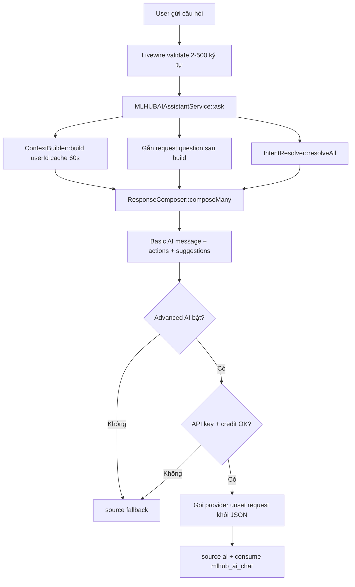

# Chat MLHUB AI — Kiến trúc hiện trạng

> **Cập nhật:** 2026-06-21
> **Trạng thái:** Basic AI **usable/stable** trên production (`mlhub.vn`). Rule-based, không gọi LLM trừ khi user bật Advanced AI.
> **Phạm vi tài liệu:** chỉ Chat MLHUB AI (`/portal/chatmlhubai`). Không thay `ARCHITECTURE_MODULE.md`, `ARCHITECTURE_FEATURE.md`, `ARCHITECTURE_SOP.md`.

---

## 1. Tính năng là gì

Chat MLHUB AI là trợ lý vận hành trong Portal:

- User hỏi bằng tiếng Việt tự nhiên (2–500 ký tự).
- **Basic AI** (mặc định): nhận diện intent bằng keyword, đọc snapshot số liệu thật, ghép câu trả lời ngắn + tối đa 3 CTA portal — **không** gọi OpenAI/Gemini, **không** trừ tín dụng AI.
- **Advanced AI** (toggle): gọi provider đã cấu hình (OpenAI/Gemini) với JSON context; trừ credit `mlhub_ai_chat` khi thành công. Luôn có sẵn câu trả lời Basic làm fallback.

**Câu chốt:** Chat trả lời *“hôm nay thế nào, nên làm gì, mở đâu”*; **AI Studio** thực hiện *“viết/soạn/tạo giúp tôi”*.

| Khía cạnh | Chat MLHUB AI | AI Studio |
| --- | --- | --- |
| Route | `portal.chatmlhubai` | `portal.ai-studio`, `portal.ai-content`, … |
| Credit Basic | Không trừ | — |
| Credit tác vụ sinh nội dung | Handoff sang Studio (action key riêng) | `ai_studio_*` theo module |
| Permission | Feature `mlhub` | Feature `ai_studio`, … |

---

## 2. Entry points & UI

| Thành phần | File | Ghi chú |
| --- | --- | --- |
| Route | `modules/CustomMLHUB/Routes/web.php` | `/portal/chatmlhubai`, middleware `web`, `auth`, `verified` |
| Full page | `Livewire/ChatMLHUBAI.php` | View `custommlhub::chat` |
| Dashboard panel | `Livewire/MLHUBAIDashboardPanel.php` | Compact chat, link mở full |
| Trait | `Livewire/Concerns/InteractsWithMLHUBAIAssistant.php` | Messages, validate, `ask()` |
| Shell | `Resources/views/partials/chat-shell.blade.php` | Toggle Basic/Advanced, bubbles, CTA, suggested prompts |

**UI copy quan trọng:**

- Basic: *“quick info lookup … no credits used”*
- Advanced: cần API key + trừ credit mỗi câu
- Footer metric/guidance do **composer** thêm vào message — Blade **không** render footer cũ trùng lặp

**Plan gate:** `canUsePlanFeature('mlhub')` — sidebar/panel ẩn nếu không có quyền.

---

## 3. Bản đồ code

```
modules/CustomMLHUB/Support/MLHUBAIAssistant/
├── MLHUBAIAssistantService.php      # Orchestrator ask()
├── MLHUBAIContextBuilder.php        # Snapshot metrics (cache 60s)
├── MLHUBAIIntentResolver.php        # Keyword match + focus priority
├── MLHUBAIKnowledgeBase.php         # Keywords, prompts, routes, batch/handoff helpers
└── MLHUBAIResponseComposer.php      # Template + CTA + footer

tests/Unit/CustomMLHUB/MLHUBAIAssistantBasicAiTest.php
```

---

## 4. Luồng xử lý



**Nguyên tắc an toàn:**

1. Basic AI luôn compose trước — API lỗi vẫn có câu trả lời.
2. `request.question` **không** nằm trong cache ContextBuilder; service merge sau `build()`.
3. Advanced AI: `unset($advancedContext['request'])` trước khi gửi JSON provider.
4. Cache key: `mlhub_ai_context:{userId}:team-{portal_team_id}:{locale}` — tách workspace/locale.
5. CTA chỉ render khi `Route::has($routeName)` — module tắt thì action biến mất.

---

## 5. Basic AI vs Advanced AI

| | Basic AI | Advanced AI |
| --- | --- | --- |
| Toggle | `useAdvancedAi = false` (mặc định) | User bật trong chat shell |
| LLM | Không | OpenAI hoặc Gemini (`ai_chat_provider`) |
| Credit | Không trừ | `mlhub_ai_chat` sau reply thành công |
| Điều kiện | Luôn chạy | `ai_chat_status=1` + API key + `credit_service()->ensureCanConsume()` |
| System prompt | — | Chỉ dùng số trong JSON context; không bịa metrics |

Model mặc định service: `gpt-5.4` từ option `ai_chat_model` — cần đối chiếu admin trước khi bật production Advanced.

---

## 6. Context (`MLHUBAIContextBuilder`)

**TTL:** 60 giây (`CACHE_TTL_SECONDS`). **Không** cache `request.question`.

| Key | Nguồn | Dùng cho |
| --- | --- | --- |
| `metrics.*` | `PortalGrowthDashboardMetrics` | visits, leads, bookings, conversion, … |
| `top_campaigns[]` | Top 5 campaign | `daily_briefing`, `top_campaigns` |
| `recent_activity[]` | 5 hoạt động gần nhất | `daily_briefing` |
| `customers.*` | Customer weekly | `new_customers` |
| `weekly_signals.*` | Lead/booking/review/coupon/QR tuần | Briefing, QR, conversion |
| `reviews.*` | ReviewFeedback tuần | Review intents |
| `active_campaigns[]` | QrCampaign published (≤6) | Campaign guidance |
| `business_list` | LocalBusiness | `businesses` |
| `onboarding[]` | Derived từ metrics | `onboarding`, `next_steps` |
| `user` | Tên user | Greeting |
| `workspace.*` | Team workspace owner | Scope plan/credit |
| `plan.*` | `PlanLimitGuard::usageSummary()` | `plan_limits` — `available=false` nếu thiếu |
| `credits.*` | `credit_summary()` | `credits` — `available=false` nếu thiếu |

**Runtime-only (không cache):**

```php
// MLHUBAIAssistantService::ask()
$context = array_replace_recursive($this->contextBuilder->build($userId), [
    'request' => ['question' => $question],
]);
```

Composer đọc câu hỏi qua `data_get($context, 'request.question')` cho scenario/industry/handoff.

**Chưa đọc trong context:** CRM counts, Google OAuth snapshot, landing slug cụ thể, `lb_businesses.type`, automation/loyalty logs.

---

## 7. Intent resolver

**File:** `MLHUBAIIntentResolver.php`
**Ma trận keyword:** `MLHUBAIKnowledgeBase::intentKeywords()` — **34 intent**.

**Pipeline:**

1. Normalize câu hỏi + keyword (ASCII lowercase, gộp space) — match có dấu/không dấu.
2. `resolveAll()` — multi-intent, confidence, `matched_keywords`.
3. Dedupe helpers: `removeDuplicateHelpCredit`, `removeGenericNextSteps`, `removeLooseDailyBriefing`, `removeReviewDuplication`.
4. `focusEverydayQuestion()` — ép intent chính cho câu hỏi vận hành.

### Thứ tự ưu tiên `focusEverydayQuestion()`

| # | Điều kiện | Intent focus |
| --- | --- | --- |
| 1 | Hỏi giới hạn gói (`goi hien tai` / `goi cua toi` + `gioi han`…) | `plan_limits` |
| 2 | Tài khoản mới (`isNewAccountOnboardingQuestion`) | `onboarding` |
| 3 | Multi-scenario ordering (≥2 tín hiệu + hỏi thứ tự) | `feedback` |
| 4 | Studio handoff (tạo/viết/soạn thật) | `ai_content_writer` hoặc `ai_studio` |
| 5 | ≥3 nhóm ngành trong câu | `industry_recommendation` (batch) |
| 6 | Match block: onboarding (tạo cơ sở vs chiến dịch) → industry → scenario (credit, QR, rating, Google→booking, lead, review…) | Theo bảng focus nội bộ |

**Lưu ý:** Câu *“Viết caption”* handoff Studio **trước** industry. Câu *“AI Content nên dùng như công cụ trong ngành spa?”* **không** handoff (advisory guard).

**Metadata response** (root + `metadata.*`): `confidence`, `matched_keywords`, `matches`, `intents`, `advanced_requested`. `fallback_reason` ở root response (không trong metadata).

---

## 8. Response composer

**File:** `MLHUBAIResponseComposer.php`

| Hành vi | Chi tiết |
| --- | --- |
| `composeMany()` | Ghép tối đa 4 intent; cap CTA ≤3 qua `actionsFor()` |
| Footer | **Một** footer duy nhất mỗi response |
| Metric footer | *“Câu trả lời có sử dụng số liệu thực tế từ tài khoản của bạn.”* |
| Guidance footer | *“Câu trả lời dựa trên tri thức nội bộ và cấu trúc tính năng của MLHUB.”* |
| Scenario keys | `low_rating_recovery`, `qr_high_scan_low_lead`, `google_to_booking`, `phone_collection`, `review_collection`, `branch_performance`, `no_credit_campaign`, `industry_batch`, `multi_scenario_ordering`, `studio_handoff`, `multi_studio_handoff` — dùng guidance footer |

**CTA rules:**

- Map intent → route qua `MLHUBAIKnowledgeBase::routeActions()` hoặc helper chuyên biệt (`industryGroupRouteActions`, `studioHandoffRouteActions`, …).
- Chỉ portal routes; **không** admin; **không** route có `{id}`/`{slug}` khi thiếu context.
- Dedupe URL; `array_slice(..., 0, 3)`.

**Không sinh nội dung marketing dài** trong chat — handoff Studio hoặc gợi ý Marketing Templates.

---

## 9. Industry — 18 nhóm ngành

**Nguồn taxonomy:** `BusinessTypeCatalog` (18 nhóm).
**Nhận diện:** từ **câu hỏi runtime** (`industryGroupAliasMap()` + normalize) — **chưa** đọc `lb_businesses.type` từ DB.

| Helper | Mục đích |
| --- | --- |
| `industryGroupDetectionOrder()` | Thứ tự ưu tiên khi match **một** nhóm |
| `detectMatchedIndustryGroups()` | Tất cả nhóm match trong câu |
| `isMultiIndustryBatchQuestion()` | ≥3 nhóm → batch mode |
| `resolveIndustryBatchClusters()` | Gom tối đa 4 cụm (F&B/service, B2B, sản xuất/OCOP, cộng đồng) |
| `industryBatchSummaryMessage()` | Tóm tắt batch, không liệt kê đủ 18 nhóm |
| `composeIndustryRecommendation()` | Template ngắn ~80–140 từ / nhóm + scenario overlay |

**Scenario overlay** (trước template ngành đơn): review collection, Google→booking, phone collection, low rating.

**Health/Dental/Fitness:** template nhắc không tư vấn y khoa, không hứa chữa khỏi.

**Other/Needs Classification:** hỏi thêm ngành, fallback nhẹ — không ép template F&B.

---

## 10. Studio handoff

**Phát hiện:** `MLHUBAIKnowledgeBase::detectStudioHandoffTypes()` → `detectStudioHandoff()`.

| Loại | Ví dụ trigger | Intent focus |
| --- | --- | --- |
| `content_writing` | Viết caption, tạo bài quảng cáo | `ai_content_writer` |
| `content_planner` | Lập lịch nội dung | `ai_studio` |
| `review_reply_writing` | Trả lời review giúp tôi | `ai_studio` |
| `image_generation` | Tạo banner/ảnh AI | `ai_studio` |
| `multi_studio` | ≥2 loại trong một câu | `ai_studio` + message chia theo loại |

**Advisory guard** (`isStudioToolAdvisoryQuestion` + `hasStudioCreationIntent`):

- *“Ưu tiên landing, QR, CRM hay AI Content?”* → tư vấn công cụ, **không** handoff.
- *“Viết caption livestream”* → handoff.

**Excluded:** câu hỏi vận hành review sync (*“review nào cần trả lời”*) — không handoff.

**CTA handoff** (`studioHandoffRouteActions` / `studioMultiHandoffRouteActions`): tối đa 3, ví dụ AI Content, AI Studio, Prompt History.

---

## 11. Batch / multi-topic mode

| Mode | Trigger | Output |
| --- | --- | --- |
| Multi-industry | ≥3 nhóm trong alias map | Batch summary 4 cụm + CTA batch |
| Multi-scenario ordering | Rating thấp + xin review + Google→booking + hỏi thứ tự | Feedback → Review Booster → Google → Booking/Landing |
| Multi-Studio | ≥2 tác vụ Studio | Liệt kê loại → route tương ứng, không chọn mỗi type đầu tiên |

---

## 12. Plan, credit, onboarding

| Intent | Hành vi |
| --- | --- |
| `credits` | Đọc `credits.*` snapshot; luôn nhắc Basic AI không trừ credit; zero balance vẫn dùng Basic |
| `plan_limits` | Đọc `plan.usage`; thắng `billing` khi hỏi *“Gói hiện tại giới hạn gì?”* |
| `onboarding` | Tài khoản mới / tạo cơ sở vs chiến dịch; CTA businesses + QR — **không** CTA Studio mặc định |
| `no_credit_campaign` | Scenario trong `credits` — chiến dịch manual, template, CRM, không bắt Advanced |

---

## 13. Prompts & i18n

| Loại | Số lượng | File |
| --- | ---: | --- |
| `initialPrompts()` | 5 | KnowledgeBase |
| `deepenPrompts()` | 34 nhóm × 3 | KnowledgeBase |
| `explorePrompts()` | 13 | KnowledgeBase |
| User-facing strings | `__()` | Composer + Blade |

Copy UI/CTA chi tiết: `ARCHITECTURE_I18N.md` §17. Ma trận ngành SOP: `ARCHITECTURE_SOP.md` §E.

---

## 14. Test coverage

**File:** `tests/Unit/CustomMLHUB/MLHUBAIAssistantBasicAiTest.php`
**Số lượng:** **70 test functions** (+ Pest datasets mở rộng ~100 assertions).

| Nhóm | Ví dụ test |
| --- | --- |
| Core P0/P1 | Resolver, composer, service metadata, footer đơn |
| Plan/credit Phase B | Snapshot, degrade, plan limit thắng billing |
| Industry 18 nhóm | Mỗi nhóm có snippet; spa, wholesale, BĐS, health |
| Scenario | QR low-lead, 2 sao, chi nhánh, no-credit campaign |
| Studio handoff | Caption, Facebook, review reply, image; spa không handoff |
| Batch E.1/E.2 | Multi-industry, multi-scenario, multi-studio, advisory guard |
| UI | Chat shell không footer cũ; onboarding không CTA Studio |
| Regression | Credit, spa đơn, caption trực tiếp, request.question không trong cache payload |

**Chạy test (khi có PHP 8.3+):**

```bash
vendor/bin/pint --dirty
php artisan test tests/Unit/CustomMLHUB/MLHUBAIAssistantBasicAiTest.php
```

**Trạng thái verify doc (2026-06-21):** host Windows dev **chưa chạy được** Pest/Pint — thiếu `php` PATH; Docker local thiếu network `coolify`.

---

## 15. Smoke manual (12 câu)

| # | Câu hỏi | Kỳ vọng ngắn |
| ---: | --- | --- |
| 1 | AI Cơ bản có tốn tín dụng AI không? | Basic không trừ; footer số liệu nếu có snapshot |
| 2 | Tôi còn bao nhiêu tín dụng AI? | Số dư thật |
| 3 | Gói hiện tại của tôi giới hạn gì? | `plan_limits`, usage |
| 4 | Spa, nên dùng MLHUB tính năng nào trước? | Industry spa; không Studio |
| 5 | Đại lý phân phối mỹ phẩm | B2B form + CRM |
| 6 | BĐS cho thuê, lấy lead | Landing + form + CRM |
| 7 | 6 ngành trong một câu | Batch summary, không template spa đơn |
| 8 | Review + 2 sao + Google + đặt bàn, thứ tự nào? | Feedback → Review → Google → Booking |
| 9 | Nhà hàng viết bài Facebook ưu đãi | Handoff AI Content |
| 10 | Tạo ảnh banner khuyến mãi bằng AI | Handoff AI Image/Studio |
| 11 | QR nhiều quét, ít SĐT | Conversion / form / báo cáo |
| 12 | Mới tạo tài khoản, bắt đầu từ đâu? | Onboarding, không industry |

---

## 16. Giới hạn hiện tại

- Keyword match `str_contains` — chưa fuzzy typo.
- Ngành từ câu hỏi, không từ hồ sơ business DB.
- Không intent riêng: email/WhatsApp/webhook automation, loyalty, files, profile/2FA, affiliate, custom domains.
- Không CTA public slug (`/qr/{slug}`, `/lp/{slug}`) khi context thiếu slug.
- Không persistence chat history / coverage log cho `unknown`.
- Advanced AI chưa QA staging đầy đủ (Phase F).

---

## 17. Future backlog (Chat MLHUB AI only)

| Ưu tiên | Hạng mục |
| --- | --- |
| P1 | Chạy Pest trên container PHP; smoke 12 câu trên staging/production |
| P1 | Snapshot ngành từ `lb_businesses.type` / BusinessTypeCatalog vào ContextBuilder |
| P1 | CRM/Google connection counts trong context |
| P2 | Intent automation/loyalty/files/profile |
| P2 | Coverage log `unknown` intent (analytics nội bộ) |
| P2 | Advanced AI QA: model admin, credit `mlhub_ai_chat`, staging |
| P3 | Admin editor knowledge base; chat history; scheduled daily briefing notification |

**Không làm trong scope hiện tại:** mở rộng Basic AI bằng LLM mặc định; thay Studio AI; migration/schema mới cho chat.

---

## 18. Tài liệu liên quan

| File | Nội dung |
| --- | --- |
| `ARCHITECTURE_MODULE.md` | CustomMLHUB module, routes |
| `ARCHITECTURE_SOP.md` | SOP ngành, scenario matrix §E |
| `ARCHITECTURE_I18N.md` | Copy UI assistant §17 |
| `ARCHITECTURE_FEATURE.md` | Độ sẵn sàng production tổng thể |
| `.cursorrules` | Quy tắc agent khi sửa assistant |

**Khi sửa logic assistant:** đọc file này + chạy `MLHUBAIAssistantBasicAiTest.php` + cập nhật §14–§16 nếu thay đổi coverage/giới hạn.
