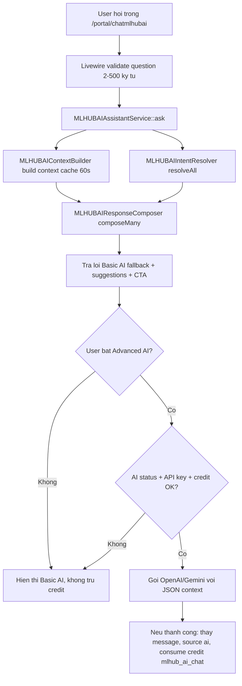

# MLHUBAI - Báo cáo kiến trúc, từ khóa và ma trận nội dung

> Ngày quét: 2026-06-20  
> Cập nhật P0: 2026-06-21 - P0 đã được duyệt và đã triển khai.  
> Phạm vi: tính năng `MLHUB AI Assistant` tại `/portal/chatmlhubai`, Basic AI không dùng token OpenAI/Gemini, Advanced AI có thể dùng OpenAI/Gemini nếu bật và có API key.  
> Trạng thái: đã quét, lập ma trận nội dung, và nâng cấp P0 cho Basic AI.

---

## 1. Kết luận nhanh

Tính năng MLHUBAI hiện đã có khung khả dụng cho giai đoạn "trợ lý nội bộ không tốn token":

- Có route riêng: `/portal/chatmlhubai`, route name `portal.chatmlhubai`.
- Có widget compact trên dashboard thông qua `MLHUBAIDashboardPanel`.
- Có 2 chế độ:
  - `Basic AI`: nhận diện intent bằng từ khóa, đọc số liệu thật, ghép câu trả lời bằng template, không dùng credit/token.
  - `Advanced AI`: chỉ gọi OpenAI/Gemini khi user bật toggle, hệ thống có API key, và credit còn đủ.
- Có context builder đọc metrics thật: business, campaign, active campaign, visits, leads, bookings, coupon claims, feedback, conversion rate, khách mới, review, top campaigns, recent activity.
- Có CTA link theo intent: customers, QR campaigns, review booster, reports, businesses, AI Studio.

Tuy nhiên, để Basic AI trả lời "mượt" như trợ lý hàng ngày, code hiện tại mới phủ lớp lõi của dashboard. Bộ intent hiện tại có 8 nhóm, 76 cụm từ khóa, 5 câu hỏi gợi ý đầu tiên, và 21 câu hỏi đào sâu. Trong khi sản phẩm hiện có nhiều module liên quan hơn: landing pages, booking, coupon, feedback, lead forms, CRM, Google Business, automation, loyalty/referral, file manager, credit, billing, team, support, AI Studio chi tiết. Nếu user hỏi các chủ đề này, Basic AI dễ rơi vào câu fallback "I did not quite catch that".

Khuyến nghị: trước khi dùng token LLM, nên mở rộng Basic AI thành một "knowledge router" nội bộ: intent matrix + metric matrix + URL matrix + question bank + response segment bank. Các đề xuất code nằm ở cuối file và cần được duyệt trước khi làm.

---

## 2. Bản đồ code hiện tại

| Lớp | File | Vai trò hiện tại | Ghi chú đánh giá |
| --- | --- | --- | --- |
| Route | `modules/CustomMLHUB/Routes/web.php` | Đăng ký `/portal/chatmlhubai`, middleware `web`, `auth`, `verified`; route name `portal.chatmlhubai`. | Dùng route user portal, cần plan feature gate ở Livewire. |
| Config | `modules/CustomMLHUB/config/config.php` | Khai báo `route_prefix => portal/chatmlhubai`. | Ổn định, dễ đổi prefix nếu cần. |
| Provider | `modules/CustomMLHUB/Providers/CustomMLHUBServiceProvider.php` | Bind service singleton, load route/view, register credit action `mlhub_ai_chat`, thêm sidebar item. | Sidebar chỉ hiện khi user có feature `mlhub`. |
| Livewire full page | `modules/CustomMLHUB/Livewire/ChatMLHUBAI.php` | Trang chat full. | Mount assistant và render view `custommlhub::chat`. |
| Livewire compact | `modules/CustomMLHUB/Livewire/MLHUBAIDashboardPanel.php` | Panel chat compact trên dashboard. | Nếu không có feature `mlhub` thì ẩn panel. |
| Shared trait | `modules/CustomMLHUB/Livewire/Concerns/InteractsWithMLHUBAIAssistant.php` | Quản lý messages, question, suggested prompts, toggle Advanced AI, validate câu hỏi 2-500 ký tự. | Chưa lưu lịch sử chat dài hạn, mới tồn tại trong state Livewire. |
| Service | `modules/CustomMLHUB/Support/MLHUBAIAssistant/MLHUBAIAssistantService.php` | Orchestrator: build context, resolve intent, compose fallback, nếu advanced thì gọi OpenAI/Gemini và trừ credit. | Basic AI dùng trước, Advanced AI là lớp tăng cường. |
| Intent resolver | `modules/CustomMLHUB/Support/MLHUBAIAssistant/MLHUBAIIntentResolver.php` | So khớp keyword bằng `str_contains`, tính confidence đơn giản. | Keyword hiện tại còn mỏng, chưa normalize không dấu/fuzzy typo tự động. |
| Context builder | `modules/CustomMLHUB/Support/MLHUBAIAssistant/MLHUBAIContextBuilder.php` | Gom snapshot số liệu user trong cache 60 giây. | Đã đọc nhiều bảng growth core, chưa đọc sâu CRM/Google/automation/billing. |
| Response composer | `modules/CustomMLHUB/Support/MLHUBAIAssistant/MLHUBAIResponseComposer.php` | Ghép câu trả lời theo intent, thêm greeting, CTA action. | Có câu trả lời ngắn gọn, nhưng mới có 7 intent nghiệp vụ. |
| UI | `modules/CustomMLHUB/Resources/views/partials/chat-shell.blade.php` | Chat shell, toggle Basic/Advanced, message bubbles, action buttons, suggested prompts. | UI đã nói rõ Basic AI không tốn credits; Advanced AI cần API key và credit. |

---

## 3. Luồng xử lý hiện tại

Nguyên tắc tốt đã có:

- Basic AI luôn tạo câu trả lời trước, nên khi API lỗi vẫn có kết quả.
- Advanced AI được ràng buộc bởi `ai_chat_status`, provider credentials, và credit.
- System prompt Advanced AI yêu cầu chỉ dùng số liệu trong JSON context, không bịa metrics.
- Actions chỉ tạo nếu `Route::has($routeName)`.

Điểm cần cảnh giác:

- Model mặc định trong service đang là `gpt-5.4`. Cần đối chiếu với cấu hình thật trước khi bật Advanced AI production.
- Nếu user hỏi ngoài 7 intent nghiệp vụ hiện có, Basic AI không có "tri thức sản phẩm" để trả lời.
- Fallback không log coverage/confidence, nên khó biết user đang hỏi nhóm nào bị thiếu.

---

## 4. Hiện trạng Basic AI

### 4.1 Chỉ số hiện tại

| Chỉ số | Giá trị hiện tại | Nguồn |
| --- | ---: | --- |
| Intent tổng | 8 | `greeting`, `new_customers`, `campaigns`, `reviews`, `next_steps`, `overview`, `visits`, `businesses` |
| Intent nghiệp vụ có câu trả lời riêng | 7 | Trừ `greeting`; unknown dùng fallback chung. |
| Cụm keyword hiện tại | 76 | Đếm từ `intentKeywords()`. |
| Câu hỏi gợi ý ban đầu | 5 | `initialPrompts()`. |
| Câu hỏi đào sâu cùng topic | 21 | 7 nhóm x 3 câu. |
| Explore prompts | 6 | Pool câu hỏi để chuyển chủ đề. |
| CTA route groups | 7 | customers, qr-campaigns, review-booster, reports, businesses, ai-studio. |
| Cache context | 60 giây | `MLHUBAIContextBuilder::CACHE_TTL_SECONDS`. |
| Giới hạn input | 2-500 ký tự | Livewire validation. |

### 4.2 Intent và keyword hiện tại

| Intent | Keyword hiện tại | Câu hỏi gợi ý/follow-up hiện tại | Metrics/Context đang dùng | CTA hiện tại |
| --- | --- | --- | --- | --- |
| `greeting` | xin chào, xin chao, chào, chao, hello, helo, hallo, alo, hi bạn, hi ban | Không có follow-up riêng; dùng initial prompts. | `generated_at`, `user.short_name`. | Không có. |
| `new_customers` | khách mới, khach moi, customer mới, new customer, khách hàng mới, tuần này có khách, tuan nay co khach, có khách mới, co khach moi | "Where did the new customers come from?", "How does it compare to last week?", "How can I get more new customers?" | `customers.new_this_week`, `customers.new_last_week`, `customers.delta`, `weekly_signals.leads/bookings/positive_reviews`. | `portal.customers`. |
| `campaigns` | chiến dịch, chien dich, campaign, đang chạy, dang chay, tổng hợp chiến dịch, tong hop chien dich, running campaign | "Which campaign performs best?", "Which campaign needs improvement?", "How do I create a new campaign?" | `active_campaigns`, `campaign.type`, `visits`, `conversions`. | `portal.qr-campaigns`. |
| `reviews` | đánh giá, danh gia, review, sao, rating, phản hồi review, đánh giá tuần, danh gia tuan | "Which reviews need a reply?", "How can I get more 5-star reviews?", "What is my average rating?" | `reviews.count`, `reviews.average_rating`, `reviews.needs_reply`, `reviews.positive_count`. | `portal.review-booster`. |
| `next_steps` | làm gì, lam gi, gợi ý, goi y, next step, what should i do, chiến dịch mới, chien dich moi, đề xuất, de xuat, nên làm | "Suggest a weekend campaign", "What should I prioritize first?", "How can I grow revenue quickly?" | `onboarding`, `metrics.visits`, `metrics.review_clicks`. | Tùy onboarding: businesses, qr-campaigns, review-booster, ai-studio. |
| `overview` | tổng quan, tong quan, overview, báo cáo, bao cao, report, tình hình, tinh hinh, kết quả, ket qua | "Which metric is dropping?", "What stood out this week?", "What should I do next? / Suggest a new campaign." | `metrics.businesses`, `active_campaigns`, `visits`, `leads`, `bookings`, `coupon_claims`, `conversion_rate`. | `portal.reports`. |
| `visits` | lượt quét, luot quet, qr scan, lượt truy cập, luot truy cap, visits, traffic | "Where do the visits come from?", "What is my conversion rate?", "How can I get more QR scans?" | `metrics.visits`, `weekly_signals.qr_scans`, `weekly_signals.leads`, `weekly_signals.bookings`. | `portal.reports`. |
| `businesses` | cơ sở, co so, danh sách cơ sở, danh sach co so, doanh nghiệp, doanh nghiep, business, chi nhánh, chi nhanh, cửa hàng, cua hang, địa điểm, dia diem | "Which business performs best?", "How do I add a new business?", "Where do I update business info?" | `business_list.count`, `business_list.names`. | `portal.businesses`. |

### 4.3 Context metrics hiện có

| Context key | Nội dung | Nguồn | Độ sẵn sàng cho Basic AI |
| --- | --- | --- | --- |
| `metrics.businesses` | Số business của user | `LocalBusiness` | Sẵn sàng |
| `metrics.campaigns` | Tổng campaign | `QrCampaign` | Sẵn sàng |
| `metrics.active_campaigns` | Campaign đã publish | `QrCampaign.published_at` | Sẵn sàng |
| `metrics.visits` | Tổng QR scan | `QrScan` | Sẵn sàng, cần lọc bớt trong backlog riêng |
| `metrics.review_clicks` | Review feedback rating >= 4 | `ReviewFeedback` | Sẵn sàng |
| `metrics.leads` | Lead submissions | `LeadSubmission` | Sẵn sàng |
| `metrics.bookings` | Bookings | `Booking` | Sẵn sàng |
| `metrics.coupon_claims` | Coupon redemptions | `CouponRedemption` | Sẵn sàng |
| `metrics.feedback` | Feedback response + review rating <= 3 | `FeedbackResponse`, `ReviewFeedback` | Sẵn sàng |
| `metrics.conversion_rate` | Conversions / visits | Tổng hợp nội bộ | Sẵn sàng |
| `customers.*` | Khách mới tuần này, tuần trước, delta | `Customer` | Sẵn sàng |
| `weekly_signals.*` | leads, bookings, positive reviews, coupon claims, QR scans trong tuần | Nhiều model growth | Sẵn sàng |
| `reviews.*` | Count, average rating, needs reply, positive count trong tuần | `ReviewFeedback` | Sẵn sàng |
| `active_campaigns[]` | 6 campaign đã publish gần nhất, type, visits, conversions | `QrCampaign`, conversions tổng hợp | Sẵn sàng |
| `top_campaigns[]` | Top 5 campaign theo visits/conversions | `PortalGrowthDashboardMetrics` | Có trong context nhưng chưa được response composer khai thác sâu |
| `recent_activity[]` | 5 activity gần nhất | `PortalGrowthDashboardMetrics` | Có trong context nhưng chưa được response composer khai thác sâu |
| `business_list` | Count và tối đa 12 tên business | `LocalBusiness` | Sẵn sàng |
| `onboarding` | create_business, create_campaign, publish_campaign, share_qr, boost_reviews | Derived từ metrics | Sẵn sàng |

---

## 5. Đánh giá "đã quét hết ngóc ngách chưa?"

### 5.1 Đã chạm đúng các ngóc ngách của riêng tính năng chat

| Khu vực | Kết quả |
| --- | --- |
| Route `/portal/chatmlhubai` | Đã có và dùng middleware auth/verified. |
| Sidebar portal | Đã đăng ký item `MLHUB AI Assistant`, chỉ hiện khi user có feature `mlhub`. |
| Dashboard panel | Đã có compact chat panel và link mở full chat. |
| Basic/Advanced toggle | Đã có UI và logic. Basic không dùng credit. Advanced cần API key và credit. |
| Context live data | Đã gom data thật từ dashboard/growth modules. |
| Intent matching | Đã có nhưng còn đơn giản. |
| Response templates | Đã có nhưng phủ ít chủ đề. |
| CTA action | Đã có nhưng ít route liên quan. |
| Credit | Advanced AI mới trừ `mlhub_ai_chat`. |
| Test riêng cho MLHUBAI | Chưa thấy test trong `tests/` cho resolver/composer/service. |

### 5.2 Chưa bao phủ hết "ngóc ngách sản phẩm"

Những nhóm sau có route/module hiện hữu nhưng chưa có intent riêng, keyword riêng, câu hỏi riêng hoặc response segment riêng trong Basic AI:

- Landing Pages
- Review Booster chi tiết: review link, negative feedback, pending replies
- Booking pages: lịch hẹn, service, slot, booking conversion
- Coupon campaigns: mã đã phát, usage limit, coupon claims
- Feedback forms: private feedback, low rating, NPS
- Lead forms: source lead, lead quality, follow-up
- Business locations
- Customers chi tiết, segmentation, duplicate/merge
- Advanced CRM: segments, tags, tasks, automations, reports
- Google Business Profile: OAuth, locations, Google reviews, auto reply, posts, insights
- Email/WhatsApp/Webhook automation
- Loyalty cards và referral campaigns
- File manager, media search, image editor
- AI Studio chi tiết: Campaign Builder, Content Writer, Repurpose, Planner, AI Image, Prompt History, Settings
- Credits, billing, packages, invoices
- Teams/workspace
- Support tickets
- Profile/security/language
- Public URLs: `/qr/{slug}`, `/lp/{slug}`, `/b/{business}`, `/l/{location}`, loyalty/referral URLs

Nhận định: code hiện tại "vibecode" đã làm đủ khung chạy và phủ core dashboard, nhưng chưa lập thành bộ tri thức sản phẩm đầy đủ. Để MLHUBAI giống trợ lý thông báo mỗi ngày, cần bổ sung ma trận nội dung trước khi dùng LLM.

---

## 6. Ma trận URL tính năng liên quan

| Nhóm | Route name | URL/prefix | Basic AI nên hiểu để trả lời | Trạng thái trong Basic AI hiện tại |
| --- | --- | --- | --- | --- |
| MLHUBAI | `portal.chatmlhubai` | `/portal/chatmlhubai` | Mở trợ lý, giải thích Basic/Advanced AI | Có UI, chưa có intent "how_to_use_ai". |
| Dashboard | `portal.dashboard` | `/portal/dashboard` | Tổng quan ngày, onboarding, widgets | Dùng metrics, chưa CTA trực tiếp trong composer. |
| Businesses | `portal.businesses` | `/portal/businesses` | Tạo/sửa business, danh sách cơ sở | Đã có intent `businesses`. |
| Business create | `portal.businesses.create` | `/portal/businesses/create` | Hướng dẫn tạo business đầu tiên | Chỉ có onboarding CTA chung. |
| Business detail | `portal.businesses.show` | `/portal/businesses/{business}` | Hồ sơ, campaign, reviews, leads, reports của từng business | Chưa có intent theo business detail. |
| Locations | `portal.businesses.locations`, `portal.locations` | `/portal/businesses/{business}/locations`, `/portal/locations` | Chi nhánh/địa điểm/QR địa điểm | Chưa có intent riêng. |
| Customers | `portal.customers` | `/portal/customers` | Danh sách khách, khách mới | Có `new_customers`, nhưng chưa có lifecycle/segment. |
| CRM | `portal.crm.*` | `/portal/crm/...` | Segment, tag, task, automation, CRM report | Chưa có intent. |
| QR Campaigns | `portal.qr-campaigns` | `/portal/qr-campaigns` | Tạo QR, xem analytics QR | Có `campaigns`/`visits`, còn mỏng. |
| QR Analytics | `portal.qr-campaigns.analytics` | `/portal/qr-campaigns/{slug}/analytics` | Campaign nào tốt/xấu | Chưa CTA analytics cụ thể. |
| Public QR | `qr-campaigns.public` | `/qr/{campaign}` | Link công khai khách quét | Chưa có intent về public link. |
| Landing Pages | `portal.landing-pages` | `/portal/landing-pages` | Tạo campaign page, form submit | Chưa có intent. |
| Public landing | `landing-pages.public` | `/lp/{slug}` | Link landing public | Chưa có intent. |
| Review Booster | `portal.review-booster` | `/portal/review-booster` | Lấy review, review xấu, pending reply | Có `reviews` nhưng chưa sâu. |
| Booking | `portal.booking-pages` | `/portal/booking-pages` | Lịch hẹn, dịch vụ, slot trống | Chưa có intent riêng, chỉ tính booking count. |
| Coupon | `portal.coupon-campaigns` | `/portal/coupon-campaigns` | Mã ưu đãi, claim, giới hạn | Chưa có intent riêng, chỉ tính coupon claims. |
| Feedback | `portal.feedback-forms` | `/portal/feedback-forms` | Phản hồi riêng, điểm thấp, NPS | Chưa có intent riêng, chỉ tính feedback count. |
| Lead Forms | `portal.lead-forms` | `/portal/lead-forms` | Lead, form, follow-up | Chưa có intent riêng, chỉ tính leads. |
| Reports | `portal.reports` | `/portal/reports` | Báo cáo, conversion, top campaign | Có `overview`/`visits`, chưa dùng top_campaigns/recent_activity sâu. |
| Marketing Templates | `portal.marketing-templates` | `/portal/marketing-templates` | Mẫu nội dung, template | Chưa có intent. |
| AI Studio | `portal.ai-studio` | `/portal/ai-studio` | Campaign Builder | Chỉ CTA trong `next_steps`, chưa có intent. |
| AI Review Reply | `portal.ai-studio.review-reply` | `/portal/ai-studio/review-reply` | Viết phản hồi review bằng AI | Chưa có intent. |
| AI Content | `portal.ai-content` | `/portal/ai-studio/ai-content` | Viết caption/content | Chưa có intent. |
| AI Planner | `portal.ai-content-planner` | `/portal/ai-studio/planner` | Kế hoạch nội dung | Chưa có intent. |
| AI Repurpose | `portal.ai-repurpose` | `/portal/ai-studio/repurpose` | Tái sử dụng nội dung | Chưa có intent. |
| AI Image | `portal.ai-image` | `/portal/ai-studio/image` | Tạo ảnh AI | Chưa có intent. |
| Prompt history | `portal.ai-studio.prompt-history` | `/portal/ai-studio/prompt-history` | Lịch sử prompt | Chưa có intent. |
| AI settings | `portal.ai-studio.settings` | `/portal/ai-studio/settings` | Cấu hình AI workspace/user | Chưa có intent. |
| AI removed modules | `portal.ai-video`, `portal.ai-review`, `portal.ai-best-time`, `portal.ai-semantic-search` | Route files có trên đĩa nhưng providers không load route | Không nên gợi ý trong UI nếu provider đã remove surface | Chưa cần intent, nên ghi là không khả dụng. |
| Google Business | `portal.google-business` | `/portal/integrations/google-business` | Google locations, reviews, posts, insights, auto reply | Chưa có intent. |
| Email Automation | `portal.email-*` | `/portal/email-automation/...` | Email automation/template/log | Chưa có intent. |
| WhatsApp | `portal.whatsapp-*` | `/portal/whatsapp-notification/...` | WhatsApp automation/template/log | Chưa có intent. |
| Webhook | `portal.webhook-*` | `/portal/webhook-automation/...` | Webhook automation/log | Chưa có intent. |
| Loyalty | `portal.loyalty-cards` | `/portal/loyalty-cards` | Thẻ tích điểm, referral | Chưa có intent. |
| Files | `portal.files.index` | `/portal/files` | Thư viện file, preview/download/edit image | Chưa có intent. |
| Credits | `portal.credits` | `/portal/credits` | Credit còn lại, lịch sử dùng | Chưa có intent trong chat. |
| Packages | `portal.packages` | `/portal/packages` | Nâng cấp gói | Chưa có intent. |
| Billing | `portal.billing`, `portal.invoices` | `/portal/billing`, `/portal/invoices` | Hóa đơn, subscription | Chưa có intent. |
| Teams | `portal.teams` | `/portal/teams` | Workspace, team members | Chưa có intent. |
| Support | `portal.support.index` | `/portal/support` | Ticket hỗ trợ | Chưa có intent. |
| Profile | `portal.profile` | `/portal/profile` | Hồ sơ, mật khẩu | Chưa có intent. |
| Affiliate | `portal.affiliate.index` | `/portal/affiliate` | Affiliate/referral revenue | Chưa có intent. |
| Custom domains | `portal.brand.domains`, `portal.qr-codes.domains` | `/portal/brand/custom-domains`, `/portal/qr-codes/domains` | Tên miền riêng cho QR/campaign | Chưa có intent. |

---

## 7. Ma trận intent để bổ sung

Bảng này là "content matrix" để Basic AI trả lời mượt hơn mà chưa cần OpenAI token. Nên tách ra file config/data riêng khi được duyệt.

| Intent đề xuất | Từ khóa nên thêm | Câu hỏi mẫu nên thêm | Metrics/dữ liệu cần đọc | CTA/URL liên quan | Ưu tiên |
| --- | --- | --- | --- | --- | --- |
| `help_using_mlhubai` | mlhub ai, trợ lý, assistant, basic ai, advanced ai, không tốn token, credit, hỏi gì được, cách dùng | "MLHUB AI hỏi được những gì?", "Basic AI có tốn credit không?", "Khi nào cần Advanced AI?" | `advancedAvailable`, credit summary nếu có | `portal.chatmlhubai`, `portal.credits`, `portal.ai-studio.settings` | P0 |
| `daily_briefing` | hôm nay, sáng nay, báo cáo ngày, daily, briefing, hôm qua, tuần này, cần chú ý | "Sáng nay tình hình thế nào?", "Hôm nay tôi nên xem chỉ số nào?", "Có gì bất thường không?" | metrics, weekly_signals, recent_activity, top_campaigns | `portal.dashboard`, `portal.reports` | P0 |
| `onboarding` | bắt đầu, setup, chưa có dữ liệu, tạo đầu tiên, cần làm gì trước, hướng dẫn | "Tôi mới tạo tài khoản thì làm gì trước?", "Tại sao dashboard chưa có số liệu?" | onboarding hints | businesses/create, qr-campaigns, review-booster | P0 |
| `business_locations` | chi nhánh, địa điểm, location, cơ sở con, mã QR địa điểm, cửa hàng nào | "Có bao nhiêu chi nhánh?", "Thêm địa điểm ở đâu?", "Mở QR của địa điểm thế nào?" | LocalBusiness + BusinessLocation count | `portal.businesses.locations`, `portal.locations` | P1 |
| `customers` | khách hàng, khách cũ, khách quay lại, danh bạ, data khách, customer list | "Có bao nhiêu khách?", "Khách mới đến từ đâu?", "Tôi nên chăm sóc nhóm khách nào?" | Customer count, new/returning, source, recent activity | `portal.customers`, `portal.crm.customers` | P0 |
| `customer_followup` | chăm sóc lại, follow up, nhắc khách, khách cũ, quay lại, gửi tin | "Nhắc khách quay lại như thế nào?", "Nên gửi ưu đãi cho nhóm nào?" | customers, CRM segments, email/whatsapp availability | CRM, email, whatsapp, coupon | P1 |
| `top_campaigns` | chiến dịch tốt nhất, top campaign, hiệu quả nhất, kém nhất, cần cải thiện | "Chiến dịch nào đang tốt nhất?", "Chiến dịch nào cần sửa?", "Tại sao conversion thấp?" | top_campaigns, active_campaigns, conversion_rate | `portal.qr-campaigns.analytics`, `portal.reports` | P0 |
| `qr_scans` | quét QR, scan, mã QR, lượt quét, in mã, đặt mã ở đâu | "Lượt quét tuần này thế nào?", "Làm sao tăng QR scan?", "Mã QR nằm ở đâu?" | visits, weekly qr_scans, campaign public URL | `portal.qr-campaigns`, public QR links | P0 |
| `landing_pages` | landing page, trang chiến dịch, trang công khai, public page, link campaign | "Tạo landing page ở đâu?", "Trang nào đang có form submit?", "Copy link public thế nào?" | landing page count/status/submissions if available | `portal.landing-pages`, `/lp/{slug}` | P1 |
| `review_booster` | review booster, xin đánh giá, đánh giá google, 5 sao, rating thấp, phản hồi riêng | "Làm sao tăng đánh giá 5 sao?", "Có review nào cần trả lời không?", "Review xấu xử lý thế nào?" | review stats, needs_reply, positive/private feedback | `portal.review-booster`, `portal.google-business?tab=reviews` | P0 |
| `google_reviews` | google review, đánh giá google, trả lời review, sync review, auto reply | "Đồng bộ Google review chưa?", "Review Google nào cần trả lời?", "Auto reply đang bật chưa?" | GoogleBusiness connection, reviews, rules | `portal.google-business?tab=reviews`, `?tab=auto_reply` | P1 |
| `booking` | đặt lịch, booking, lịch hẹn, slot, dịch vụ, khách đặt | "Hôm nay có lịch hẹn không?", "Tạo trang đặt lịch thế nào?", "Dịch vụ nào được đặt nhiều?" | bookings this week, service count, upcoming bookings | `portal.booking-pages` | P0 |
| `coupon` | coupon, mã giảm giá, voucher, ưu đãi, claim, khách nhận mã | "Có bao nhiêu khách nhận mã?", "Tạo voucher cuối tuần thế nào?", "Mã nào gần hết lượt?" | coupon_claims, campaign settings usage/expiry | `portal.coupon-campaigns` | P0 |
| `feedback` | feedback, phản hồi riêng, góp ý, khách không hài lòng, NPS, rating thấp | "Có phản hồi xấu nào không?", "Khách phàn nàn gì nhiều?", "Nên xử lý feedback thế nào?" | feedback count, low rating, recent feedback themes if available | `portal.feedback-forms`, reports | P0 |
| `leads` | lead, khách tiềm năng, form tư vấn, yêu cầu báo giá, số điện thoại mới | "Có lead mới không?", "Lead từ form nào?", "Nên follow up lead nào trước?" | leads this week, recent lead activity, campaign source | `portal.lead-forms`, `portal.businesses.leads` | P0 |
| `conversion` | chuyển đổi, conversion, tỉ lệ, hiệu suất, funnel, scan ra khách | "Tỉ lệ chuyển đổi bao nhiêu?", "Tại sao scan nhiều mà ít lead?", "Nên tối ưu bước nào?" | visits, conversions, conversion_rate, top_campaigns | `portal.reports` | P0 |
| `reports` | báo cáo, analytics, report, biểu đồ, chỉ số, dashboard | "Mở báo cáo ở đâu?", "Báo cáo tuần này có gì?", "Chỉ số nào giảm?" | metrics, top_campaigns, recent_activity | `portal.reports` | P0 |
| `ai_studio` | ai studio, campaign builder, tạo nội dung, viết caption, prompt, lịch sử prompt | "AI Studio làm được gì?", "Tạo nội dung chiến dịch ở đâu?", "Xem lại prompt cũ thế nào?" | credit summary, route availability, prompt history count if available | `portal.ai-studio`, `portal.ai-content`, `portal.ai-studio.prompt-history` | P1 |
| `ai_content_writer` | content writer, caption, bài viết, nội dung facebook, bài quảng cáo, CTA | "Viết caption cho ưu đãi cuối tuần", "Tạo CTA cho landing page", "Viết tin nhắn nhắc khách" | business profile, campaign type, brand voice if available | `portal.ai-content` | P1 |
| `ai_planner` | content planner, lịch nội dung, kế hoạch bài đăng, calendar | "Lập kế hoạch nội dung 7 ngày", "Tuần này đăng gì?" | campaign/business context, AI credit | `portal.ai-content-planner` | P2 |
| `ai_image` | ảnh AI, tạo ảnh, image, banner, poster, visual | "Tạo ảnh khuyến mãi ở đâu?", "AI image có tốn credit không?" | AI image jobs, credits | `portal.ai-image`, `portal.files.index` | P2 |
| `credits` | credit, token, số dư, hết credit, mua thêm, usage | "Tôi còn bao nhiêu credit?", "Basic AI có trừ credit không?", "Mua thêm credit ở đâu?" | credit_summary, plan permission cost | `portal.credits`, `portal.packages` | P0 |
| `billing` | thanh toán, hóa đơn, invoice, gói, nâng cấp, subscription | "Nâng cấp gói ở đâu?", "Xem hóa đơn ở đâu?", "Gói hiện tại giới hạn gì?" | plan usage, billing status, invoices | `portal.packages`, `portal.billing`, `portal.invoices` | P1 |
| `plan_limits` | giới hạn, limit, gói hiện tại, tối đa, quota, hết lượt | "Tôi còn tạo được bao nhiêu campaign?", "Vì sao không tạo được QR?", "Gói Free giới hạn gì?" | PlanLimitGuard usageSummary | dashboard planUsage, packages | P0 |
| `files` | file, media, ảnh, upload, thư viện, drive, dropbox, onedrive, edit image | "Upload ảnh ở đâu?", "Tìm ảnh online thế nào?", "Dung lượng còn bao nhiêu?" | storage usage, file count, plan limits | `portal.files.index`, `portal.files.search-online` | P2 |
| `crm_segments` | CRM, segment, phân nhóm, tag, task, ghi chú, automation CRM | "Phân nhóm khách thế nào?", "Tạo task chăm sóc khách ở đâu?", "CRM automation là gì?" | CRM counts, segments/tags/tasks/automation | `portal.crm.*` | P1 |
| `google_business` | Google Business, GBP, location google, bài đăng google, insight | "Kết nối Google Business ở đâu?", "Có sync review chưa?", "Đăng bài Google thế nào?" | connection count, location count, review sync, posts | `portal.google-business` | P1 |
| `email_automation` | email automation, email template, email log, gửi email tự động | "Tạo email chăm sóc lại ở đâu?", "Email có gửi lỗi không?" | automation count, templates, logs, SMTP status if available | `portal.email-automations`, `portal.email-logs` | P2 |
| `whatsapp_automation` | whatsapp, tin nhắn, cloud api, template whatsapp, log | "Gửi WhatsApp tự động thế nào?", "WhatsApp còn giới hạn gì?" | whatsapp limits/logs | `portal.whatsapp-notifications` | P2 |
| `webhook_automation` | webhook, zapier, automation ngoài, API, retry | "Kết nối Zapier/webhook ở đâu?", "Webhook lỗi xem ở đâu?" | webhook automations/logs | `portal.webhook-automations`, `portal.webhook-logs` | P2 |
| `loyalty_referral` | loyalty, tích điểm, thẻ thành viên, referral, giới thiệu bạn bè | "Tạo thẻ tích điểm ở đâu?", "Chiến dịch giới thiệu hoạt động thế nào?" | loyalty card/referral counts | `portal.loyalty-cards` | P2 |
| `custom_domains` | tên miền riêng, custom domain, domain QR, branded link | "Gắn tên miền riêng ở đâu?", "Domain đã verify chưa?" | custom domain status/count | `portal.brand.domains`, `portal.qr-codes.domains` | P2 |
| `teams` | team, workspace, thành viên, phân quyền, mời người | "Mời nhân viên vào workspace thế nào?", "Đổi workspace ở đâu?" | team members, workspace role | `portal.teams` | P1 |
| `support` | hỗ trợ, ticket, liên hệ, lỗi, cần giúp | "Gửi ticket hỗ trợ ở đâu?", "Tôi cần báo lỗi" | ticket count/status if available | `portal.support.index` | P1 |
| `profile_security` | hồ sơ, mật khẩu, đổi email, bảo mật, 2FA, ngôn ngữ | "Đổi mật khẩu ở đâu?", "Đổi ngôn ngữ thế nào?" | user profile, locale | `portal.profile`, language route | P2 |
| `unknown` | fallback | "Bạn có thể hỏi lại theo một trong các nhóm: khách, chiến dịch, review, booking..." | none | suggested prompts | P0 |

---

## 8. Bộ câu hỏi để MLHUBAI gợi ý

### 8.1 Starter prompts nên thay/bổ sung

Hiện có 5 câu bằng tiếng Anh. Nên bổ sung bản tiếng Việt hoặc đảm bảo translation có đầy đủ:

| Nhóm | Câu hỏi nên có |
| --- | --- |
| Tổng quan | "Sáng nay tình hình kinh doanh thế nào?" |
| Tổng quan | "Tóm tắt nhanh tuần này cho tôi." |
| Hành động | "Hôm nay tôi nên ưu tiên việc gì?" |
| Khách hàng | "Tuần này có khách mới không?" |
| Campaign | "Chiến dịch nào đang hiệu quả nhất?" |
| QR | "Lượt quét QR tuần này thế nào?" |
| Review | "Có đánh giá nào cần trả lời không?" |
| Booking | "Có lịch hẹn mới nào không?" |
| Lead | "Có lead mới nào cần chăm sóc không?" |
| Coupon | "Voucher/coupon nào đang được nhận nhiều?" |
| Feedback | "Có phản hồi xấu nào cần xử lý không?" |
| Plan/Credit | "Basic AI có tốn credit không?" |

### 8.2 Question bank theo ngữ cảnh

| Trạng thái dữ liệu | Câu hỏi nên gợi ý | Định hướng trả lời |
| --- | --- | --- |
| Chưa có business | "Tôi cần làm gì để bắt đầu?" | Thêm business trước, rồi tạo campaign/QR. |
| Có business, chưa có campaign | "Nên tạo chiến dịch đầu tiên loại nào?" | Review Booster nếu shop dịch vụ/F&B, lead form nếu cần tư vấn, coupon nếu cần quay lại. |
| Có campaign, chưa publish | "Làm sao đưa campaign ra public?" | Publish campaign/landing, copy link/QR. |
| Có publish, chưa có scan | "Tại sao chưa có lượt quét?" | Đặt QR ở quầy, bàn, hóa đơn, tin nhắn; kiểm tra public link. |
| Scan cao, conversion thấp | "Scan nhiều nhưng ít khách để lại thông tin, nên làm gì?" | Kiểm tra CTA, form ngắn hơn, ưu đãi rõ hơn, review/coupon/lead split. |
| Nhiều review tốt | "Làm sao tận dụng review tốt?" | Reply, dùng trong landing/social, Google Business post. |
| Nhiều feedback xấu | "Phản hồi xấu đang nói gì?" | Ưu tiên xử lý, dùng private feedback, tạo task CRM. |
| Nhiều lead | "Lead nào cần gọi trước?" | Ưu tiên lead gần nhất/từ campaign có ý định cao. |
| Hết credit | "Hết credit thì Basic AI còn dùng được không?" | Basic AI vẫn dùng được; Advanced AI/AI Studio cần credit. |
| Sắp vượt plan limit | "Tôi còn tạo được bao nhiêu campaign/QR?" | Đọc plan usage, gợi ý nâng cấp nếu gần hết. |

### 8.3 Câu hỏi bản ngày theo vai trò "trợ lý thông báo mỗi ngày"

| Thời điểm | Câu hỏi/chủ đề | Response segment nên ghép |
| --- | --- | --- |
| Sáng | "Chào buổi sáng, hôm nay tôi cần xem gì?" | Greeting + yesterday/this week snapshot + 1 rui ro + 1 next action. |
| Trước giờ mở cửa | "Có lịch hẹn hay lead nào cần chuẩn bị không?" | Booking upcoming + lead new + CTA booking/leads. |
| Giữa ngày | "Chiến dịch nào đang kéo khách tốt?" | Top campaign + conversion + gợi ý share QR. |
| Chiều | "Có feedback/review cần xử lý không?" | Needs reply + low rating/private feedback + CTA review/feedback. |
| Cuối ngày | "Tóm tắt ngày hôm nay." | Visits, leads, bookings, coupons, feedback, review count + next-day action. |
| Cuối tuần | "Cuối tuần nên chạy chiến dịch gì?" | Weekend coupon/review booster/booking reminder theo context. |

---

## 9. Bộ chỉ số nên thêm vào Basic AI

| Nhóm chỉ số | Field đề xuất | Cách dùng trong câu trả lời | Ưu tiên |
| --- | --- | --- | --- |
| Freshness | `context.generated_at`, `data_freshness_seconds` | Nói rõ "số liệu cập nhật lúc..." nếu cần. | P0 |
| Intent | `intent`, `matched_keywords`, `confidence`, `coverage_score` | Debug nội bộ, không cần hiện user. | P0 |
| Readiness | `context_readiness` theo module | Nếu thiếu bảng/module/permission, nói lý do. | P0 |
| Plan | `plan.name`, `plan.limits`, `plan.usage_percent` | Trả lời "còn bao nhiêu quota". | P0 |
| Credits | `credits.remaining`, `credits.used`, `credits.limit`, `credit_cost_mlhub_ai_chat` | Giải thích Basic vs Advanced. | P0 |
| Campaign trends | `top_campaigns`, `worst_campaigns`, `delta_visits`, `delta_conversions` | Nói "tăng/giảm so với tuần trước". | P1 |
| Conversion | `conversion_by_type`, `conversion_by_campaign` | Gợi ý tối ưu đúng điểm nghẽn. | P1 |
| Review | `needs_reply`, `low_rating_count`, `google_review_count`, `avg_rating_delta` | Ưu tiên xử lý review/feedback. | P1 |
| Booking | `upcoming_bookings`, `booking_by_service`, `no_show_or_cancelled` | Trợ lý vận hành ngày. | P1 |
| Leads | `new_leads`, `uncontacted_leads`, `lead_source_campaigns` | Gợi ý follow-up. | P1 |
| CRM | `open_tasks`, `segments_count`, `automations_active` | Trợ lý chăm sóc lại. | P2 |
| Google Business | `connected_locations`, `reviews_synced`, `posts_scheduled`, `auto_reply_enabled` | Giải thích local presence. | P2 |
| Automation | `email_logs_failed`, `whatsapp_logs_failed`, `webhook_logs_failed` | Cảnh báo vận hành. | P2 |

---

## 10. Công thức trả lời Basic AI để "mượt" mà không dùng token

Nên xem mỗi câu trả lời Basic AI là ghép 5 segment có điều kiện:

1. Greeting/time-aware segment  
   Ví dụ: "Chào buổi sáng anh/chị, em đã xem nhanh số liệu mới nhất."

2. Fact segment  
   Chỉ nói số liệu có trong context: "Tuần này có 12 lượt quét QR, 3 lead, 1 booking."

3. Interpretation segment  
   Dùng rule nội bộ: conversion rate thấp/cao, review rating tốt/xấu, campaign empty, onboarding missing.

4. Next action segment  
   Luôn đưa 1-3 việc có thể làm ngay: tạo campaign, share QR, reply review, gọi lead, tạo coupon.

5. CTA segment  
   Gắn action route: "Mở Reports", "Tạo chiến dịch", "Mở Review Booster".

### 10.1 Rule gợi ý nhanh

| Điều kiện | Câu trả lời nên ưu tiên |
| --- | --- |
| `businesses = 0` | Tạo business trước, vì campaign/QR cần home base. |
| `campaigns = 0` | Tạo Review Booster hoặc Lead Form đầu tiên. |
| `active_campaigns = 0 and campaigns > 0` | Publish campaign đang nháp. |
| `visits = 0 and active_campaigns > 0` | Chia sẻ/in QR, đặt tại quầy/hóa đơn/tin nhắn. |
| `visits > 0 and conversion_rate = 0` | CTA/form/ưu đãi chưa đủ mạnh; đề xuất coupon/lead form rõ hơn. |
| `reviews.needs_reply > 0` | Trả lời review trước để tăng uy tín. |
| `weekly_signals.leads > 0` | Gọi/chăm sóc lead trong ngày. |
| `weekly_signals.bookings > 0` | Kiểm tra lịch hẹn và nhắc khách. |
| `weekly_signals.coupon_claims > 0` | Theo dõi đổi mã và tạo follow-up quay lại. |
| `feedback > 0 or low_rating_count > 0` | Xử lý phản hồi riêng trước khi đẩy review công khai. |

### 10.2 Điểm tin cậy nội bộ nên tính

| Tên điểm | Công thức ý tưởng | Mục đích |
| --- | --- | --- |
| `keyword_score` | Tổng độ dài keyword match / độ dài câu hỏi, có trọng số theo keyword dài | Xếp hạng intent. |
| `route_confidence` | 1 nếu route tồn tại, 0 nếu không | Chỉ hiện CTA đúng. |
| `data_confidence` | 1 nếu context có metric cần thiết, 0.5 nếu thiếu một phần, 0 nếu không có | Chọn câu trả lời "dữ liệu thiếu" thay vì nói quá chắc. |
| `answer_confidence` | Trung bình có trọng số của keyword/data/route | Để fallback sang gợi ý hỏi lại. |
| `module_coverage` | Số module được context builder đọc / số module liên quan intent | Biết intent nào cần bổ sung context. |

---

## 11. Đề xuất nâng cấp code - chờ duyệt trước khi làm

Không thực hiện trong lần này. Đây là backlog để bạn chọn làm tiếp.

| Ưu tiên | Đề xuất | Lợi ích | Rủi ro/ghi chú |
| --- | --- | --- | --- |
| P0 | Tách `intentKeywords`, `questionBank`, `routeMatrix`, `responseSegments` ra class/config riêng | Dễ mở rộng không làm phình `MLHUBAIIntentResolver` và `ResponseComposer` | Cần test để tránh vỡ Basic AI. |
| P0 | Thêm unit test cho resolver/composer/service Basic AI | Bảo vệ keyword, multi-intent, fallback, CTA | Nên test trước khi sửa logic. |
| P0 | Normalize tiếng Việt không dấu: dùng bản normalized song song, xử lý "danh gia" và "đánh giá" như nhau | Tăng match khi user gõ không dấu | Cần tránh làm hỏng từ khóa có dấu hiện tại. |
| P0 | Thêm `matched_keywords`, `confidence`, `fallback_reason` nội bộ vào response metadata/log | Biết user hỏi gì mà hệ thống chưa trả lời được | Không cần hiện trên UI user. |
| P1 | Mở rộng `MLHUBAIContextBuilder` theo module: plan/credits, landing, booking, coupon, lead, feedback, CRM, Google | Basic AI trả lời đầy đủ sản phẩm | Cần đọc bảng có điều kiện `Schema::hasTable` và plan feature. |
| P1 | Thêm intent hierarchy: primary intent + secondary intents + topic entities | Câu hỏi "review và booking tuần này sao?" trả lời cả hai mượt hơn | Cần test multi-intent. |
| P1 | Dùng `top_campaigns` và `recent_activity` trong composer | Trả lời có ngữ cảnh hơn, giống báo cáo mỗi ngày | Context đã có, chỉ cần composer dùng. |
| P1 | Thêm Vietnamese-first prompts thay cho English starter nếu locale `vi` | UX hợp với MLHUB Việt Nam | Cần cập nhật translation. |
| P1 | Thêm "help cards" khi unknown: đưa 5 nhóm user có thể hỏi | Giảm cảm giác bị tắt | Đơn giản, ít rủi ro. |
| P2 | Admin/editor cho knowledge base Basic AI | Non-dev có thể thêm keyword/câu hỏi | Cần thiết kế UI và permission. |
| P2 | Lưu chat history hoặc prompt log Basic AI | Phân tích nhu cầu thật của user | Cần privacy/retention. |
| P2 | Scheduled daily briefing | Trợ lý tự động thông báo mỗi ngày | Cần automation/notification design. |

---

## 12. P0 đã triển khai (Xong - 2026-06-21)

| Hạng mục P0 | Trạng thái | File cập nhật | Ghi chú |
| --- | --- | --- | --- |
| Tách ma trận từ khóa/câu hỏi/route | Xong | `modules/CustomMLHUB/Support/MLHUBAIAssistant/MLHUBAIKnowledgeBase.php` | Thêm knowledge base riêng cho Basic AI: intent keywords, starter prompts, follow-up prompts, explore prompts, route actions. |
| Mở rộng intent P0 | Xong | `MLHUBAIKnowledgeBase.php`, `MLHUBAIIntentResolver.php` | Đã thêm `help_using_mlhubai`, `daily_briefing`, `onboarding`, `top_campaigns`, `qr_scans`, `review_booster`, `booking`, `coupon`, `feedback`, `leads`, `conversion`, `credits`, `plan_limits`. |
| Normalize tiếng Việt không dấu | Xong | `MLHUBAIIntentResolver.php` | Resolver chuyển câu hỏi và keyword về bản normalized, nên câu hỏi không dấu vẫn match được keyword có dấu/không dấu. |
| Trả về matched keywords/confidence | Xong | `MLHUBAIIntentResolver.php`, `MLHUBAIAssistantService.php` | Response có `metadata.confidence`, `metadata.matched_keywords`, `metadata.matches`, `metadata.intents`, `metadata.advanced_requested`. |
| Starter prompts tiếng Việt | Xong | `MLHUBAIKnowledgeBase.php` | Đã thay bộ câu hỏi đầu bằng các câu hỏi Viet-first: báo cáo sáng nay, top campaign, Basic AI/credit, booking/coupon/lead, next action. |
| Composer dùng top campaigns/recent activity | Xong | `MLHUBAIResponseComposer.php` | `daily_briefing` và `top_campaigns` đã đọc `top_campaigns[]`; `daily_briefing` đã đọc `recent_activity[]`. |
| Thêm response segments cho P0 | Xong | `MLHUBAIResponseComposer.php` | Có đoạn trả lời riêng cho booking, coupon, feedback, leads, conversion, credits, plan limits, QR scan, Review Booster. |
| CTA route liên quan P0 | Xong | `MLHUBAIKnowledgeBase.php`, `MLHUBAIResponseComposer.php` | Đã mở rộng CTA tới dashboard, reports, chatmlhubai, ai settings, booking pages, coupon campaigns, feedback forms, lead forms, credits, packages. |
| Unit test bảo vệ Basic AI | Xong một phần | `tests/Unit/CustomMLHUB/MLHUBAIAssistantBasicAiTest.php` | Đã thêm test cho resolver multi-intent, starter prompts, composer daily briefing/top campaign, metadata service. Chưa chạy full Pest được do máy host chưa có PHP và Docker escalation bị quota chặn. |

### 12.1 Ma trận P0 sau nâng cấp

| Intent | Từ khóa chính đã có | Dữ liệu Basic AI đang dùng | URL/CTA liên quan |
| --- | --- | --- | --- |
| `help_using_mlhubai` | mlhub ai, tro ly, assistant, basic ai, advanced ai, token, credit, cach dung | Rule nội bộ Basic/Advanced AI | `portal.chatmlhubai`, `portal.ai-studio.settings` |
| `daily_briefing` | hom nay, sang nay, bao cao ngay, daily, briefing, can chu y | `metrics`, `top_campaigns.0`, `recent_activity.0` | `portal.dashboard`, `portal.reports` |
| `onboarding` | bat dau, setup, chua co du lieu, tao dau tien, can lam gi truoc | `onboarding`, `metrics` | businesses, qr-campaigns, review-booster, ai-studio tuy hint |
| `top_campaigns` | chien dich tot nhat, top campaign, hieu qua nhat, kem nhat, dang tot | `top_campaigns[]` | `portal.reports`, `portal.qr-campaigns` |
| `qr_scans` | quet qr, scan qr, ma qr, luot quet, in ma, dat ma | `metrics.visits`, `weekly_signals.qr_scans/leads/bookings` | `portal.reports`, `portal.qr-campaigns` |
| `review_booster` | review booster, xin danh gia, danh gia google, 5 sao, rating thap | `reviews.*` | `portal.review-booster` |
| `booking` | dat lich, booking, lich hen, slot, dich vu, khach dat | `metrics.bookings`, `weekly_signals.bookings` | `portal.booking-pages` |
| `coupon` | coupon, ma giam gia, voucher, uu dai, claim | `metrics.coupon_claims`, `weekly_signals.coupon_claims` | `portal.coupon-campaigns` |
| `feedback` | feedback, phan hoi, gop y, khach khong hai long, nps, rating thap | `metrics.feedback`, `reviews.needs_reply` | `portal.feedback-forms` |
| `leads` | lead, khach tiem nang, form tu van, yeu cau bao gia, so dien thoai moi | `metrics.leads`, `weekly_signals.leads` | `portal.lead-forms`, `portal.customers` |
| `conversion` | chuyen doi, conversion, ti le, hieu suat, funnel | `metrics.conversion_rate`, `visits`, `leads`, `bookings`, `coupon_claims`, `feedback` | `portal.reports` |
| `credits` | credit, token, so du, het credit, mua them, usage | Rule nội bộ Basic không trừ credit | `portal.credits` |
| `plan_limits` | gioi han, limit, goi hien tai, quota, het luot, nang goi | Chưa có plan snapshot trong context; trả lời cảnh báo không bịa số | `portal.packages` |

### 12.2 Trạng thái xác minh

| Kiểm tra | Kết quả | Ghi chú |
| --- | --- | --- |
| PHP lint `MLHUBAIKnowledgeBase.php` bằng Docker | Pass | `No syntax errors detected`. |
| `git diff --check` | Pass | Chỉ có cảnh báo line-ending CRLF/LF của workspace Windows, không có whitespace error. |
| `php -v` trên host | Fail môi trường | Host hiện báo `php` không có trên PATH. |
| Pest/PHPUnit P0 | Chưa chạy được | Lần trước container Laravel dùng `php:8.3-cli` bị lỗi boot theme `No theme registered for area [guest]`; lần tiếp theo Docker escalation bị quota chặn. Cần chạy lại khi có PHP host hoặc container app đã boot theme đúng. |

### 12.3 Việc còn lại sau P0

| Ưu tiên tiếp | Đề xuất | Lý do |
| --- | --- | --- |
| P1 | Bổ sung plan/credit snapshot vào `MLHUBAIContextBuilder` | Để `credits` và `plan_limits` trả lời bằng số thật thay vì rule chung. |
| P1 | Thêm context chi tiết cho booking/coupon/lead/feedback gần nhất | Để trả lời "ai", "lúc nào", "campaign nào" sâu hơn. |
| P1 | Lưu coverage log cho unknown/fallback | Để biết user hỏi nhóm nào nhiều và bổ sung keyword đúng nhu cầu thật. |
| P1 | Chạy lại Pest trên môi trường PHP đầy đủ | Khóa chắt P0 bằng test tự động trước khi mở tiếp. |

## 13. P1 Knowledge Base đã triển khai (2026-06-21)

Phạm vi lần này: chỉ mở rộng Basic AI Knowledge Base và response templates trong `modules/CustomMLHUB/Support/MLHUBAIAssistant/*`, đối chiếu route portal/public với `ARCHITECTURE_MODULE.md` và route files thực tế. Không thêm admin-only route, không hard-code dynamic public URL khi context chưa có slug, không gọi OpenAI/Gemini, không tạo migration, không đổi schema/provider/bootstrap.

| Intent P1 | Trạng thái | Route action đã thêm | Ghi chú |
| --- | --- | --- | --- |
| `business_locations` | Xong | `portal.locations`, `portal.businesses` | Không dùng route có tham số như `portal.businesses.locations` vì cần business id. |
| `customers` | Xong | `portal.customers`, `portal.crm.customers` | `portal.crm.customers` sẽ tự bị bỏ qua nếu module CRM không load route. |
| `landing_pages` | Xong | `portal.landing-pages` | Không tự tạo public link landing khi chưa có slug trong context. |
| `marketing_templates` | Xong | `portal.marketing-templates` | Chỉ portal route. |
| `crm_segments` | Xong | `portal.crm.segments`, `portal.crm.customers` | Chỉ portal CRM route, không admin route. |
| `google_business` | Xong | `portal.google-business` | Chỉ hướng dẫn kiểm tra OAuth/location/insights trong portal. |
| `google_reviews` | Xong | `portal.google-business` | Không thêm query tab hard-code; response giải thích review/auto reply. |
| `ai_studio` | Xong | `portal.ai-studio`, `portal.ai-studio.prompt-history`, `portal.ai-studio.settings` | Basic AI vẫn không tốn credit; AI Studio task có thể tốn credit. |
| `ai_content_writer` | Xong | `portal.ai-content`, `portal.ai-studio` | `portal.ai-content` đã được grep trong route file. |
| `billing` | Xong | `portal.billing`, `portal.invoices`, `portal.packages` | Dùng portal billing/invoices/packages, không admin billing. |
| `teams` | Xong | `portal.teams` | Không dùng route join/stream/switch trong action. |
| `support` | Xong | `portal.support.index` | Không dùng support show vì cần ticket param. |

### 13.1 Test P1 đã thêm

| Test | Mục đích |
| --- | --- |
| `resolver recognizes P1 portal product intents` | Bảo vệ resolver nhận diện đủ 12 intent P1 với câu hỏi không dấu/mixed English. |
| `P1 route actions stay portal scoped and avoid dynamic public URLs` | Bảo vệ route action không có `admin`, không có route dynamic param, và có các route portal cần thiết. |
| `composer answers P1 intents with rule based guidance` | Bảo vệ composer trả lời Basic AI bằng template cho landing pages, Google reviews, Billing, Support và không hard-code `/lp/{slug}`. |

### 13.2 Route đối chiếu

Tất cả route action P1 đã thêm đều được grep từ route files hiện tại. Runtime vẫn được bảo vệ bởi `Route::has()` trong `MLHUBAIResponseComposer::intentActions`, nên nếu module nào không load provider thì action sẽ không render thay vì lỗi.

| Route name | Nguồn grep |
| --- | --- |
| `portal.locations` | `modules/AppBusinessLocations/Routes/web.php` |
| `portal.customers` | `modules/AppCustomers/Routes/web.php` |
| `portal.crm.customers`, `portal.crm.segments` | `modules/AppAdvancedCustomerCrm/Routes/web.php` |
| `portal.landing-pages` | `modules/AppLandingPages/Routes/web.php` |
| `portal.marketing-templates` | `modules/AppMarketingTemplates/Routes/web.php` |
| `portal.google-business` | `modules/AppGoogleBusiness/Routes/web.php` |
| `portal.ai-studio`, `portal.ai-studio.prompt-history`, `portal.ai-studio.settings` | `modules/AppAIStudio/Routes/web.php` |
| `portal.ai-content` | `modules/AppAIContent/Routes/web.php` |
| `portal.billing`, `portal.invoices` | `modules/AppBilling/Routes/web.php` |
| `portal.packages` | `modules/AppPayments/Routes/web.php` |
| `portal.teams` | `modules/AppTeams/Routes/web.php` |
| `portal.support.index` | `modules/AppSupport/Routes/web.php` |

### 13.3 Chưa thay đổi

| File | Trạng thái |
| --- | --- |
| `ARCHITECTURE_MODULE.md` | Chỉ đọc đối chiếu route/module, không sửa. |
| `ARCHITECTURE_SOP.md` | Chỉ đọc đối chiếu SOP/CRM route, không sửa. |
| `MLHUBAIContextBuilder.php` | Chưa sửa trong P1 Knowledge Base này; các câu trả lời P1 không bịa số khi context chưa có snapshot. |

## 14. Việc nên làm ngay sau khi duyệt

1. P0 đã xong: test file đã tạo, intent P0 đã thêm, starter prompts đã Việt hóa, composer đã dùng top campaigns/recent activity, metadata đã có trong response.
2. Chạy lại Pest khi môi trường PHP/container sẵn sàng.
3. Tiếp tục P1: plan/credits snapshot, context chi tiết theo module, fallback coverage log.
4. Sau khi Basic AI ổn định, mới tính tiếp có nên bật Advanced AI/token cho câu hỏi phức tạp.

---

## 15. Nguồn đã quét

| File/nhóm file | Lý do quét |
| --- | --- |
| `modules/CustomMLHUB/Routes/web.php` | Xác nhận route `/portal/chatmlhubai`. |
| `modules/CustomMLHUB/Providers/CustomMLHUBServiceProvider.php` | Xác nhận service binding, sidebar, credit action. |
| `modules/CustomMLHUB/Livewire/*` | Xác nhận UI full/compact và plan gate. |
| `modules/CustomMLHUB/Livewire/Concerns/InteractsWithMLHUBAIAssistant.php` | Xác nhận message flow, validation, suggested prompts. |
| `modules/CustomMLHUB/Support/MLHUBAIAssistant/*` | Xác nhận Basic/Advanced AI, intent, context, response composer. |
| `modules/CustomMLHUB/Resources/views/partials/chat-shell.blade.php` | Xác nhận UI Basic/Advanced, CTA, empty state. |
| `app/Support/Portal/PortalGrowthDashboardMetrics.php` | Xác nhận metrics dashboard đang dùng. |
| `database/seeders/PlanSeeder.php` | Xác nhận `credit_cost_mlhub_ai_chat` và permission `mlhub`. |
| `modules/*/Routes/web.php` của các module portal | Lập ma trận URL tính năng liên quan. |
| `modules/*/Providers/*ServiceProvider.php` liên quan | Xác nhận sidebar, plan key, route surface thật sự được load. |
| `ARCHITECTURE_FEATURE.md`, `ARCHITECTURE_MODULE.md` | Đối chiếu tài liệu hiện có; không thay thế quét code hiện tại. |
