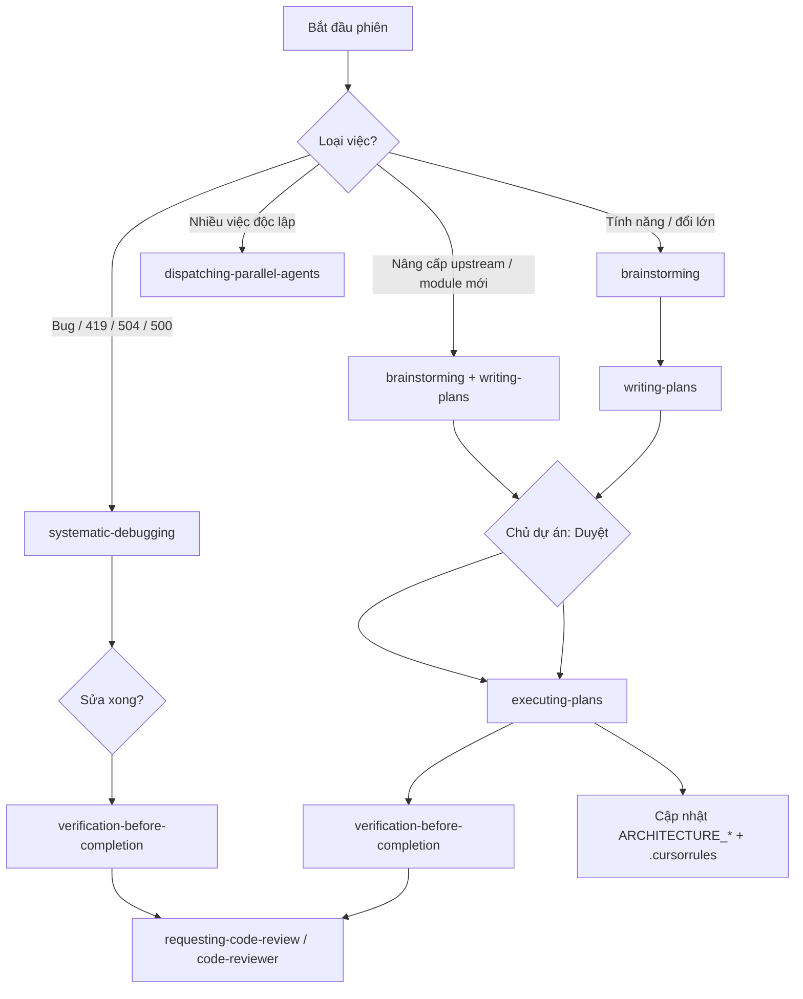

# MLHUB — Bộ Prompt & Sổ tay lệnh (Vibecode)

Nơi lưu **prompt mẫu** để làm việc với Cursor (kèm plugin **Superpowers**) và **cheatsheet lệnh** (Laravel / Docker / Coolify) cho dự án MLHUB. Mở file này mỗi khi bắt đầu phiên làm việc, chọn luồng §2 rồi copy prompt §3.

> Đọc kèm: `.cursorrules`, `ARCHITECTURE_CHECKLIST.md`, `ARCHITECTURE_BACKEND.md`, `ARCHITECTURE_FRONTEND.md`, `ARCHITECTURE_FEATURE.md`, `ARCHITECTURE_ADMINFAKER.md`.
> Mọi prompt nên đính kèm `@file` đúng chỗ thay vì `@Codebase` để tiết kiệm tài nguyên.
> **Commit / push / redeploy Coolify do chủ dự án làm thủ công** — AI chỉ sửa local + soạn commit message.

---

## 1. Mẹo dùng prompt hiệu quả

- **Khoanh vùng hẹp:** `@modules/AppBookingPages/...` thay vì cả dự án.
- **Nói rõ loại việc:** "sửa lỗi" (surgical) hay "tính năng mới" (ưu tiên extension point).
- **Nhắc ngữ cảnh chuẩn:** "theo `.cursorrules` và `ARCHITECTURE_CHECKLIST.md`".
- **Bật Superpowers:** gõ `/` trong chat → chọn skill (hoặc nói rõ skill trong prompt — xem §2).
- **Việc rủi ro:** luôn **kế hoạch trước → duyệt → code** (`writing-plans` → bạn gõ **Duyệt** → `executing-plans`).
- **Một task một mục tiêu:** đừng gộp nhiều việc không liên quan vào một prompt.

---

## 2. Superpowers + quy trình Vibecode (MLHUB)

Plugin **Superpowers** trong Cursor cung cấp **skills** (quy trình bắt buộc) và **subagent** (rà soát chuyên sâu). Dùng để quản lý dự án, fix lỗi production và nâng cấp phiên bản mà không “nhảy cóc” vào code.

### 2.1 Cách gọi trong Cursor

| Cách | Ví dụ |
|------|--------|
| Gõ `/` | `/brainstorming`, hoặc tìm tên skill trong danh sách |
| Trong prompt | “Dùng skill `systematic-debugging` cho lỗi 419” |
| Subagent | “Chạy code-reviewer sau khi xong dashboard” |

> Lệnh cũ `/brainstorm`, `/write-plan`, `/execute-plan` **đã deprecated** — dùng skill cùng tên thay thế.

### 2.2 Luồng chuẩn theo loại việc



### 2.3 Bảng skill — khi nào dùng (MLHUB)

| Skill | Dùng khi | Không dùng khi |
|-------|----------|----------------|
| **using-superpowers** | Đầu phiên lớn, chưa quen plugin | Đã rõ skill cần dùng |
| **brainstorming** | Tính năng mới, đổi kiến trúc, nâng cấp upstream | Sửa 1 dòng typo |
| **writing-plans** | Trước khi code; sau brainstorm | Đã có kế hoạch chi tiết |
| **executing-plans** | Sau khi bạn gõ **Duyệt** | Chưa duyệt kế hoạch |
| **systematic-debugging** | 419 Livewire, 504, 500, test fail, log ERROR | Đoán mò sửa ngay |
| **test-driven-development** | Logic mới, bug có thể tái hiện bằng test | Chỉ đổi chuỗi `lang/vi.json` |
| **verification-before-completion** | Trước khi bảo “xong” / trước commit | Chưa chạy pint/test |
| **requesting-code-review** | Xong cụm việc lớn | Thay đổi 1 file nhỏ |
| **code-reviewer** (subagent) | Review sau dashboard/auth/infra | Mỗi dòng CSS |
| **receiving-code-review** | Có feedback PR/review cần phân tích | — |
| **finishing-a-development-branch** | Nhánh xong, cần merge/PR/dọn | Giữa chừng task |
| **dispatching-parallel-agents** | 2+ task không phụ thuộc | Một bug một file |
| **using-git-worktrees** | Thử nghiệm tách nhánh an toàn | Hotfix production nhỏ |

### 2.4 MASTER PROMPT — Ổn định workspace / nâng cấp (copy nguyên khối)

Dùng khi vừa đổi nhiều file, chuẩn bị production, hoặc sau khi merge upstream. **Không code** cho đến khi bạn **Duyệt** kế hoạch.

```
Act as Staff Engineer for MLHUB (Laravel 13 + Livewire 4, modular monolith, production mlhub.vn).

Use Superpowers skills in order: brainstorming → writing-plans → (wait for my "Duyệt") → executing-plans → verification-before-completion → code-reviewer.

PHASE 1 — Read and internalize:
- .cursorrules
- ARCHITECTURE_CHECKLIST.md, ARCHITECTURE_BACKEND.md, ARCHITECTURE_FRONTEND.md, ARCHITECTURE_FEATURE.md, ARCHITECTURE_ADMINFAKER.md, ARCHITECTURE_PROMPT.md
Propose .cursorrules updates only if ARCHITECTURE_* and code diverge.

PHASE 2 — Infra (local mirrors production intent):
Inspect .env.example, docker-compose.yaml, Dockerfile, entrypoint.sh.
Focus: Redis session/cache/queue, TRUSTED_PROXIES, SESSION_DOMAIN, single queue worker, Livewire deploy cache, 419/504 causes.

PHASE 3 — Code health:
Review recent changes: @app/Livewire/Portal/Dashboard.php, @app/Providers/AppServiceProvider.php, @bootstrap/app.php, @modules/AdminLog, middleware, seeders.
Cross-check ARCHITECTURE_* and .cursorrules. List P0/P1/P2 — no code yet.

PHASE 4 — Output a step-by-step plan (writing-plans): rules → infra → code fixes → verification checklist.
Wait for my approval "Duyệt" before implementing.
```

### 2.5 MASTER PROMPT — Sửa lỗi production (419 / 504 / 500)

```
MLHUB production bug. Use skill systematic-debugging — do NOT patch until root cause is identified.

Symptom: <mô tả, vd Livewire 419 on /portal/dashboard>
Evidence: @storage/logs/laravel.log OR Admin → Settings → Logs (paste ERROR lines)
Repro: <URL, browser, after deploy? yes/no>

Read .cursorrules (Livewire 419/504 section) and @ARCHITECTURE_CHECKLIST.md.

Checklist to investigate:
- Deploy snapshot stale? (Ctrl+F5, entrypoint Livewire JS sync)
- SESSION_DOMAIN / APP_URL on Coolify
- Parallel wire:init (portal dashboard must use loadDashboardSections once)
- Redis session down / APP_KEY rotated
- Heavy QrScan count / missing migration index

Surgical fix only. After fix: verification-before-completion + list Coolify env if any.
Suggest commit message. Do not git push.
```

### 2.6 MASTER PROMPT — Nâng cấp phiên bản tác giả / module marketplace

```
MLHUB upstream/marketplace upgrade. Skills: brainstorming → writing-plans → wait "Duyệt" → executing-plans.

What changed: <phiên bản / module tên>
Attach: @modules/<ModuleName>/ (if known)

Before coding:
1. Diff scope vs .cursorrules (prefer edit existing files, modules/Custom* for new logic)
2. List new migrations under modules/*/Database/Migrations
3. Plan: migrate on deploy (entrypoint), portal smoke routes, update ARCHITECTURE_* counts (Admin*/App*/Payment*)

After deploy checklist:
- Coolify log: migrate OK, "Livewire JS synced"
- php artisan optimize:clear then optimize (or rely on entrypoint)
- Portal: CRM, email-automation, loyalty, reports — no 500
- Optional pilot: MLHUB_ALLOW_RESET_DEMO=true → mlhub:reset-demo --force + Redis FLUSHALL

Do not run migrate:fresh on production. Document new env keys in .env.example only.
```

### 2.7 Sau khi AI báo “xong” (chủ dự án)

1. Đọc tóm tắt file đổi + **commit message gợi ý**.
2. Coolify **Environment Variables** (nếu AI liệt kê).
3. Commit + push → đợi build.
4. Trên site: **Ctrl+F5** trang portal/admin (tránh Livewire 419 tab cũ).
5. Ghi note vào §8 (sổ tay cá nhân) nếu gặp cạm bẫy mới.

---

## 3. Bộ Prompt mẫu (copy & điền)

### 3.1 Khởi động phiên làm việc (skill: brainstorming)

```
Bối cảnh: MLHUB (Laravel 13 + Livewire 4, production mlhub.vn). Dùng skill brainstorming.
Đọc lướt .cursorrules và ARCHITECTURE_CHECKLIST.md (và ARCHITECTURE_PROMPT.md §2 nếu cần).
Mục tiêu hôm nay: <mô tả>.
Xác nhận đã nắm quy trình → đề xuất bước tiếp theo (có cần writing-plans không). CHƯA code.
```

### 3.2 Sửa lỗi (Bug fix — skill: systematic-debugging)

```
Sửa lỗi trong @<đường-dẫn-file>. 
Hiện tượng: <mô tả lỗi + cách tái hiện>. 
Kỳ vọng: <hành vi đúng>. 
Yêu cầu: sửa tối thiểu, bám đúng phong cách file (vibecode §3), scope theo auth()->id(), 
không refactor ngoài phạm vi. Giải thích nguyên nhân gốc trước khi sửa.
```

### 3.3 Tính năng mới (skills: brainstorming → writing-plans)

```
Thêm tính năng: <mô tả>. 
Đây là tính năng MỚI nên ưu tiên điểm mở rộng (modules/Custom* + providers.marketplace.php) 
theo ARCHITECTURE_BACKEND.md §5, KHÔNG sửa core nếu không cần. 
Hãy trình bày kế hoạch (file/route/model/migration/permission/env mới) để tôi duyệt, rồi mới code.
```

### 3.4 Một growth tool mới (theo engine lb_campaigns)

```
Tôi muốn thêm growth tool kiểu <tên>. 
Hãy theo đúng mẫu engine dùng chung: model QrCampaign (lb_campaigns) với type='<key>' + settings JSON, 
public qua QrCampaignPublicController, PlanLimitGuard, CustomerUpserter, GrowthToolNotifier 
(xem ARCHITECTURE_FEATURE.md §0). Trình bày kế hoạch trước.
```

### 3.5 Giao diện / Theme (White-label)

```
Chỉnh giao diện <mô tả> ở khu <guest/portal/admin>. 
Lưu ý theme guest `mlhubfrontend`, backend `mlhubbackend` (ARCHITECTURE_FRONTEND.md §2.2). 
Dùng lại <x-ui.*>/<x-shared.*>, màu dùng token var(--theme-*), không hard-code màu. 
Nếu chỉ là branding nhỏ, gợi ý dùng Admin → Themes → Custom CSS/JS thay vì sửa file.
```

### 3.6 Tính năng AI (có credit)

```
Thêm/sửa tính năng AI: <mô tả>. 
Bắt buộc: feature gate → credit_service()->ensureCanConsume() trước khi gọi LLM → 
try/catch (Throwable) có fallback → consume_credits() khi thành công (mẫu AppAIContent). 
Scope lịch sử theo workspaceOwnerUserId().
```

### 3.7 Database migration (🔴 skill: writing-plans)

```
Tôi cần thay đổi schema: <mô tả>. 
ĐỪNG code ngay. Hãy trình bày kế hoạch: bảng/cột (lb_*), kiểu dữ liệu, index, ràng buộc, 
chỉ thêm mới/nullable hay có đổi/xóa, phương án rollback, và cách chạy qua pipeline 
(entrypoint.sh / migrate --force), tuyệt đối không migrate:fresh trên production.
```

### 3.8 Payment / Subscription / Credit (🔴 plan trước)

```
Làm việc với cổng thanh toán <PaymentXxx>: <mô tả>. 
Trình bày kế hoạch trước: contract/luồng tiền (checkout→webhook→subscription/credit), 
ca lỗi/hoàn tiền/hết hạn, webhook URL & env cần cấu hình, đảm bảo không log dữ liệu nhạy cảm. 
Test sandbox trước.
```

### 3.9 Rà soát / Audit trước production (subagent: code-reviewer)

```
Audit module @<module> theo ARCHITECTURE_FEATURE.md. 
Kiểm tra: IDOR (scope tenant), thiếu rate-limit/captcha ở endpoint public, XSS khi hiển thị input khách, 
race condition, và xử lý lỗi. Liệt kê rủi ro theo mức P0/P1/P2 + đề xuất fix, CHƯA sửa.
```

### 3.10 Cập nhật tài liệu / sau khi nâng cấp upstream

```
Tôi vừa cập nhật phiên bản tác giả và/hoặc cài module mới.
Dùng luồng ARCHITECTURE_PROMPT.md §2.6 (upstream upgrade): brainstorming → writing-plans → chờ Duyệt.
Quét surgical: modules/*, migration mới, routes public → cập nhật .cursorrules, Dockerfile, entrypoint.sh, .env.example, ARCHITECTURE_*.md.
```

```
Tôi vừa thay đổi <mô tả>. Hãy cập nhật các file ARCHITECTURE_*.md / .cursorrules liên quan 
cho khớp thực tế (surgical, không viết lại toàn bộ) để Cursor sau này không phải quét lại dự án.
```

### 3.11 Chuẩn bị commit (skill: verification-before-completion)

```
Tóm tắt thay đổi của phiên này và soạn commit message đúng style repo. 
Liệt kê file đổi, migration/route/permission/env mới. 
Nhắc tôi nếu có biến .env cần cập nhật trên Coolify. Chưa push cho tới khi tôi đồng ý.
Chạy verification-before-completion: pint trên file đã sửa, nêu test/manual check cần làm.
```

### 3.12 Livewire 419 / "page expired" (rút gọn)

```
Lỗi Livewire 419 trên <URL>. Skill systematic-debugging.
@bootstrap/app.php @app/Livewire/Portal/Dashboard.php @resources/themes/app/mlhubbackend/resources/views/livewire/portal/dashboard.blade.php
Đã Ctrl+F5 chưa: <có/không>. Vừa deploy: <có/không>.
Sửa surgical; nhắc Coolify: APP_URL, SESSION_DOMAIN, TRUSTED_PROXIES. Không SSH vá tay server.
```

### 3.13 Duyệt kế hoạch rồi triển khai (một câu)

```
Duyệt. Triển khai kế hoạch vừa lập theo executing-plans — từng bước, surgical, cập nhật ARCHITECTURE_* nếu cần.
```

---

## 4. Cheatsheet lệnh Laravel (chạy ở LOCAL trên Cursor)

```bash
# Chất lượng code
vendor/bin/pint --dirty              # format file vừa đổi (không đụng core)
vendor/bin/pint <path>               # format file/thư mục cụ thể
php artisan test                     # chạy toàn bộ test (Pest)
php artisan test --filter=<Tên>      # chạy 1 nhóm test

# Dev server (dự án có script gộp)
composer dev                         # serve + queue:listen + vite cùng lúc
php artisan serve                    # chỉ web server
php artisan queue:listen --tries=1   # queue (driver redis)

# Database (MySQL local)
php artisan migrate                  # áp migration
php artisan migrate:status           # xem trạng thái
php artisan migrate --pretend        # xem SQL sẽ chạy, KHÔNG thực thi
php artisan db:seed --class=<Seeder> # seed dữ liệu mẫu

# Cache / cấu hình (khi dev)
php artisan optimize:clear           # xóa mọi cache
php artisan config:clear
php artisan route:clear
php artisan view:clear               # sau khi sửa Blade
php artisan route:list --name=portal # tra route theo tên

# Module / autoload
composer dump-autoload               # sau khi thêm namespace/class mới
php artisan about                    # tổng quan môi trường

# Tinker (thử nghiệm nhanh, đọc dữ liệu)
php artisan tinker
```

> ⚠️ KHÔNG chạy `migrate:fresh`, `migrate:rollback`, `db:wipe` trên DB có dữ liệu thật.

### 4.1 Reset dữ liệu demo (không còn Web Installer)

> 🔴 **Chỉ pilot/staging/local — chưa có khách thật.** MLHUB **đã gỡ Web Installer**; bootstrap qua **seed** + env Coolify.

**Tài khoản duy nhất cần nhớ:** `demo@mlhub.vn` / `123456` — vừa **super admin**, vừa có **demo tăng trưởng** (gói `agency-lifetime`).

**Coolify (tab Environment Variables) — luôn giữ:**


| Biến                          | Giá trị                                                                     |
| ----------------------------- | --------------------------------------------------------------------------- |
| `APP_INSTALLED`               | `true` (bắt buộc — entrypoint mới chạy `migrate`)                           |
| `MLHUB_ADMIN_PLAN_SLUG`       | `agency-lifetime`                                                           |
| `MLHUB_ALLOW_RESET_DEMO`      | `true` (chỉ khi cần chạy lệnh wipe trên pilot; xong có thể đặt lại `false`) |
| `MLHUB_LICENSE_PURCHASE_CODE` | Mã license Stackposts (Coolify — không commit)                              |
| `MLHUB_LICENSE_DOMAIN`        | `mlhub.vn`                                                                  |
| `RUN_QUEUE_WORKER`            | `true` (entrypoint start worker; `false` nếu worker Coolify riêng)           |
| `MAIL_PASSWORD`               | SMTP (không commit vào repo; seed ghi vào `options.smtp_password` nếu có)   |


**License / Marketplace sau reset:** không còn Web Installer (`purchase_verify_url`). Seed `MLHUBMarketplaceSeeder` + `license_`* trong `MLHUBBootstrapSeeder` khôi phục `marketplace_packages` và trạng thái license. **Không** import nguyên `mysql-dump-default-*.sql` (chứa SMTP/captcha secret). Logo đã upload: `MLHUBBrandFilesSeeder` tái tạo bản ghi `files` nếu ảnh còn trên disk `storage/app/public`.

#### A. Combo một lệnh (trong container app — khuyến nghị)

```bash
docker exec -it <container_app> sh
cd /var/www/html
php artisan mlhub:reset-demo --force
redis-cli -h <redis-host> -a '<password>' FLUSHALL
```

Lệnh trên: `db:wipe` → `migrate` → `db:seed` (foundation, license, marketplace, demo VN + volume) → `**admin-faker:refresh**` (demo investor Đà Nẵng SOHO: 10 business, 32 QR campaign, FAQ/blog/support — xem `ARCHITECTURE_ADMINFAKER.md`; không LinkBio/publishing) → `MLHUBDemoExtrasSeeder` (email templates, template packs) → `optimize:clear`. **Không** seed `files` (logo upload tay). Chỉ chạy `db:seed` / reset mà không có bước Admin Faker ≈ dump `mysql-moi.sql` (thiếu ~27 bảng so với `mysql-cu.sql` sau Faker).

#### B. Từng bước (nếu muốn kiểm soát)

```bash
cd /var/www/html
php artisan db:wipe --force --drop-views
php artisan migrate --force
php artisan db:seed --force
php artisan optimize:clear
```

**Redis (bắt buộc sau reset):** `redis-cli FLUSHALL` — session/cache cũ không còn trỏ user ID đã xóa.

#### C. SQL thủ công (khi không vào được artisan)

```sql
DROP DATABASE mlhub;
CREATE DATABASE mlhub CHARACTER SET utf8mb4 COLLATE utf8mb4_unicode_ci;
```

Sau đó trong container: `php artisan migrate --force` và `php artisan db:seed --force` (hoặc `mlhub:reset-demo --force`).

#### D. Chỉ seed lại demo (không wipe)

```bash
php artisan db:seed --class=LocalBoostDemoSeeder --force
php artisan optimize:clear
```

#### E. Sau reset — kiểm tra

- Đăng nhập `**demo@mlhub.vn**` / `**123456**` → **Admin** + **Portal** đều được.
- **Tổng quan tăng trưởng:** visits ~1.2k–4.8k/chiến dịch; tỷ lệ chuyển đổi ~8–10%.

**Cấu hình:** `mlhub_adminfaker_dn_soho.php` — **11** cơ sở, `target_qr_visits` **6M** (~60%), `customer_target` **6600**, `volume_scale` **12**, FAQ/blog **150** mỗi loại.

> Quy ước repo: không giữ script one-off/generator trong `database/seeders/scripts` hoặc `database/seeders/data` nếu không cần runtime seed. Ưu tiên chỉnh trực tiếp file data runtime để dễ compare với upstream.

### 4.2 Tải full source từ server (`fullcode.zip`) — pilot / backup

> Dùng khi cần tải **toàn bộ thư mục app đang chạy** trên Coolify (`/var/www/html`) về máy — gồm code, `vendor/`, `modules/`, `storage/` (upload/cache/log trên container), theme, v.v. **Source of truth vẫn là GitHub** — zip chỉ để backup/so sánh tạm, không thay commit/push.

> 🔴 **Bảo mật:** File đặt trong `public/` = **URL công khai**. Ai biết link `https://mlhub.vn/fullcode.zip` đều tải được. **Tạo → tải xong → xóa ngay** (bước 4). Không để qua đêm trên production.

**“Full” nghĩa là gì:** Nén **gần như mọi thứ** trong `/var/www/html`. Chỉ **không** đưa vào zip: (1) chính file `public/fullcode.zip` đang tạo, (2) file `.env` (chứa mật khẩu — bí mật thật nằm tab Environment Variables của Coolify). Các file khác (`vendor`, `storage`, `bootstrap/cache`, `.env.example`, …) **đều nằm trong zip**.

Mỗi lần container khởi động, `entrypoint.sh` đã tạo symlink `public/resources/themes` → `../../resources/themes`. Lệnh zip dùng cờ **`-y`** để không đi theo symlink lặp vô hạn (tránh zip phình 500MB+ vì `themes/themes/...`).

**Bước 1 — Vào container app (Coolify → Terminal hoặc `docker exec`):**

```bash
docker exec -it <container_app> sh
cd /var/www/html
```

Nếu báo `zip: not found`:

```bash
apt-get update && apt-get install -y zip
```

**Bước 2 — Nén full (một lệnh):**

```bash
zip -ry public/fullcode.zip . -x "public/fullcode.zip" -x ".env"
```

- **`-r`**: nén đệ quy toàn bộ thư mục hiện tại.
- **`-y`**: bỏ qua symlink khi ghi zip (theme vẫn đủ vì có `resources/themes/`).
- Kích thước thường **~200MB–1GB+** (có `vendor` + `storage`), tạo **vài phút** — đợi đến khi shell trả về prompt, không thoát giữa chừng.
- Sau khi xong, kiểm tra nhanh:

```bash
ls -lh public/fullcode.zip
```

**Bước 3 — Tải bằng trình duyệt:**

`https://mlhub.vn/fullcode.zip` (hoặc `https://www.mlhub.vn/fullcode.zip`)

**Bước 4 — Xóa file ngay sau khi tải xong (bắt buộc):**

```bash
rm -f /var/www/html/public/fullcode.zip
ls -la /var/www/html/public/fullcode.zip
# phải báo: No such file or directory
```

**Khắc phục khi zip quá lớn bất thường (hàng GB, log có `themes/themes/themes/...`):**

Container lỗi symlink (hiếm nếu đã deploy bản có `entrypoint.sh` mới). **Redeploy** Coolify rồi chạy lại bước 2, hoặc sửa tay:

```bash
rm -rf public/resources/themes
mkdir -p public/resources
ln -sfn ../../resources/themes public/resources/themes
zip -ry public/fullcode.zip . -x "public/fullcode.zip" -x ".env"
```

**Lưu ý:**

- Giải nén trên Windows: chuột phải `fullcode.zip` → Extract All (hoặc 7-Zip). Trên máy dev: `unzip fullcode.zip -d thu-muc-moi`.
- Máy local nếu Git báo hàng chục nghìn file `public/resources/themes/themes/...` sau khi giải nén: **đừng commit** — xóa thư mục lỗi đó; so sánh code dùng bản từ GitHub.
- Không commit `public/fullcode.zip` lên GitHub.
- `storage/` trên Coolify gắn volume `mlhub-storage` — khi zip **trong container** tại `/var/www/html`, phần `storage/` đang mount **vẫn được nén** (upload khách, log, cache…). Backup volume riêng: snapshot Persistent Storage trên Coolify.
- Production thường **không có** `.git/` trong image — zip vẫn đủ để chạy/so sánh; lịch sử git lấy từ repo GitHub.

---

## 5. Cheatsheet Docker / SSH Coolify (CHỈ để CHẨN ĐOÁN — đọc log/kiểm tra)

> 🔴 **Quy tắc cốt lõi (ARCHITECTURE_CHECKLIST.md §1):** KHÔNG dùng các lệnh này để **thay đổi** hạ tầng/code/config trên server. Mọi thay đổi đi qua local → GitHub → Coolify build. Các lệnh dưới đây chỉ để **xem trạng thái, đọc log, debug**.

Tham chiếu container (từ `docker-compose.yaml`): tên dạng `mggu45o8q8aso8stbepn622j-...`, app chạy port 80 nội bộ, volume `mlhub-storage:/var/www/html/storage`, domain `mlhub.vn`.

```bash
# SSH vào server (thực hiện trong Coolify hoặc terminal được cấp quyền)
ssh <user>@<server-ip>

# Xem container đang chạy
docker ps
docker ps --filter "name=mlhub"      # lọc theo tên dự án

# Đọc log ứng dụng (chẩn đoán lỗi deploy/runtime)
docker logs --tail=200 -f <container_id_or_name>

# Vào shell container để XEM (không sửa)
docker exec -it <container_id_or_name> sh      # hoặc bash nếu có
#   bên trong container, dùng để ĐỌC trạng thái:
php artisan about
php artisan migrate:status
tail -n 200 storage/logs/laravel.log
cat .env | grep -v PASSWORD          # xem cấu hình (tránh lộ secret)

# Tài nguyên / dung lượng
docker stats --no-stream
df -h
```

### Khi gặp sự cố trên production → làm gì?

1. **Đọc log** (`docker logs`, `storage/logs/laravel.log`) để xác định nguyên nhân.
2. **Tái hiện ở local**, sửa bằng code/config, test, commit, push.
3. Để **Coolify auto-build** lại. KHÔNG vá tay trên container.
4. Nếu là biến môi trường: sửa trong **Coolify UI (env)** + cập nhật `.env.example` ở repo cho khớp.
5. Nếu cần chạy migration khi deploy: đảm bảo nằm trong `entrypoint.sh`/pipeline.

### 5.1 Xem & tải `laravel.log` an toàn (module AdminLog)

> ✅ **Dùng trang admin, KHÔNG copy log ra `public/`.** Xem/tải log tại **Admin → Cài đặt → Logs** (`https://mlhub.vn/admin/settings/log`). Trang này nằm sau `auth` + `EnsureAdminAccess` (chỉ admin), tránh phơi log ra Internet.
>
> 🔴 **TUYỆT ĐỐI KHÔNG** copy `storage/logs/*.log` vào `public/` để tải qua URL công khai — log chứa stack trace, DB host, user ID, email, token; ai có URL (kể cả Google) đều đọc được.

Tại trang đó có thể: chọn file log, xem nhanh phần cuối (tail), **tải xuống**, **xoá nội dung** (clear) hoặc **xoá file**. Code: `modules/AdminLog`.

---

## 6. Tham chiếu nhanh môi trường MLHUB


| Hạng mục            | Giá trị                                                                                                          |
| ------------------- | ---------------------------------------------------------------------------------------------------------------- |
| Brand / domain      | MLHUB / `mlhub.vn` (+ `www`)                                                                                     |
| Locale / timezone   | `vi` / `Asia/Ho_Chi_Minh`                                                                                        |
| DB                  | MySQL (3306)                                                                                                     |
| Session/Queue/Cache | `redis` (phpredis; cần queue worker + Redis sống)                                                                |
| Mail                | ✅ `smtp` qua Emailit (`smtp.emailit.com:587`, secret trong Coolify env)                                          |
| Captcha             | Cloudflare Turnstile (mặc định) + reCAPTCHA v2 — Admin → Captcha (OptionStore); gắn ở auth, chưa gắn form public |
| Rate-limit          | `throttle:10,1` trên 5 form public (booking/coupon/feedback/lead/review)                                         |
| Storage             | disk `public` (S3 trống)                                                                                         |
| Theme active        | guest = `mlhubfrontend`, backend = `mlhubbackend` (env `THEME_FRONTEND` / `THEME_BACKEND`)                        |
| Session / URL prod  | `SESSION_DOMAIN=.mlhub.vn`, `APP_URL=https://mlhub.vn`, `TRUSTED_PROXIES=*`                                       |
| Deploy              | Coolify + Traefik (HTTP→HTTPS, Let's Encrypt)                                                                    |


---

## 7. Sổ tay cá nhân (tự ghi note mỗi lần code)

> Khu vực để bạn tự bổ sung. Gợi ý ghi theo định dạng ngày + việc + lệnh/đường dẫn liên quan.

### DD-MM-YYYY — <tiêu đề việc>

- Bối cảnh / mục tiêu:
- File/module liên quan: `@...`
- Lệnh đã dùng:
- Kết quả / lưu ý / cạm bẫy gặp phải:
- Việc cần làm tiếp:

## 8. Lựa chọn mô hình AI trong Cursor

### 1. Giữ nguyên **Opus 4.8 High (Core)**

- **Khi nào dùng:** Dành cho các tác vụ cốt lõi mà chúng ta vừa bàn tới (Cấu hình luồng Email/SMTP, Viết middleware Rate-limit/Captcha chống Spam, hoặc xử lý Race-condition cho Booking).
- **Lý do:** Dòng Opus luôn là "nhà vô địch" trong việc đọc hiểu ngữ cảnh dài. Nó sẽ nuốt trọn bộ `ARCHITECTURE_*.md` của bạn, nhớ rất kỹ các quy tắc an toàn (không dùng `migrate:fresh` trên production, luôn scope theo `auth()->id()`), và đưa ra kế hoạch (Plan) cực kỳ sắc bén trước khi code.

### 2. Dùng **Composer 2.5 Fast (Giải pháp)**

- **Khi nào dùng:** Khi bạn đã thảo luận xong giải pháp với Opus và chốt được phương án, hãy dùng tính năng Composer (phím tắt thường là `Cmd/Ctrl + I` hoặc `Cmd/Ctrl + K` trên toàn dự án) để AI tự động áp dụng các thay đổi đó vào nhiều file cùng lúc (ví dụ: chèn throttle vào hàng loạt file `Routes/web.php` của các module).
- **Lý do:** Tốc độ thực thi cực nhanh và gõ code trực tiếp vào file (surgical edits) rất tốt.

### 3. Dùng **Sonnet 4.6 Medium** hoặc **GPT-5.5 Medium (Theme)**

- **Khi nào dùng:** Tác vụ nhẹ: chỉnh CSS Tailwind trên theme `mlhubfrontend` / `mlhubbackend`, bổ sung `lang/vi.json`, regex validation.
- **Luôn kèm:** `.cursorrules` + `@file` blade cụ thể; không thay thế bước `writing-plans` cho tính năng lớn.
- **Lý do:** Tiết kiệm "Premium credits" của bạn, tốc độ phản hồi nhanh hơn Opus, và dư sức xử lý các file đơn lẻ.

